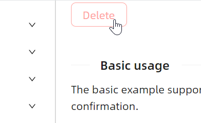
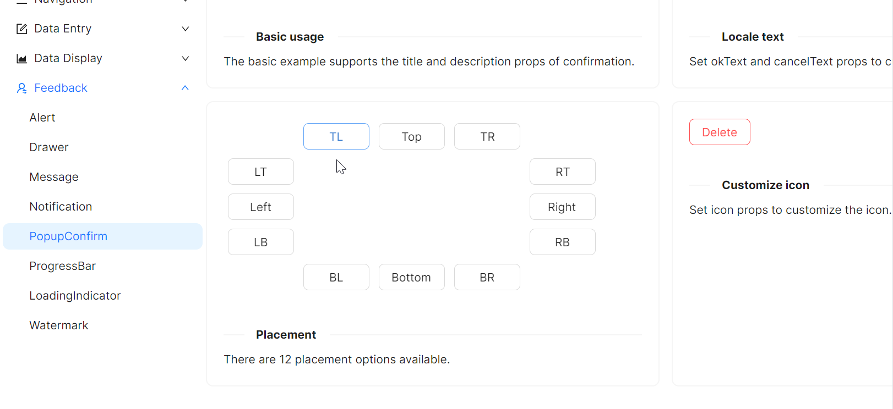
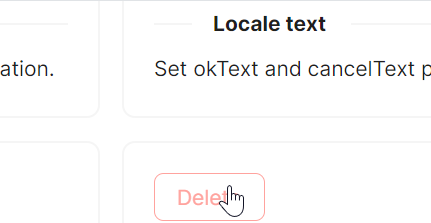

# 快速入门

### 基础配置条件

* Nuget安装Avalonia
* Nuget安装AtomUI

### 基础用法

`PopupConfirm` 弹窗在业务场景中极其常见，`AtomUI` 提供了一个非常简单的组件来满足这种业务场景。

这个示例中，使用一个 `Button` 组件来触发 `PopupConfirm`，这其中需要留意的属性为：
* `Title`: 弹窗的标题
* `ConfirmContent`: 弹窗内容
* `OkText`: 确认按钮的文字
* `CancelText`: 取消按钮的文字
* `Placement`: 弹窗出现的位置
* `IsShowArrow`: 是否显示箭头



axaml文件：
```axaml
<atom:PopupConfirm
    Title="Delete the task"
    ConfirmContent="Are you sure to delete this task?"
    OkText="Ok"
    CancelText="Cancel"
    Placement="Top"
    IsShowArrow="True">
    <atom:Button ButtonType="Default" IsDanger="True">Delete</atom:Button>
</atom:PopupConfirm>
```

### 默认本地语系

这个示例中展示了默认情况下，弹窗中的确认按钮、取消按钮的语系与文案。


```axaml
<atom:PopupConfirm
    Title="Delete the task"
    ConfirmContent="Are you sure to delete this task?">
    <atom:Button ButtonType="Default" IsDanger="True">Delete</atom:Button>
</atom:PopupConfirm>
```

### 弹出位置

这个示例中，通过 `Placement` 来展示弹窗出现的位置。



```axaml
<Grid>
    <Grid.Styles>
        <Style Selector="atom|Button">
            <Setter Property="Margin" Value="5" />
            <Setter Property="Width" Value="80" />
        </Style>
    </Grid.Styles>
    <Grid.RowDefinitions>
        <RowDefinition Height="Auto" />
        <RowDefinition Height="Auto" />
        <RowDefinition Height="Auto" />
        <RowDefinition Height="Auto" />
        <RowDefinition Height="Auto" />
    </Grid.RowDefinitions>
    <Grid.ColumnDefinitions>
        <ColumnDefinition Width="Auto" />
        <ColumnDefinition Width="Auto" />
        <ColumnDefinition Width="Auto" />
        <ColumnDefinition Width="Auto" />
        <ColumnDefinition Width="Auto" />
    </Grid.ColumnDefinitions>

    <atom:PopupConfirm
        Grid.Row="1" Grid.Column="0" Trigger="Click" Placement="LeftEdgeAlignedTop"
        Title="Delete the task"
        ConfirmContent="Are you sure to delete this task?"
        OkText="Ok"
        CancelText="Cancel">
        <atom:Button ButtonType="Default">LT</atom:Button>
    </atom:PopupConfirm>

    <atom:PopupConfirm
        Grid.Row="2" Grid.Column="0" Trigger="Click" Placement="Left"
        Title="Delete the task"
        ConfirmContent="Are you sure to delete this task?"
        OkText="Ok"
        CancelText="Cancel">
        <atom:Button ButtonType="Default">Left</atom:Button>
    </atom:PopupConfirm>

    <atom:PopupConfirm
        Grid.Row="3" Grid.Column="0" Trigger="Click" Placement="LeftEdgeAlignedBottom"
        Title="Delete the task"
        ConfirmContent="Are you sure to delete this task?"
        OkText="Ok"
        CancelText="Cancel">
        <atom:Button ButtonType="Default">LB</atom:Button>
    </atom:PopupConfirm>

    <atom:PopupConfirm
        Grid.Row="0" Grid.Column="1" Trigger="Click" Placement="TopEdgeAlignedLeft"
        Title="Delete the task"
        ConfirmContent="Are you sure to delete this task?"
        OkText="Ok"
        CancelText="Cancel">
        <atom:Button ButtonType="Default">TL</atom:Button>
    </atom:PopupConfirm>

    <atom:PopupConfirm
        Grid.Row="0" Grid.Column="2" Trigger="Click" Placement="Top"
        Title="Delete the task"
        ConfirmContent="Are you sure to delete this task?"
        OkText="Ok"
        CancelText="Cancel">
        <atom:Button ButtonType="Default">Top</atom:Button>
    </atom:PopupConfirm>

    <atom:PopupConfirm
        Grid.Row="0" Grid.Column="3" Trigger="Click" Placement="TopEdgeAlignedRight"
        Title="Delete the task"
        ConfirmContent="Are you sure to delete this task?"
        OkText="Ok"
        CancelText="Cancel">
        <atom:Button ButtonType="Default">TR</atom:Button>
    </atom:PopupConfirm>

    <atom:PopupConfirm
        Grid.Row="1" Grid.Column="4" Trigger="Click" Placement="RightEdgeAlignedTop"
        Title="Delete the task"
        ConfirmContent="Are you sure to delete this task?"
        OkText="Ok"
        CancelText="Cancel">
        <atom:Button ButtonType="Default">RT</atom:Button>
    </atom:PopupConfirm>

    <atom:PopupConfirm
        Grid.Row="2" Grid.Column="4" Trigger="Click" Placement="Right"
        Title="Delete the task"
        ConfirmContent="Are you sure to delete this task?"
        OkText="Ok"
        CancelText="Cancel">
        <atom:Button ButtonType="Default">Right</atom:Button>
    </atom:PopupConfirm>

    <atom:PopupConfirm
        Grid.Row="3" Grid.Column="4" Trigger="Click" Placement="RightEdgeAlignedBottom"
        Title="Delete the task"
        ConfirmContent="Are you sure to delete this task?"
        OkText="Ok"
        CancelText="Cancel">
        <atom:Button ButtonType="Default">RB</atom:Button>
    </atom:PopupConfirm>

    <atom:PopupConfirm
        Grid.Row="4" Grid.Column="1" Trigger="Click" Placement="BottomEdgeAlignedLeft"
        Title="Delete the task"
        ConfirmContent="Are you sure to delete this task?"
        OkText="Ok"
        CancelText="Cancel">
        <atom:Button ButtonType="Default">BL</atom:Button>
    </atom:PopupConfirm>

    <atom:PopupConfirm
        Grid.Row="4" Grid.Column="2" Trigger="Click" Placement="Bottom"
        Title="Delete the task"
        ConfirmContent="Are you sure to delete this task?"
        OkText="Ok"
        CancelText="Cancel">
        <atom:Button ButtonType="Default">Bottom</atom:Button>
    </atom:PopupConfirm>

    <atom:PopupConfirm
        Grid.Row="4" Grid.Column="3" Trigger="Click" Placement="BottomEdgeAlignedRight"
        Title="Delete the task"
        ConfirmContent="Are you sure to delete this task?"
        OkText="Ok"
        CancelText="Cancel">
        <atom:Button ButtonType="Default">BR</atom:Button>
    </atom:PopupConfirm>

</Grid>
```

### 自定义图标

这个示例通过 `Icon` （图标参考 `AtomUI` 的图标库）来展示图标。



```axaml
<atom:PopupConfirm
    Title="Delete the task"
    ConfirmContent="Are you sure to delete this task?"
    Icon="{atom:IconProvider Kind=QuestionCircleOutlined}"
    ConfirmStatus="Error"
    OkText="Ok"
    CancelText="Cancel">
    <atom:Button ButtonType="Default" IsDanger="True">Delete</atom:Button>
</atom:PopupConfirm>
```