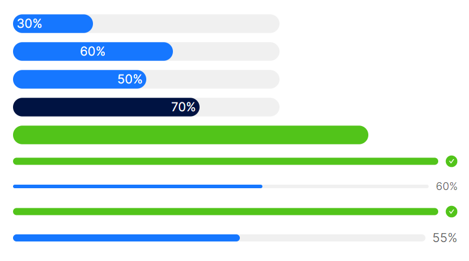
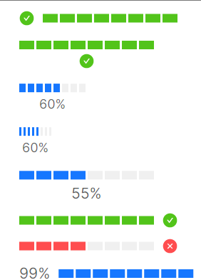

# 进度值位置

`ProgressBar` 组件支持设定进度值位置，能够更好满足更多的业务场景。

属性 `PercentPosition` 可以设置为Start、Center、End，分别表示进度值在进度条的开始、中间、结束位置。



```axaml
<StackPanel Orientation="Vertical" Spacing="10">
    <atom:ProgressBar Value="30" Minimum="0" Maximum="100" Width="300"
                      PercentPosition="{Binding InnerStartPercentPosition}" />
    <atom:ProgressBar Value="60" Minimum="0" Maximum="100" Width="300"
                      PercentPosition="{Binding InnerCenterPercentPosition}" />
    <atom:ProgressBar Value="50" Minimum="0" Maximum="100" Width="300"
                      PercentPosition="{Binding InnerEndPercentPosition}" />
    <atom:ProgressBar Value="70" Minimum="0" Maximum="100" Width="300" StrokeBrush="#001342"
                      PercentPosition="{Binding InnerEndPercentPosition}" />
    <atom:ProgressBar Value="100" Minimum="0" Maximum="100" Width="400"
                      PercentPosition="{Binding InnerCenterPercentPosition}" />
    <atom:ProgressBar Value="100" Minimum="0" Maximum="100"
                      PercentPosition="{Binding OutterStartPercentPosition}" />
    <atom:ProgressBar Value="60" Minimum="0" Maximum="100"
                      PercentPosition="{Binding OutterCenterPercentPosition}" SizeType="Small" />
    <atom:ProgressBar Value="100" Minimum="0" Maximum="100"
                      PercentPosition="{Binding OutterCenterPercentPosition}" />
    <atom:ProgressBar Value="55" Minimum="0" Maximum="100"
                      PercentPosition="{Binding OutterStartPercentPosition}" />
</StackPanel>
```



```axaml
<StackPanel Orientation="Vertical" Spacing="10">
    <atom:StepsProgressBar Value="100" Minimum="0" Maximum="100" Steps="8" PercentPosition="Start" />
    <atom:StepsProgressBar Value="100" Minimum="0" Maximum="100" Steps="8" PercentPosition="Center" />
    <atom:StepsProgressBar Value="60" Minimum="0" Maximum="100" Steps="8" PercentPosition="Center"
                           SizeType="Middle" />
    <atom:StepsProgressBar Value="60" Minimum="0" Maximum="100" Steps="8" PercentPosition="Center"
                           SizeType="Small" />
    <atom:StepsProgressBar Value="55" Minimum="0" Maximum="100" Steps="8" PercentPosition="Center" />
    <atom:StepsProgressBar Value="100" Minimum="0" Maximum="100" Steps="8" PercentPosition="End" />
    <atom:StepsProgressBar Value="55" Minimum="0" Maximum="100" Steps="8" PercentPosition="End"
                           Status="Exception" />
    <atom:StepsProgressBar Value="99" Minimum="0" Maximum="100" Steps="8" PercentPosition="Start" />
</StackPanel>
```
