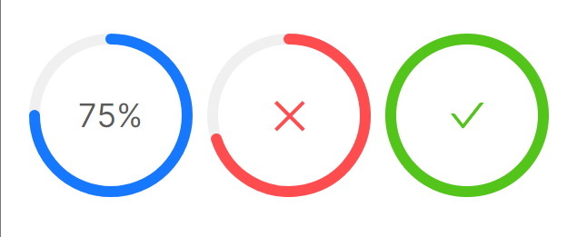
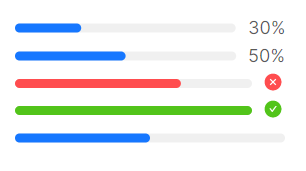
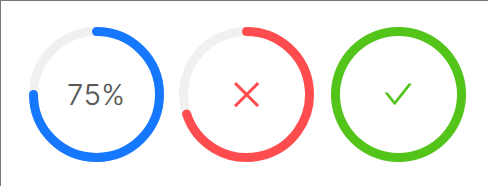
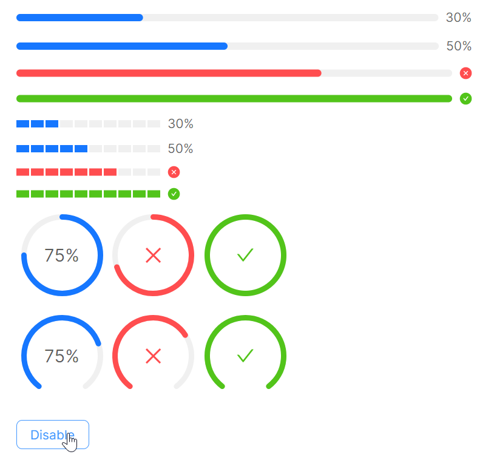

# 快速入门

### 基础配置条件

* Nuget安装Avalonia
* Nuget安装AtomUI

### 基础用法

这个示例展示了长条形进度条和圆形进度条，长条是 `ProgressBar` 圆形为 `CircleProgress`。

如下几个属性其实较为简单，一眼万年：
* Value：当前进度值
* Minimum：最小值
* Maximum：最大值
* Status：Normal、Success、Exception、Active，四个值表示的颜色不一样，同时代表的含义也不一样
* ShowProgressInfo：是否显示进度信息


```axaml
<StackPanel Orientation="Vertical" Spacing="10">
    <atom:ProgressBar Value="30" Minimum="0" Maximum="100" />
    <atom:ProgressBar Value="50" Minimum="0" Maximum="100" />
    <atom:ProgressBar Value="70" Minimum="0" Maximum="100" Status="Exception" />
    <atom:ProgressBar Value="100" Minimum="0" Maximum="100" />
    <atom:ProgressBar Value="50" Minimum="0" Maximum="100" ShowProgressInfo="False" />
</StackPanel>
```



```axaml
<WrapPanel Orientation="Horizontal">
    <atom:CircleProgress Value="75" Minimum="0" Maximum="100" />
    <atom:CircleProgress Value="70" Minimum="0" Maximum="100" Status="Exception" />
    <atom:CircleProgress Value="100" Minimum="0" Maximum="100" />
</WrapPanel>
```

### 大小尺寸

直接由 `SizeType` 属性设定即可，可选值为：Large、Middle、Small。



```axaml
<WrapPanel Orientation="Horizontal" Width="180" HorizontalAlignment="Left">
    <atom:ProgressBar Value="30" Minimum="0" Maximum="100" SizeType="Middle" />
    <atom:ProgressBar Value="50" Minimum="0" Maximum="100" SizeType="Middle" />
    <atom:ProgressBar Value="70" Minimum="0" Maximum="100" Status="Exception" SizeType="Middle" />
    <atom:ProgressBar Value="100" Minimum="0" Maximum="100" SizeType="Middle" />
    <atom:ProgressBar Value="50" Minimum="0" Maximum="100" ShowProgressInfo="False" SizeType="Middle" />
</WrapPanel>
```



```axaml
<WrapPanel Orientation="Horizontal">
    <atom:CircleProgress Value="75" Minimum="0" Maximum="100" SizeType="Middle" />
    <atom:CircleProgress Value="70" Minimum="0" Maximum="100" Status="Exception" SizeType="Middle" />
    <atom:CircleProgress Value="100" Minimum="0" Maximum="100" SizeType="Middle" />
</WrapPanel>
```

### 禁用特性

`IsEnabled` 设定为True，直接禁用组件。



```axaml
<StackPanel Orientation="Vertical" Spacing="10">
    <atom:ProgressBar Value="30" Minimum="0" Maximum="100" IsEnabled="{Binding ToggleStatus}" />
    <atom:ProgressBar Value="50" Minimum="0" Maximum="100" IsEnabled="{Binding ToggleStatus}" />
    <atom:ProgressBar Value="70" Minimum="0" Maximum="100" Status="Exception"
                      IsEnabled="{Binding ToggleStatus}" />
    <atom:ProgressBar Value="100" Minimum="0" Maximum="100" IsEnabled="{Binding ToggleStatus}" />

    <atom:StepsProgressBar Value="30" Minimum="0" Maximum="100" Steps="10"
                           IsEnabled="{Binding ToggleStatus}" />
    <atom:StepsProgressBar Value="50" Minimum="0" Maximum="100" Steps="10"
                           IsEnabled="{Binding ToggleStatus}" />
    <atom:StepsProgressBar Value="70" Minimum="0" Maximum="100" Steps="10" Status="Exception"
                           IsEnabled="{Binding ToggleStatus}" />
    <atom:StepsProgressBar Value="100" Minimum="0" Maximum="100" Steps="10"
                           IsEnabled="{Binding ToggleStatus}" />

    <WrapPanel Orientation="Horizontal">
        <atom:CircleProgress Value="75" Minimum="0" Maximum="100" SizeType="Middle"
                             IsEnabled="{Binding ToggleStatus}" />
        <atom:CircleProgress Value="70" Minimum="0" Maximum="100" SizeType="Middle" Status="Exception"
                             IsEnabled="{Binding ToggleStatus}" />
        <atom:CircleProgress Value="100" Minimum="0" Maximum="100" SizeType="Middle"
                             IsEnabled="{Binding ToggleStatus}" />
    </WrapPanel>

    <WrapPanel Orientation="Horizontal">
        <atom:DashboardProgress Value="75" Minimum="0" Maximum="100" SizeType="Middle"
                                IsEnabled="{Binding ToggleStatus}" />
        <atom:DashboardProgress Value="70" Minimum="0" Maximum="100" SizeType="Middle" Status="Exception"
                                IsEnabled="{Binding ToggleStatus}" />
        <atom:DashboardProgress Value="100" Minimum="0" Maximum="100" SizeType="Middle"
                                IsEnabled="{Binding ToggleStatus}" />
    </WrapPanel>

    <atom:Button Margin="0, 10, 0, 0"
                 Content="{Binding ToggleDisabledText}"
                 Command="{Binding ToggleEnabledStatus}" />
</StackPanel>
```