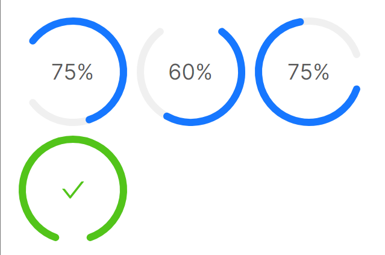
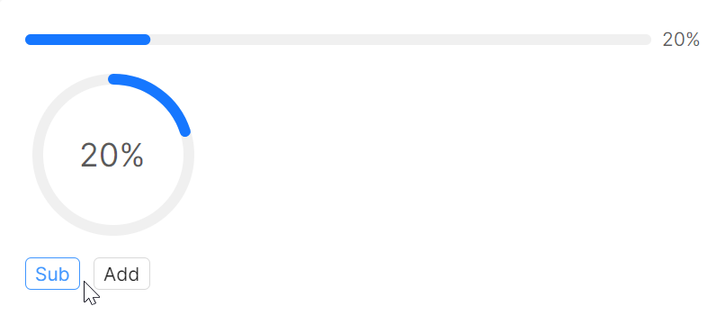
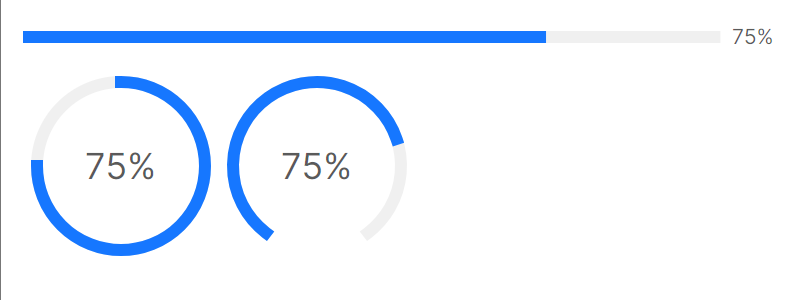
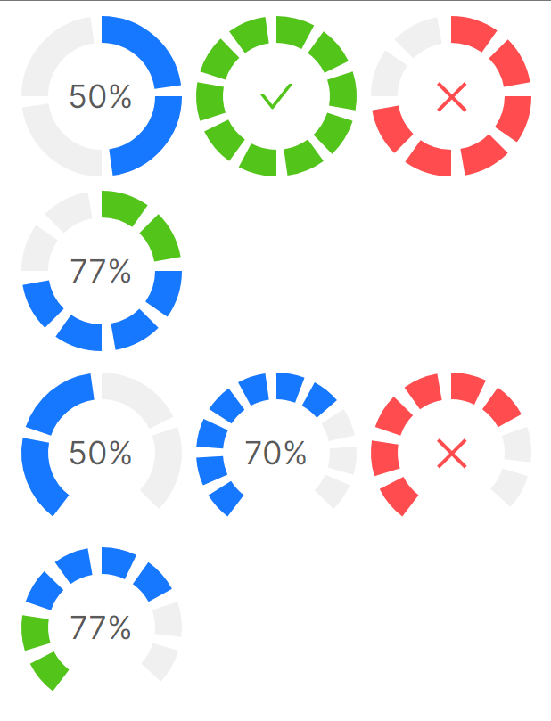
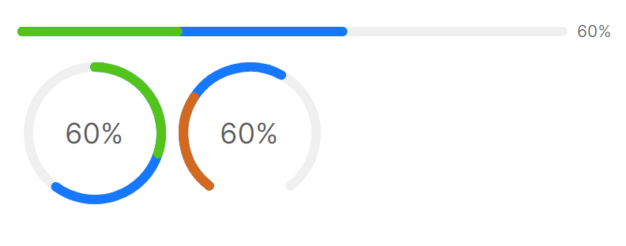

# 快速入门

### 基础配置条件

* Nuget安装Avalonia
* Nuget安装AtomUI

### 基础用法

`ProgressBar` 是最常用的线性进度条，`CircleProgress` 为圆环形进度条。以下是核心属性：

* `Value`：当前进度值
* `Minimum`：最小值
* `Maximum`：最大值
* `Status`：状态，可选 Normal、Success、Exception、Active，不同状态呈现不同颜色
* `ShowProgressInfo`：是否显示进度信息


```xaml
<StackPanel Orientation="Vertical" Spacing="10">
    <atom:ProgressBar Value="30" Minimum="0" Maximum="100" />
    <atom:ProgressBar Value="50" Minimum="0" Maximum="100" />
    <atom:ProgressBar Value="70" Minimum="0" Maximum="100" Status="Exception" />
    <atom:ProgressBar Value="100" Minimum="0" Maximum="100" />
    <atom:ProgressBar Value="50" Minimum="0" Maximum="100" ShowProgressInfo="False" />
</StackPanel>
```


```xaml
<WrapPanel Orientation="Horizontal">
    <atom:CircleProgress Value="75" Minimum="0" Maximum="100" />
    <atom:CircleProgress Value="70" Minimum="0" Maximum="100" Status="Exception" />
    <atom:CircleProgress Value="100" Minimum="0" Maximum="100" />
</WrapPanel>
```

### 大小尺寸

通过 `SizeType` 属性设置尺寸，可选值为 Large、Middle、Small。


```xaml
<WrapPanel Orientation="Horizontal" Width="180" HorizontalAlignment="Left">
    <atom:ProgressBar Value="30" Minimum="0" Maximum="100" SizeType="Middle" />
    <atom:ProgressBar Value="50" Minimum="0" Maximum="100" SizeType="Middle" />
    <atom:ProgressBar Value="70" Minimum="0" Maximum="100" Status="Exception" SizeType="Middle" />
    <atom:ProgressBar Value="100" Minimum="0" Maximum="100" SizeType="Middle" />
    <atom:ProgressBar Value="50" Minimum="0" Maximum="100" ShowProgressInfo="False" SizeType="Middle" />
</WrapPanel>
```


```xaml
<WrapPanel Orientation="Horizontal">
    <atom:CircleProgress Value="75" Minimum="0" Maximum="100" SizeType="Middle" />
    <atom:CircleProgress Value="70" Minimum="0" Maximum="100" Status="Exception" SizeType="Middle" />
    <atom:CircleProgress Value="100" Minimum="0" Maximum="100" SizeType="Middle" />
</WrapPanel>
```

### 百分比位置

`ProgressBar` 支持通过 `PercentPosition` 属性自定义百分比文本的显示位置。`PercentPosition` 是一个 record struct，包含两个字段：

* `IsInner`：为 `true` 时百分比显示在进度条内部，为 `false` 时显示在外部
* `Alignment`：对齐方式，可选 `LinePercentAlignment.Start`、`Center`、`End`


```xaml
<StackPanel Orientation="Vertical" Spacing="10">
    <atom:ProgressBar Value="30" Minimum="0" Maximum="100" Width="300"
                      PercentPosition="{Binding InnerStartPercentPosition}" />
    <atom:ProgressBar Value="60" Minimum="0" Maximum="100" Width="300"
                      PercentPosition="{Binding InnerCenterPercentPosition}" />
    <atom:ProgressBar Value="50" Minimum="0" Maximum="100" Width="300"
                      PercentPosition="{Binding InnerEndPercentPosition}" />
    <atom:ProgressBar Value="70" Minimum="0" Maximum="100" Width="300" StrokeBrush="#001342"
                      PercentPosition="{Binding InnerEndPercentPosition}" />
    <atom:ProgressBar Value="100" Minimum="0" Maximum="100" Width="400"
                      PercentPosition="{Binding InnerCenterPercentPosition}" />
    <atom:ProgressBar Value="100" Minimum="0" Maximum="100"
                      PercentPosition="{Binding OutterStartPercentPosition}" />
    <atom:ProgressBar Value="60" Minimum="0" Maximum="100"
                      PercentPosition="{Binding OutterCenterPercentPosition}" SizeType="Small" />
    <atom:ProgressBar Value="100" Minimum="0" Maximum="100"
                      PercentPosition="{Binding OutterCenterPercentPosition}" />
    <atom:ProgressBar Value="55" Minimum="0" Maximum="100"
                      PercentPosition="{Binding OutterStartPercentPosition}" />
</StackPanel>
```

### DashboardProgress 仪表盘

`DashboardProgress` 是仪表盘样式的进度组件。通过 `DashboardGapPosition` 设定缺口位置（Left/Top/Right/Bottom），`GapDegree` 设定缺口角度大小。



```xaml
<WrapPanel Orientation="Horizontal">
    <atom:DashboardProgress Value="75" Minimum="0" Maximum="100" DashboardGapPosition="Left" />
    <atom:DashboardProgress Value="60" Minimum="0" Maximum="100" DashboardGapPosition="Top" />
    <atom:DashboardProgress Value="75" Minimum="0" Maximum="100" DashboardGapPosition="Right"
                            GapDegree="40" />
    <atom:DashboardProgress Value="100" Minimum="0" Maximum="100" DashboardGapPosition="Bottom"
                            GapDegree="40" />
</WrapPanel>
```

### 动态进度更新

在实际使用中，进度通常需要动态更新，例如文件上传场景。只需动态调整 `Value` 属性即可。



```xaml
<StackPanel Orientation="Vertical" Spacing="10">
    <atom:ProgressBar Value="{Binding ProgressValue}" Minimum="0" Maximum="100" />
    <atom:CircleProgress Value="{Binding ProgressValue}" Minimum="0" Maximum="100" />
    <StackPanel Orientation="Horizontal" Spacing="10">
        <atom:Button SizeType="Small" Command="{Binding SubProgressValue}">Sub</atom:Button>
        <atom:Button SizeType="Small" Command="{Binding AddProgressValue}">Add</atom:Button>
    </StackPanel>
</StackPanel>
```

### 线条端点与渐变色

`StrokeLineCap` 设定线条端点形状，默认圆弧状，可设为 `Square` 变成矩形。



```xaml
<StackPanel Orientation="Vertical" Spacing="10">
    <atom:ProgressBar Value="75" Minimum="0" Maximum="100" StrokeLineCap="Square" />
    <WrapPanel Orientation="Horizontal">
        <atom:CircleProgress Value="75" Minimum="0" Maximum="100" StrokeLineCap="Square" />
        <atom:DashboardProgress Value="75" Minimum="0" Maximum="100" StrokeLineCap="Square" />
    </WrapPanel>
</StackPanel>
```

`StrokeBrush` 支持设定渐变色画笔。


```xaml
<StackPanel Orientation="Vertical" Spacing="10">
    <atom:ProgressBar Value="99" Minimum="0" Maximum="100"
                      StrokeBrush="{Binding TwoStopsGradientStrokeColor}" />
    <atom:ProgressBar Value="50" Minimum="0" Maximum="100"
                      StrokeBrush="{Binding TwoStopsGradientStrokeColor}" Status="Active" />
    <WrapPanel Orientation="Horizontal">
        <atom:CircleProgress Value="90" Minimum="0" Maximum="100"
                             StrokeBrush="{Binding TwoStopsGradientStrokeColor}" />
        <atom:CircleProgress Value="100" Minimum="0" Maximum="100"
                             StrokeBrush="{Binding TwoStopsGradientStrokeColor}" />
        <atom:CircleProgress Value="93" Minimum="0" Maximum="100"
                             StrokeBrush="{Binding ThreeStopsGradientStrokeColor}" />
    </WrapPanel>
</StackPanel>
```

### StepsProgressBar 步骤进度条

`StepsProgressBar` 将进度条分割为若干段展示。`Steps` 属性设定分段数量。进度条采用向上取整的方式显示已完成段数。


```xaml
<StackPanel Orientation="Vertical" Spacing="5">
    <atom:StepsProgressBar Value="50" Minimum="0" Maximum="100" Steps="3" />
    <atom:StepsProgressBar Value="30" Minimum="0" Maximum="100" Steps="5" />
    <atom:StepsProgressBar Value="100" Minimum="0" Maximum="100" Steps="5" SizeType="Middle" />
    <atom:StepsProgressBar Value="80" Minimum="0" Maximum="100" Steps="8" SizeType="Small" />
    <atom:StepsProgressBar Value="60" Minimum="0" Maximum="100" Steps="5"
                           StepsStrokeBrush="{Binding StepsChunkBrushes}" />
</StackPanel>
```

`CircleProgress` 和 `DashboardProgress` 也支持分段模式，通过 `StepCount` 设定分段数，`StepGap` 设定间距，`IndicatorThickness` 设定圆环厚度。



```xaml
<StackPanel Orientation="Vertical" Spacing="5">
    <WrapPanel Orientation="Horizontal">
        <atom:CircleProgress Value="50" Minimum="0" Maximum="100" StepCount="4" StepGap="8"
                             IndicatorThickness="20" />
        <atom:CircleProgress Value="100" Minimum="0" Maximum="100" StepCount="10" StepGap="8"
                             IndicatorThickness="20" />
        <atom:CircleProgress Value="77" Minimum="0" Maximum="100" StepCount="8" StepGap="10"
                             IndicatorThickness="20" Status="Exception" />
        <atom:CircleProgress Value="77" Minimum="0" Maximum="100" StepCount="8" StepGap="10"
                             IndicatorThickness="20"
                             SuccessThreshold="30" />
    </WrapPanel>
    <WrapPanel Orientation="Horizontal">
        <atom:DashboardProgress Value="50" Minimum="0" Maximum="100" StepCount="4" StepGap="8"
                                IndicatorThickness="20" />
        <atom:DashboardProgress Value="70" Minimum="0" Maximum="100" StepCount="10" StepGap="8"
                                IndicatorThickness="20" />
        <atom:DashboardProgress Value="77" Minimum="0" Maximum="100" StepCount="8" StepGap="10"
                                IndicatorThickness="20" Status="Exception" />
        <atom:DashboardProgress Value="77" Minimum="0" Maximum="100" StepCount="8" StepGap="10"
                                IndicatorThickness="20"
                                SuccessThreshold="30" />
    </WrapPanel>
</StackPanel>
```

### 成功阈值

`SuccessThreshold` 设定成功阈值，当进度超过该值时，阈值以内的部分标识为成功色。`SuccessStrokeBrush` 可自定义成功段颜色，默认为浅绿色。



```xaml
<StackPanel Orientation="Vertical" Spacing="10">
    <atom:ProgressBar Value="60" Minimum="0" Maximum="100" SuccessThreshold="30" />
    <WrapPanel Orientation="Horizontal">
        <atom:CircleProgress Value="60" Minimum="0" Maximum="100" SuccessThreshold="30" />
        <atom:DashboardProgress Value="60" Minimum="0" Maximum="100" SuccessThreshold="30"
                                SuccessStrokeBrush="Chocolate" />
    </WrapPanel>
</StackPanel>
```

### 竖向进度条

通过 `Orientation` 属性设定进度条方向，可选 `Horizontal`（默认）和 `Vertical`。`ProgressBar` 和 `StepsProgressBar` 均支持竖向模式。


```xaml
<StackPanel Orientation="Horizontal" Spacing="10" Height="300">
    <atom:ProgressBar Value="100" Minimum="0" Maximum="100" Orientation="Vertical" />
    <atom:ProgressBar Value="55" Minimum="0" Maximum="100" Orientation="Vertical" />
    <atom:ProgressBar Value="55" Minimum="0" Maximum="100" Orientation="Vertical" SizeType="Small" />
    <atom:ProgressBar Value="55" Minimum="0" Maximum="100" Orientation="Vertical"
                      PercentPosition="{Binding OutterStartPercentPosition}" />
    <atom:ProgressBar Value="55" Minimum="0" Maximum="100" Orientation="Vertical"
                      PercentPosition="{Binding OutterCenterPercentPosition}" />
    <atom:ProgressBar Value="100" Minimum="0" Maximum="100" Orientation="Vertical"
                      PercentPosition="{Binding OutterStartPercentPosition}" />
    <atom:ProgressBar Value="55" Minimum="0" Maximum="100" Orientation="Vertical"
                      PercentPosition="{Binding InnerStartPercentPosition}" />
    <atom:ProgressBar Value="55" Minimum="0" Maximum="100" Orientation="Vertical"
                      PercentPosition="{Binding InnerCenterPercentPosition}" />
    <atom:ProgressBar Value="100" Minimum="0" Maximum="100" Orientation="Vertical"
                      PercentPosition="{Binding InnerStartPercentPosition}" />
    <atom:ProgressBar Value="70" Minimum="0" Maximum="100" Orientation="Vertical"
                      PercentPosition="{Binding InnerEndPercentPosition}" />
</StackPanel>
```


```xaml
<StackPanel Orientation="Horizontal" Spacing="10" Height="300">
    <atom:StepsProgressBar Value="100" Minimum="0" Maximum="100" Steps="10" Orientation="Vertical"
                           PercentPosition="End" />
    <atom:StepsProgressBar Value="55" Minimum="0" Maximum="100" Steps="5" Orientation="Vertical" />
    <atom:StepsProgressBar Value="55" Minimum="0" Maximum="100" Steps="10" Orientation="Vertical"
                           SizeType="Small" />
    <atom:StepsProgressBar Value="55" Minimum="0" Maximum="100" Steps="6" Orientation="Vertical"
                           PercentPosition="Start" />
    <atom:StepsProgressBar Value="55" Minimum="0" Maximum="100" Steps="6" Orientation="Vertical"
                           PercentPosition="Center" />
    <atom:StepsProgressBar Value="100" Minimum="0" Maximum="100" Steps="6" Orientation="Vertical"
                           PercentPosition="Start" />
</StackPanel>
```

### 禁用特性

将 `IsEnabled` 设为 `False` 即可禁用组件。


```xaml
<StackPanel Orientation="Vertical" Spacing="10">
    <atom:ProgressBar Value="30" Minimum="0" Maximum="100" IsEnabled="{Binding ToggleStatus}" />
    <atom:ProgressBar Value="50" Minimum="0" Maximum="100" IsEnabled="{Binding ToggleStatus}" />
    <atom:ProgressBar Value="70" Minimum="0" Maximum="100" Status="Exception"
                      IsEnabled="{Binding ToggleStatus}" />
    <atom:ProgressBar Value="100" Minimum="0" Maximum="100" IsEnabled="{Binding ToggleStatus}" />

    <atom:StepsProgressBar Value="30" Minimum="0" Maximum="100" Steps="10"
                           IsEnabled="{Binding ToggleStatus}" />
    <atom:StepsProgressBar Value="50" Minimum="0" Maximum="100" Steps="10"
                           IsEnabled="{Binding ToggleStatus}" />
    <atom:StepsProgressBar Value="70" Minimum="0" Maximum="100" Steps="10" Status="Exception"
                           IsEnabled="{Binding ToggleStatus}" />
    <atom:StepsProgressBar Value="100" Minimum="0" Maximum="100" Steps="10"
                           IsEnabled="{Binding ToggleStatus}" />

    <WrapPanel Orientation="Horizontal">
        <atom:CircleProgress Value="75" Minimum="0" Maximum="100" SizeType="Middle"
                             IsEnabled="{Binding ToggleStatus}" />
        <atom:CircleProgress Value="70" Minimum="0" Maximum="100" SizeType="Middle" Status="Exception"
                             IsEnabled="{Binding ToggleStatus}" />
        <atom:CircleProgress Value="100" Minimum="0" Maximum="100" SizeType="Middle"
                             IsEnabled="{Binding ToggleStatus}" />
    </WrapPanel>

    <WrapPanel Orientation="Horizontal">
        <atom:DashboardProgress Value="75" Minimum="0" Maximum="100" SizeType="Middle"
                                IsEnabled="{Binding ToggleStatus}" />
        <atom:DashboardProgress Value="70" Minimum="0" Maximum="100" SizeType="Middle" Status="Exception"
                                IsEnabled="{Binding ToggleStatus}" />
        <atom:DashboardProgress Value="100" Minimum="0" Maximum="100" SizeType="Middle"
                                IsEnabled="{Binding ToggleStatus}" />
    </WrapPanel>

    <atom:Button Margin="0, 10, 0, 0"
                 Content="{Binding ToggleDisabledText}"
                 Command="{Binding ToggleEnabledStatus}" />
</StackPanel>
```
