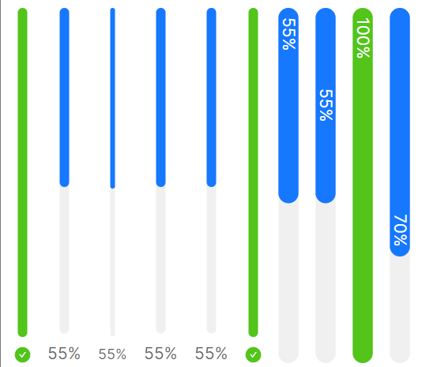
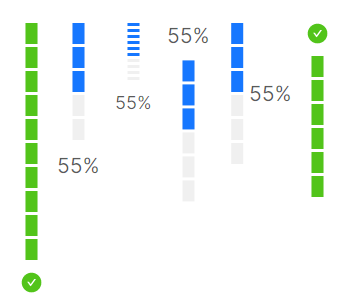

# 竖向进度条

`atom:ProgressBar` 是视觉上连续的不间断的进度条，而 `atom:StepsProgressBar` 则为带有隔断的进度条。但是二者共同遵循 `Orientation` 属性，该属于可以设定进度条方向，可选值为 `Horizontal` 和 `Vertical`。



```axaml
<StackPanel Orientation="Horizontal" Spacing="10" Height="300">
    <atom:ProgressBar Value="100" Minimum="0" Maximum="100" Orientation="Vertical" />
    <atom:ProgressBar Value="55" Minimum="0" Maximum="100" Orientation="Vertical" />
    <atom:ProgressBar Value="55" Minimum="0" Maximum="100" Orientation="Vertical" SizeType="Small" />
    <atom:ProgressBar Value="55" Minimum="0" Maximum="100" Orientation="Vertical"
                      PercentPosition="{Binding OutterStartPercentPosition}" />
    <atom:ProgressBar Value="55" Minimum="0" Maximum="100" Orientation="Vertical"
                      PercentPosition="{Binding OutterCenterPercentPosition}" />
    <atom:ProgressBar Value="100" Minimum="0" Maximum="100" Orientation="Vertical"
                      PercentPosition="{Binding OutterStartPercentPosition}" />

    <atom:ProgressBar Value="55" Minimum="0" Maximum="100" Orientation="Vertical"
                      PercentPosition="{Binding InnerStartPercentPosition}" />
    <atom:ProgressBar Value="55" Minimum="0" Maximum="100" Orientation="Vertical"
                      PercentPosition="{Binding InnerCenterPercentPosition}" />
    <atom:ProgressBar Value="100" Minimum="0" Maximum="100" Orientation="Vertical"
                      PercentPosition="{Binding InnerStartPercentPosition}" />
    <atom:ProgressBar Value="70" Minimum="0" Maximum="100" Orientation="Vertical"
                      PercentPosition="{Binding InnerEndPercentPosition}" />
</StackPanel>
```



```axaml
<StackPanel Orientation="Horizontal" Spacing="10" Height="300">
    <atom:StepsProgressBar Value="100" Minimum="0" Maximum="100" Steps="10" Orientation="Vertical"
                           PercentPosition="End" />
    <atom:StepsProgressBar Value="55" Minimum="0" Maximum="100" Steps="5" Orientation="Vertical" />
    <atom:StepsProgressBar Value="55" Minimum="0" Maximum="100" Steps="10" Orientation="Vertical"
                           SizeType="Small" />
    <atom:StepsProgressBar Value="55" Minimum="0" Maximum="100" Steps="6" Orientation="Vertical"
                           PercentPosition="Start" />
    <atom:StepsProgressBar Value="55" Minimum="0" Maximum="100" Steps="6" Orientation="Vertical"
                           PercentPosition="Center" />
    <atom:StepsProgressBar Value="100" Minimum="0" Maximum="100" Steps="6" Orientation="Vertical"
                           PercentPosition="Start" />
</StackPanel>
```
