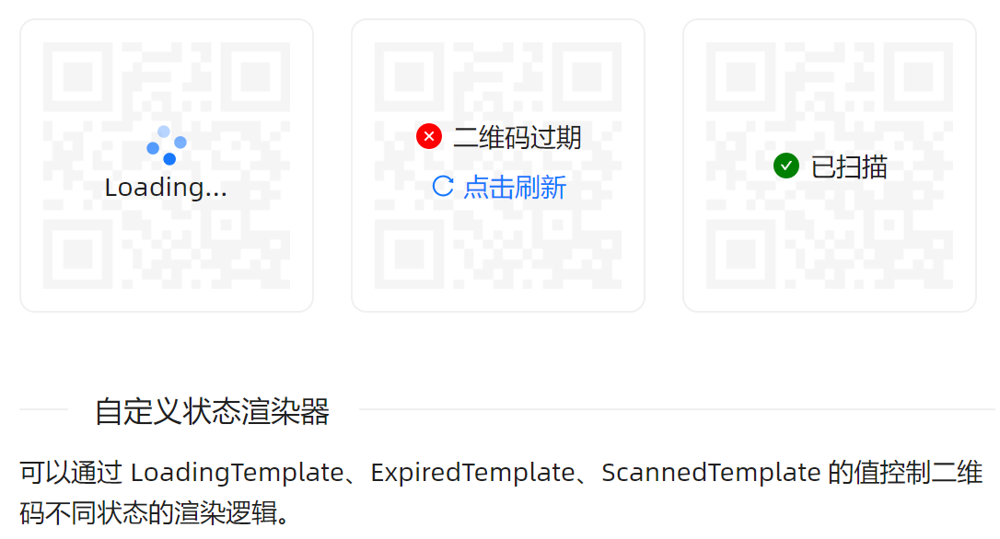
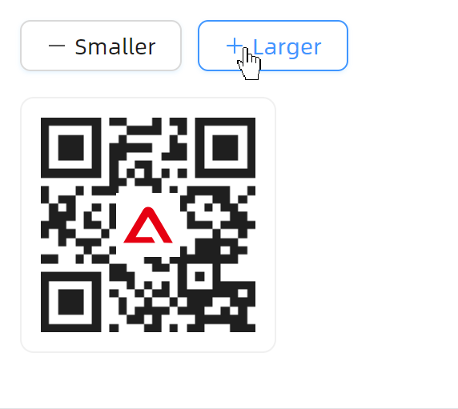
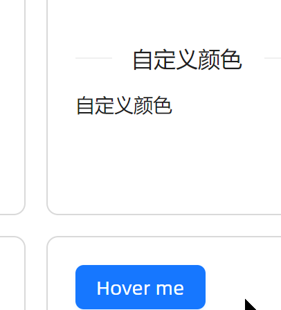

# QRcode 高级用法

### 自定义状态



```xaml
<WrapPanel ItemSpacing="20" LineSpacing="20" Orientation="Horizontal">
    <atom:QRCode Value="https://atomui.net" Status="Loading">
        <atom:QRCode.LoadingContent>
            <StackPanel Orientation="Vertical" HorizontalAlignment="Center" VerticalAlignment="Center">
                <atom:Spin IsSpinning="True" HorizontalAlignment="Center"/>
                <atom:TextBlock>Loading...</atom:TextBlock>
            </StackPanel>
        </atom:QRCode.LoadingContent>
    </atom:QRCode>
    <atom:QRCode Value="https://atomui.net" Status="Expired">
        <atom:QRCode.ExpiredContent>
            <StackPanel Orientation="Vertical" HorizontalAlignment="Center" VerticalAlignment="Center">
                <StackPanel Orientation="Horizontal" HorizontalAlignment="Center"
                            VerticalAlignment="Center" Spacing="5">
                    <antdicons:CloseCircleFilled FillBrush="Red" Width="16" Height="16" />
                    <atom:TextBlock HorizontalAlignment="Center" VerticalAlignment="Center">二维码过期</atom:TextBlock>
                </StackPanel>
                <atom:Button HorizontalAlignment="Center"
                             Icon="{antdicons:AntDesignIconProvider Kind=ReloadOutlined}" ButtonType="Link">
                    点击刷新
                </atom:Button>
            </StackPanel>
        </atom:QRCode.ExpiredContent>
    </atom:QRCode>
    <atom:QRCode Value="https://atomui.net" Status="Scanned">
        <atom:QRCode.ScannedContent>
            <StackPanel Orientation="Horizontal" HorizontalAlignment="Center"
                        VerticalAlignment="Center"
                        Spacing="5">
                <antdicons:CheckCircleFilled FillBrush="Green" Width="16" Height="16" />
                <atom:TextBlock HorizontalAlignment="Center" VerticalAlignment="Center">已扫描</atom:TextBlock>
            </StackPanel>
        </atom:QRCode.ScannedContent>
    </atom:QRCode>
</WrapPanel>
```

### 自定义尺寸



```xaml
<StackPanel Orientation="Vertical">
    <StackPanel Orientation="Horizontal" Spacing="10" Margin="0,0,0,16">
        <atom:Button Icon="{antdicons:AntDesignIconProvider Kind=MinusOutlined}" Command="{Binding SmallerCommand}">Smaller</atom:Button>
        <atom:Button Icon="{antdicons:AntDesignIconProvider Kind=PlusOutlined}" Command="{Binding LargerCommand}">Larger</atom:Button>
    </StackPanel>
    <atom:QRCode Value="https://atomui.net" Icon="avares://AtomUIGallery/Assets/ATOMUI-LOGO.png"
                 Size="{Binding Size}" IconSize="{Binding IconSize}" />
</StackPanel>
```

### 自定义颜色


```xaml
<StackPanel Orientation="Horizontal" Spacing="10">
    <atom:QRCode Value="https://atomui.net"
                 Color="{DynamicResource {x:Static atom:SharedTokenKey.ColorSuccessText}}" />
    <atom:QRCode Value="https://atomui.net"
                 Color="{DynamicResource {x:Static atom:SharedTokenKey.ColorInfoText}}"
                 Background="{DynamicResource {x:Static atom:SharedTokenKey.ColorBgLayout}}" />
</StackPanel>
```

### 气泡二维码



```xaml
<atom:FlyoutHost Trigger="Hover">
    <atom:FlyoutHost.Flyout>
        <atom:Flyout>
            <atom:QRCode Value="https://atomui.net" IsBordered="False" />
        </atom:Flyout>
    </atom:FlyoutHost.Flyout>
    <atom:Button ButtonType="Primary">Hover me</atom:Button>
</atom:FlyoutHost>
```

### 公共文件

view-model文件：
```csharp
using System.Reactive;
using AtomUI.Controls;
using AtomUI.Desktop.Controls;
using ReactiveUI;

namespace AtomUIGallery.ShowCases.ViewModels;

public class QRCodeViewModel : ReactiveObject, IRoutableViewModel
{
    public static TreeNodeKey ID = "QRCode";

    public IScreen HostScreen { get; }

    public string UrlPathSegment { get; } = ID.ToString();
    private const double MinSize = 48;
    private const double MaxSize = 300;

    private string _qrCodeInput = "https://atomui.net";

    public string QRCodeInput
    {
        get => _qrCodeInput;
        set => this.RaiseAndSetIfChanged(ref _qrCodeInput, value);
    }

    private int _size = 160;

    public int Size
    {
        get => _size;
        set => this.RaiseAndSetIfChanged(ref _size, value);
    }

    private readonly ObservableAsPropertyHelper<int> _iconSize;

    public int IconSize => _iconSize.Value;

    private List<QRCodeEccLevel> _eccLevels = [];

    public List<QRCodeEccLevel> EccLevels
    {
        get => _eccLevels;
        set => this.RaiseAndSetIfChanged(ref _eccLevels, value);
    }

    public ReactiveCommand<Button, Unit> SmallerCommand { get; }
    public ReactiveCommand<Button, Unit> LargerCommand { get; }

    public QRCodeViewModel(IScreen screen)
    {
        HostScreen = screen;
        var smallerCanExecute = this.WhenAnyValue(x => x.Size, size => size > MinSize);
        var largerCanExecute  = this.WhenAnyValue(x => x.Size, size => size < MaxSize);
        SmallerCommand = ReactiveCommand.Create<Button>(_ => { Size -= 10; }, smallerCanExecute);
        LargerCommand  = ReactiveCommand.Create<Button>(_ => { Size += 10; }, largerCanExecute);
        EccLevels =
        [
            QRCodeEccLevel.L,
            QRCodeEccLevel.M,
            QRCodeEccLevel.Q,
            QRCodeEccLevel.H
        ];
        _iconSize = this.WhenAnyValue(x => x.Size, size => size / 4).ToProperty(this, x => x.IconSize);
    }
}
```