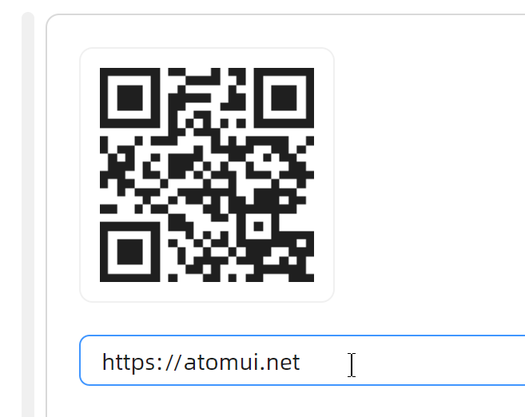

# QRCode 二维码

## 简介

能够将文本转换为二维码的组件。当需要将链接、文本等信息转换为二维码展示时，可使用 QRCode 组件。AtomUI 的 QRCode 组件支持自定义颜色、图标、尺寸，内置多种状态控制，并提供四种纠错等级，满足各类业务场景需求。

## 何时使用

- 需要将链接转换为二维码供用户扫描时
- 需要在页面中展示可识别的二维码图形时
- 需要对二维码进行状态管理（加载中、已过期、已扫描）时
- 需要在有限空间内通过气泡弹出二维码时

## 主要特性

- **多种状态** — 内置 Active、Loading、Expired、Scanned 四种状态，支持自定义状态内容模板
- **自定义图标** — 通过 Icon 属性为二维码中心设置自定义图标
- **自定义颜色** — 通过 Color 属性自定义二维码前景色
- **纠错等级** — 支持 L、M、Q、H 四种纠错等级，适应不同场景需求
- **尺寸控制** — 通过 Size 和 IconSize 属性灵活控制二维码及图标大小
- **刷新事件** — 提供 RefreshRequested 事件，方便处理二维码过期后的刷新逻辑
- **边框控制** — IsBordered 属性控制是否显示边框，便于嵌入气泡等场景
