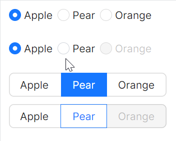
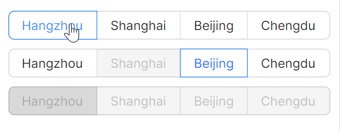
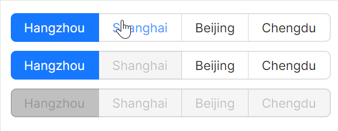
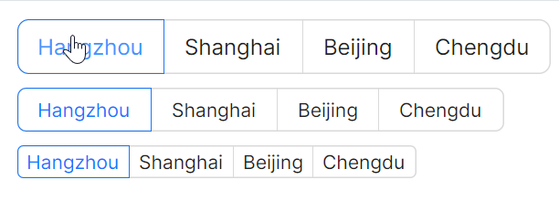

# 按钮选项

### 基础用法

`AtomUI` 还额外提供一个叫做 `OptionButton` 的组件，这个组件一般是和 `OptionButtonGroup` 搭配使用的。

`OptionButton` 本质上是继承了 `AvaloniaRadioButton` 类，与 `RadioButton` 是同级的组件，但是 `OptionButton` 组件提供了按钮形式的选项，同时也可以支持设定大小尺寸。



```axaml
<StackPanel Orientation="Vertical" Spacing="10">
    <StackPanel Orientation="Horizontal" HorizontalAlignment="Left">
        <atom:RadioButton IsChecked="True">Apple</atom:RadioButton>
        <atom:RadioButton>Pear</atom:RadioButton>
        <atom:RadioButton>Orange</atom:RadioButton>
    </StackPanel>
    <StackPanel Orientation="Horizontal" HorizontalAlignment="Left">
        <atom:RadioButton IsChecked="True">Apple</atom:RadioButton>
        <atom:RadioButton>Pear</atom:RadioButton>
        <atom:RadioButton IsEnabled="False">Orange</atom:RadioButton>
    </StackPanel>
    <atom:OptionButtonGroup ButtonStyle="Solid">
        <atom:OptionButton IsChecked="True">Apple</atom:OptionButton>
        <atom:OptionButton>Pear</atom:OptionButton>
        <atom:OptionButton>Orange</atom:OptionButton>
    </atom:OptionButtonGroup>
    
    <atom:OptionButtonGroup ButtonStyle="Outline">
        <atom:OptionButton>Apple</atom:OptionButton>
        <atom:OptionButton IsChecked="True">Pear</atom:OptionButton>
        <atom:OptionButton IsEnabled="False">Orange</atom:OptionButton>
    </atom:OptionButtonGroup>
</StackPanel>
```

### 不同风格

`OptionButton` 可以自由组合 `IsChecked` 与 `IsEnabled` 属性来实现各种不同效果。



```axaml
<StackPanel Orientation="Vertical" Spacing="10">
    <atom:OptionButtonGroup>
        <atom:OptionButton IsChecked="True">Hangzhou</atom:OptionButton>
        <atom:OptionButton>Shanghai</atom:OptionButton>
        <atom:OptionButton>Beijing</atom:OptionButton>
        <atom:OptionButton>Chengdu</atom:OptionButton>
    </atom:OptionButtonGroup>

    <atom:OptionButtonGroup>
        <atom:OptionButton IsChecked="True">Hangzhou</atom:OptionButton>
        <atom:OptionButton IsEnabled="False">Shanghai</atom:OptionButton>
        <atom:OptionButton>Beijing</atom:OptionButton>
        <atom:OptionButton>Chengdu</atom:OptionButton>
    </atom:OptionButtonGroup>

    <atom:OptionButtonGroup>
        <atom:OptionButton IsChecked="True" IsEnabled="False">Hangzhou</atom:OptionButton>
        <atom:OptionButton IsEnabled="False">Shanghai</atom:OptionButton>
        <atom:OptionButton IsEnabled="False">Beijing</atom:OptionButton>
        <atom:OptionButton IsEnabled="False">Chengdu</atom:OptionButton>
    </atom:OptionButtonGroup>

</StackPanel>
```

### Solid按钮风格

`ButtonStyle` 有两个可选值，分别为Solid与Outline。 



```axaml
<StackPanel Orientation="Vertical" Spacing="10">

    <atom:OptionButtonGroup ButtonStyle="Solid">
        <atom:OptionButton IsChecked="True">Hangzhou</atom:OptionButton>
        <atom:OptionButton>Shanghai</atom:OptionButton>
        <atom:OptionButton>Beijing</atom:OptionButton>
        <atom:OptionButton>Chengdu</atom:OptionButton>
    </atom:OptionButtonGroup>

    <atom:OptionButtonGroup ButtonStyle="Solid">
        <atom:OptionButton IsChecked="True">Hangzhou</atom:OptionButton>
        <atom:OptionButton IsEnabled="False">Shanghai</atom:OptionButton>
        <atom:OptionButton>Beijing</atom:OptionButton>
        <atom:OptionButton>Chengdu</atom:OptionButton>
    </atom:OptionButtonGroup>

    <atom:OptionButtonGroup ButtonStyle="Solid">
        <atom:OptionButton IsChecked="True" IsEnabled="False">Hangzhou</atom:OptionButton>
        <atom:OptionButton IsEnabled="False">Shanghai</atom:OptionButton>
        <atom:OptionButton IsEnabled="False">Beijing</atom:OptionButton>
        <atom:OptionButton IsEnabled="False">Chengdu</atom:OptionButton>
    </atom:OptionButtonGroup>

</StackPanel>
```

### 大小尺寸

`SizeType` 属性，你一定搞得定！可选值有Large、Middle、Small三种。



```axaml
<StackPanel Orientation="Vertical" Spacing="10">
    <atom:OptionButtonGroup SizeType="Large">
        <atom:OptionButton IsChecked="True">Hangzhou</atom:OptionButton>
        <atom:OptionButton>Shanghai</atom:OptionButton>
        <atom:OptionButton>Beijing</atom:OptionButton>
        <atom:OptionButton>Chengdu</atom:OptionButton>
    </atom:OptionButtonGroup>

    <atom:OptionButtonGroup SizeType="Middle">
        <atom:OptionButton IsChecked="True">Hangzhou</atom:OptionButton>
        <atom:OptionButton>Shanghai</atom:OptionButton>
        <atom:OptionButton>Beijing</atom:OptionButton>
        <atom:OptionButton>Chengdu</atom:OptionButton>
    </atom:OptionButtonGroup>

    <atom:OptionButtonGroup SizeType="Small">
        <atom:OptionButton IsChecked="True">Hangzhou</atom:OptionButton>
        <atom:OptionButton>Shanghai</atom:OptionButton>
        <atom:OptionButton>Beijing</atom:OptionButton>
        <atom:OptionButton>Chengdu</atom:OptionButton>
    </atom:OptionButtonGroup>

</StackPanel>
```