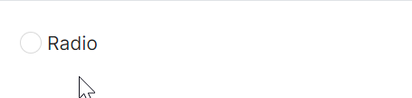
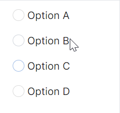

# RadioButton 快速入门

### 前置条件

* 通过 NuGet 安装 Avalonia
* 通过 NuGet 安装 AtomUI

在 AXAML 文件中引入 AtomUI 命名空间：

```xaml
xmlns:atom="https://atomui.net"
```

---

### 基础用法

最简单的 `RadioButton`，当选项被选中时 `IsChecked` 属性变为 `True`。



```xaml
<atom:RadioButton>Radio</atom:RadioButton>
```

---

### 竖向排列

将多个 `RadioButton` 放置在纵向的 `StackPanel` 中，即可实现竖向排列。



```xaml
<StackPanel Orientation="Vertical" HorizontalAlignment="Left">
    <atom:RadioButton>Option A</atom:RadioButton>
    <atom:RadioButton>Option B</atom:RadioButton>
    <atom:RadioButton>Option C</atom:RadioButton>
    <atom:RadioButton>Option D</atom:RadioButton>
</StackPanel>
```

---

### 禁用状态

通过 `IsEnabled` 属性控制单选按钮的可用状态。


```xaml
<StackPanel HorizontalAlignment="Left" Orientation="Vertical">
    <StackPanel Orientation="Horizontal">
        <atom:RadioButton x:Name="ToggleDisabledRadioUnChecked">Radio1</atom:RadioButton>
        <atom:RadioButton x:Name="ToggleDisabledRadioChecked" IsChecked="True">Radio2</atom:RadioButton>
    </StackPanel>
    <atom:Button ButtonType="Primary"
                 x:Name="ToggleDisabledButton"
                 Margin="0, 20, 0, 0"
                 Command="{Binding $parent[showCase:RadioButtonShowCase].ToggleDisabledStatus}"
                 CommandParameter="{Binding ElementName=ToggleDisabledButton}">
        toggle disabled
    </atom:Button>
</StackPanel>
```

---

### 图标单选组

在实际业务中，多个单选框常组成互斥的一组。同时也可以为每个选项添加图标，实现更加直观的选择体验。

```xaml
<WrapPanel Orientation="Horizontal" ItemSpacing="10">
    <atom:RadioButton>
        <StackPanel Spacing="5" Orientation="Vertical">
            <atom:Icon IconInfo="{atom:IconInfoProvider Kind=LineChartOutlined}"
                       Width="18"
                       Height="18"/>
            <TextBlock>LineChart</TextBlock>
        </StackPanel>
    </atom:RadioButton>
    <atom:RadioButton>
        <StackPanel Spacing="5" Orientation="Vertical">
            <atom:Icon IconInfo="{atom:IconInfoProvider Kind=DotChartOutlined}"
                       Width="18"
                       Height="18"/>
            <TextBlock>DotChart</TextBlock>
        </StackPanel>
    </atom:RadioButton>
    <atom:RadioButton>
        <StackPanel Spacing="5" Orientation="Vertical">
            <atom:Icon IconInfo="{atom:IconInfoProvider Kind=BarChartOutlined}"
                       Width="18"
                       Height="18"/>
            <TextBlock>BarChart</TextBlock>
        </StackPanel>
    </atom:RadioButton>
    <atom:RadioButton>
        <StackPanel Spacing="5" Orientation="Vertical">
            <atom:Icon IconInfo="{atom:IconInfoProvider Kind=PieChartOutlined}"
                       Width="18"
                       Height="18"/>
            <TextBlock>PieChart</TextBlock>
        </StackPanel>
    </atom:RadioButton>
</WrapPanel>
```

---

### OptionButton 基础用法

`OptionButton` 是 AtomUI 提供的按钮形式单选组件，继承自 `Avalonia.Controls.RadioButton`，通常与 `OptionButtonGroup` 搭配使用。`OptionButtonGroup` 的 `ButtonStyle` 属性支持 `Solid` 和 `Outline` 两种风格。


```xaml
<StackPanel Orientation="Vertical" Spacing="10">
    <StackPanel Orientation="Horizontal" HorizontalAlignment="Left">
        <atom:RadioButton IsChecked="True">Apple</atom:RadioButton>
        <atom:RadioButton>Pear</atom:RadioButton>
        <atom:RadioButton>Orange</atom:RadioButton>
    </StackPanel>
    <StackPanel Orientation="Horizontal" HorizontalAlignment="Left">
        <atom:RadioButton IsChecked="True">Apple</atom:RadioButton>
        <atom:RadioButton>Pear</atom:RadioButton>
        <atom:RadioButton IsEnabled="False">Orange</atom:RadioButton>
    </StackPanel>
    <atom:OptionButtonGroup ButtonStyle="Solid">
        <atom:OptionButton IsChecked="True">Apple</atom:OptionButton>
        <atom:OptionButton>Pear</atom:OptionButton>
        <atom:OptionButton>Orange</atom:OptionButton>
    </atom:OptionButtonGroup>

    <atom:OptionButtonGroup ButtonStyle="Outline">
        <atom:OptionButton>Apple</atom:OptionButton>
        <atom:OptionButton IsChecked="True">Pear</atom:OptionButton>
        <atom:OptionButton IsEnabled="False">Orange</atom:OptionButton>
    </atom:OptionButtonGroup>
</StackPanel>
```

---

### OptionButton 不同状态组合

`OptionButton` 支持自由组合 `IsChecked` 与 `IsEnabled` 属性，实现多种状态效果。


```xaml
<StackPanel Orientation="Vertical" Spacing="10">
    <atom:OptionButtonGroup>
        <atom:OptionButton IsChecked="True">Hangzhou</atom:OptionButton>
        <atom:OptionButton>Shanghai</atom:OptionButton>
        <atom:OptionButton>Beijing</atom:OptionButton>
        <atom:OptionButton>Chengdu</atom:OptionButton>
    </atom:OptionButtonGroup>

    <atom:OptionButtonGroup>
        <atom:OptionButton IsChecked="True">Hangzhou</atom:OptionButton>
        <atom:OptionButton IsEnabled="False">Shanghai</atom:OptionButton>
        <atom:OptionButton>Beijing</atom:OptionButton>
        <atom:OptionButton>Chengdu</atom:OptionButton>
    </atom:OptionButtonGroup>

    <atom:OptionButtonGroup>
        <atom:OptionButton IsChecked="True" IsEnabled="False">Hangzhou</atom:OptionButton>
        <atom:OptionButton IsEnabled="False">Shanghai</atom:OptionButton>
        <atom:OptionButton IsEnabled="False">Beijing</atom:OptionButton>
        <atom:OptionButton IsEnabled="False">Chengdu</atom:OptionButton>
    </atom:OptionButtonGroup>
</StackPanel>
```

---

### Solid 按钮风格

将 `OptionButtonGroup` 的 `ButtonStyle` 设为 `Solid`，实现填充式按钮风格。


```xaml
<StackPanel Orientation="Vertical" Spacing="10">
    <atom:OptionButtonGroup ButtonStyle="Solid">
        <atom:OptionButton IsChecked="True">Hangzhou</atom:OptionButton>
        <atom:OptionButton>Shanghai</atom:OptionButton>
        <atom:OptionButton>Beijing</atom:OptionButton>
        <atom:OptionButton>Chengdu</atom:OptionButton>
    </atom:OptionButtonGroup>

    <atom:OptionButtonGroup ButtonStyle="Solid">
        <atom:OptionButton IsChecked="True">Hangzhou</atom:OptionButton>
        <atom:OptionButton IsEnabled="False">Shanghai</atom:OptionButton>
        <atom:OptionButton>Beijing</atom:OptionButton>
        <atom:OptionButton>Chengdu</atom:OptionButton>
    </atom:OptionButtonGroup>

    <atom:OptionButtonGroup ButtonStyle="Solid">
        <atom:OptionButton IsChecked="True" IsEnabled="False">Hangzhou</atom:OptionButton>
        <atom:OptionButton IsEnabled="False">Shanghai</atom:OptionButton>
        <atom:OptionButton IsEnabled="False">Beijing</atom:OptionButton>
        <atom:OptionButton IsEnabled="False">Chengdu</atom:OptionButton>
    </atom:OptionButtonGroup>
</StackPanel>
```

---

### 尺寸

通过 `OptionButtonGroup` 的 `SizeType` 属性设置尺寸，可选值为 `Large`、`Middle`、`Small`。


```xaml
<StackPanel Orientation="Vertical" Spacing="10">
    <atom:OptionButtonGroup SizeType="Large">
        <atom:OptionButton IsChecked="True">Hangzhou</atom:OptionButton>
        <atom:OptionButton>Shanghai</atom:OptionButton>
        <atom:OptionButton>Beijing</atom:OptionButton>
        <atom:OptionButton>Chengdu</atom:OptionButton>
    </atom:OptionButtonGroup>

    <atom:OptionButtonGroup SizeType="Middle">
        <atom:OptionButton IsChecked="True">Hangzhou</atom:OptionButton>
        <atom:OptionButton>Shanghai</atom:OptionButton>
        <atom:OptionButton>Beijing</atom:OptionButton>
        <atom:OptionButton>Chengdu</atom:OptionButton>
    </atom:OptionButtonGroup>

    <atom:OptionButtonGroup SizeType="Small">
        <atom:OptionButton IsChecked="True">Hangzhou</atom:OptionButton>
        <atom:OptionButton>Shanghai</atom:OptionButton>
        <atom:OptionButton>Beijing</atom:OptionButton>
        <atom:OptionButton>Chengdu</atom:OptionButton>
    </atom:OptionButtonGroup>
</StackPanel>
```
