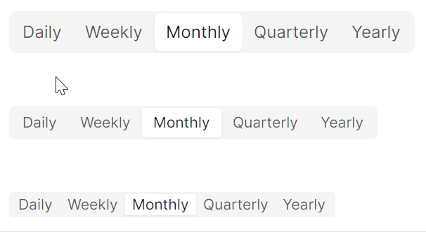
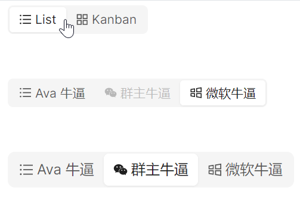

# Segmented 快速入门

### 基础配置条件

* Nuget安装Avalonia
* Nuget安装AtomUI

### 基础用法

`Segmented` 组件由 `atom:Segmented` 包裹内部的 `atom:SegmentedItem` 组成，点击即可在各选项间切换。


```xaml
<StackPanel HorizontalAlignment="Left" Orientation="Vertical" Spacing="10">
    <atom:Segmented Margin="20">
        <atom:SegmentedItem>Daily</atom:SegmentedItem>
        <atom:SegmentedItem>Weekly</atom:SegmentedItem>
        <atom:SegmentedItem>Monthly</atom:SegmentedItem>
        <atom:SegmentedItem>Quarterly</atom:SegmentedItem>
        <atom:SegmentedItem>Yearly</atom:SegmentedItem>
    </atom:Segmented>
</StackPanel>
```

### Block 模式

将 `IsExpanding` 设为 `True`，所有 `SegmentedItem` 将平均分配可用水平空间，每个选项宽度相等，整个控件占据父容器的完整宽度。


```xaml
<StackPanel HorizontalAlignment="Stretch" Orientation="Vertical">
    <atom:Segmented IsExpanding="True" Margin="20">
        <atom:SegmentedItem>123</atom:SegmentedItem>
        <atom:SegmentedItem>456</atom:SegmentedItem>
        <atom:SegmentedItem>longtext-longtext-longtext-longtext</atom:SegmentedItem>
    </atom:Segmented>
</StackPanel>
```

### 禁用状态

通过 `IsEnabled` 属性控制禁用状态。可以禁用整个控件，也可以单独禁用某个选项。


```xaml
<StackPanel HorizontalAlignment="Stretch" Orientation="Vertical" Spacing="10">
    <atom:Segmented Margin="20">
        <atom:SegmentedItem IsEnabled="False">Map</atom:SegmentedItem>
        <atom:SegmentedItem IsEnabled="False">Transit</atom:SegmentedItem>
        <atom:SegmentedItem IsEnabled="False">Satellite</atom:SegmentedItem>
    </atom:Segmented>
    <atom:Segmented>
        <atom:SegmentedItem>Daily</atom:SegmentedItem>
        <atom:SegmentedItem IsEnabled="False">Weekly</atom:SegmentedItem>
        <atom:SegmentedItem>Monthly</atom:SegmentedItem>
        <atom:SegmentedItem IsEnabled="False">Quarterly</atom:SegmentedItem>
        <atom:SegmentedItem>Yearly</atom:SegmentedItem>
    </atom:Segmented>
</StackPanel>
```

### 尺寸大小

通过 `SizeType` 属性设置控件尺寸，支持 `Large`、`Middle`（默认）、`Small` 三种大小。



```xaml
<StackPanel HorizontalAlignment="Left" Orientation="Vertical" Spacing="10">
    <atom:Segmented SizeType="Large" Margin="20">
        <atom:SegmentedItem>Daily</atom:SegmentedItem>
        <atom:SegmentedItem>Weekly</atom:SegmentedItem>
        <atom:SegmentedItem>Monthly</atom:SegmentedItem>
        <atom:SegmentedItem>Quarterly</atom:SegmentedItem>
        <atom:SegmentedItem>Yearly</atom:SegmentedItem>
    </atom:Segmented>

    <atom:Segmented Margin="20">
        <atom:SegmentedItem>Daily</atom:SegmentedItem>
        <atom:SegmentedItem>Weekly</atom:SegmentedItem>
        <atom:SegmentedItem>Monthly</atom:SegmentedItem>
        <atom:SegmentedItem>Quarterly</atom:SegmentedItem>
        <atom:SegmentedItem>Yearly</atom:SegmentedItem>
    </atom:Segmented>

    <atom:Segmented SizeType="Small" Margin="20">
        <atom:SegmentedItem>Daily</atom:SegmentedItem>
        <atom:SegmentedItem>Weekly</atom:SegmentedItem>
        <atom:SegmentedItem>Monthly</atom:SegmentedItem>
        <atom:SegmentedItem>Quarterly</atom:SegmentedItem>
        <atom:SegmentedItem>Yearly</atom:SegmentedItem>
    </atom:Segmented>
</StackPanel>
```

### 纯图标

通过 `Icon` 属性为 `SegmentedItem` 设置图标。不设置文字内容时，选项仅显示图标。


```xaml
<StackPanel HorizontalAlignment="Left" Orientation="Vertical" Spacing="10">
    <atom:Segmented Margin="20">
        <atom:SegmentedItem Icon="{atom:IconProvider Kind=BarsOutlined}" />
        <atom:SegmentedItem Icon="{atom:IconProvider Kind=AppstoreOutlined}" />
    </atom:Segmented>
</StackPanel>
```

### 图标与文字混合

同时设置 `Icon` 和文字内容，即可实现图标与文字的混合展示。



```xaml
<StackPanel HorizontalAlignment="Left" Orientation="Vertical" Spacing="10">
    <atom:Segmented Margin="20">
        <atom:SegmentedItem Icon="{atom:IconProvider Kind=BarsOutlined}">
            List
        </atom:SegmentedItem>
        <atom:SegmentedItem Content="Kanban" Icon="{atom:IconProvider Kind=AppstoreOutlined}" />
    </atom:Segmented>
</StackPanel>
```
