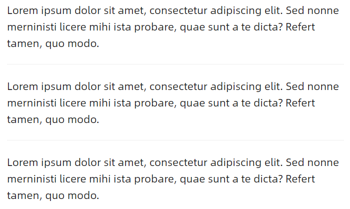
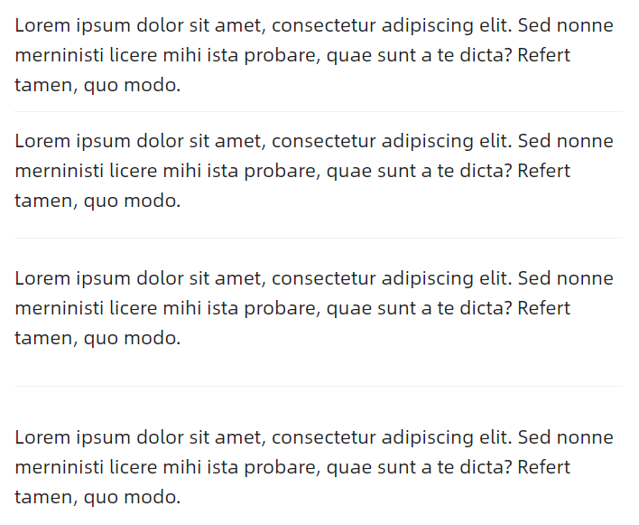
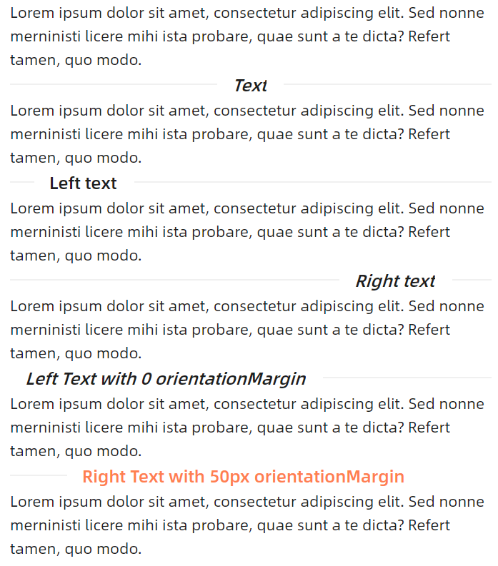
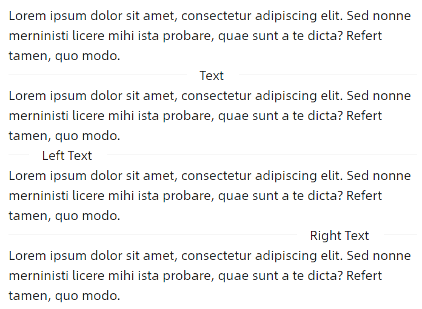
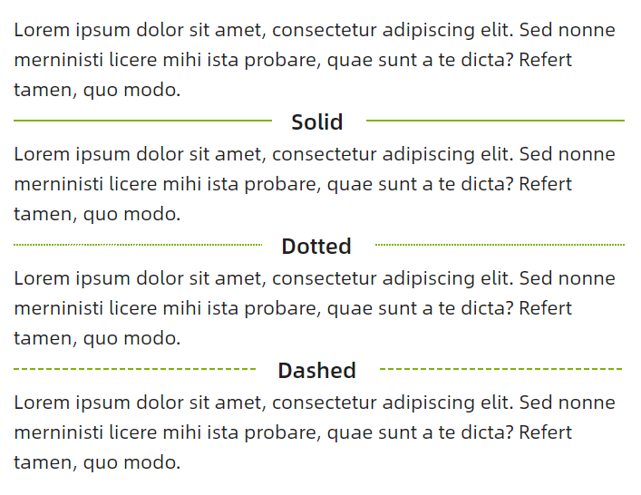
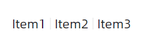

# Separator 快速入门

### 基础配置条件

* Nuget安装Avalonia
* Nuget安装AtomUI

### 基础用法

最简单的水平分隔线用法，直接在内容之间插入 `atom:Separator` 即可。



```xaml
<StackPanel Orientation="Vertical">
    <atom:TextBlock TextWrapping="Wrap">
        Lorem ipsum dolor sit amet, consectetur adipiscing elit. Sed nonne merninisti licere mihi ista probare, quae sunt a te dicta? Refert tamen, quo modo.
    </atom:TextBlock>
    <atom:Separator/>
    <atom:TextBlock TextWrapping="Wrap">
        Lorem ipsum dolor sit amet, consectetur adipiscing elit. Sed nonne merninisti licere mihi ista probare, quae sunt a te dicta? Refert tamen, quo modo.
    </atom:TextBlock>
    <atom:Separator/>
    <atom:TextBlock TextWrapping="Wrap">
        Lorem ipsum dolor sit amet, consectetur adipiscing elit. Sed nonne merninisti licere mihi ista probare, quae sunt a te dicta? Refert tamen, quo modo.
    </atom:TextBlock>
</StackPanel>
```

### 设置间距

通过 `SizeType` 属性来控制分隔线的上下间距，提供 `Small`、`Middle`、`Large` 三个值。



```xaml
<StackPanel Orientation="Vertical">
    <atom:TextBlock TextWrapping="Wrap">
        Lorem ipsum dolor sit amet, consectetur adipiscing elit. Sed nonne merninisti licere mihi ista probare, quae sunt a te dicta? Refert tamen, quo modo.
    </atom:TextBlock>
    <atom:Separator SizeType="Small"/>
    <atom:TextBlock TextWrapping="Wrap">
        Lorem ipsum dolor sit amet, consectetur adipiscing elit. Sed nonne merninisti licere mihi ista probare, quae sunt a te dicta? Refert tamen, quo modo.
    </atom:TextBlock>
    <atom:Separator SizeType="Middle"/>
    <atom:TextBlock TextWrapping="Wrap">
        Lorem ipsum dolor sit amet, consectetur adipiscing elit. Sed nonne merninisti licere mihi ista probare, quae sunt a te dicta? Refert tamen, quo modo.
    </atom:TextBlock>
    <atom:Separator SizeType="Large"/>
    <atom:TextBlock TextWrapping="Wrap">
        Lorem ipsum dolor sit amet, consectetur adipiscing elit. Sed nonne merninisti licere mihi ista probare, quae sunt a te dicta? Refert tamen, quo modo.
    </atom:TextBlock>
</StackPanel>
```

### 文字分隔线

通过 `Title` 属性设置分隔线中的文字，通过 `TitlePosition` 指定文字位置（`Left`、`Center`、`Right`），还可以通过 `FontStyle`、`FontWeight` 控制文字样式，通过 `TitleColor` 自定义文字颜色，通过 `OrientationMargin` 调整文字与边缘的距离。



```xaml
<StackPanel Orientation="Vertical">
    <atom:TextBlock TextWrapping="Wrap">
        Lorem ipsum dolor sit amet, consectetur adipiscing elit. Sed nonne merninisti licere mihi ista probare, quae sunt a te dicta? Refert tamen, quo modo.
    </atom:TextBlock>
    <atom:Separator Title="Text" FontStyle="Italic" />
    <atom:TextBlock TextWrapping="Wrap">
        Lorem ipsum dolor sit amet, consectetur adipiscing elit. Sed nonne merninisti licere mihi ista probare, quae sunt a te dicta? Refert tamen, quo modo.
    </atom:TextBlock>
    <atom:Separator Title="Left text" TitlePosition="Left" FontWeight="Bold" />
    <atom:TextBlock TextWrapping="Wrap">
        Lorem ipsum dolor sit amet, consectetur adipiscing elit. Sed nonne merninisti licere mihi ista probare, quae sunt a te dicta? Refert tamen, quo modo.
    </atom:TextBlock>
    <atom:Separator Title="Right text" TitlePosition="Right" FontStyle="Oblique" />
    <atom:TextBlock TextWrapping="Wrap">
        Lorem ipsum dolor sit amet, consectetur adipiscing elit. Sed nonne merninisti licere mihi ista probare, quae sunt a te dicta? Refert tamen, quo modo.
    </atom:TextBlock>
    <atom:Separator Title="Left Text with 0 orientationMargin" TitlePosition="Left" FontStyle="Oblique"
                    FontWeight="Medium" OrientationMargin="0" />
    <atom:TextBlock TextWrapping="Wrap">
        Lorem ipsum dolor sit amet, consectetur adipiscing elit. Sed nonne merninisti licere mihi ista probare, quae sunt a te dicta? Refert tamen, quo modo.
    </atom:TextBlock>
    <atom:Separator Title="Right Text with 50px orientationMargin" TitlePosition="Right" TitleColor="Coral"
                    FontWeight="Medium"
                    OrientationMargin="50" />
    <atom:TextBlock TextWrapping="Wrap">
        Lorem ipsum dolor sit amet, consectetur adipiscing elit. Sed nonne merninisti licere mihi ista probare, quae sunt a te dicta? Refert tamen, quo modo.
    </atom:TextBlock>
</StackPanel>
```

### 纯文本分隔线

通过 `IsPlain` 属性设置文字为普通正文样式，不带额外的字体装饰。



```xaml
<StackPanel Orientation="Vertical">
    <atom:TextBlock TextWrapping="Wrap">
        Lorem ipsum dolor sit amet, consectetur adipiscing elit. Sed nonne merninisti licere mihi ista probare, quae sunt a te dicta? Refert tamen, quo modo.
    </atom:TextBlock>
    <atom:Separator Title="Text" IsPlain="True"/>
    <atom:TextBlock TextWrapping="Wrap">
        Lorem ipsum dolor sit amet, consectetur adipiscing elit. Sed nonne merninisti licere mihi ista probare, quae sunt a te dicta? Refert tamen, quo modo.
    </atom:TextBlock>
    <atom:Separator Title="Left Text" TitlePosition="Left" IsPlain="True"/>
    <atom:TextBlock TextWrapping="Wrap">
        Lorem ipsum dolor sit amet, consectetur adipiscing elit. Sed nonne merninisti licere mihi ista probare, quae sunt a te dicta? Refert tamen, quo modo.
    </atom:TextBlock>
    <atom:Separator Title="Right Text" TitlePosition="Right" IsPlain="True"/>
    <atom:TextBlock TextWrapping="Wrap">
        Lorem ipsum dolor sit amet, consectetur adipiscing elit. Sed nonne merninisti licere mihi ista probare, quae sunt a te dicta? Refert tamen, quo modo.
    </atom:TextBlock>
</StackPanel>
```

### 线条变体

通过 `Variant` 属性改变分隔线的线条样式，支持 `Solid`（实线）、`Dotted`（点线）、`Dashed`（虚线）三种样式。可搭配 `LineColor` 自定义线条颜色。



```xaml
<StackPanel Orientation="Vertical">
    <atom:TextBlock TextWrapping="Wrap">
        Lorem ipsum dolor sit amet, consectetur adipiscing elit. Sed nonne merninisti licere mihi ista probare, quae sunt a te dicta? Refert tamen, quo modo.
    </atom:TextBlock>
    <atom:Separator Title="Solid" LineColor="#7cb305"/>
    <atom:TextBlock TextWrapping="Wrap">
        Lorem ipsum dolor sit amet, consectetur adipiscing elit. Sed nonne merninisti licere mihi ista probare, quae sunt a te dicta? Refert tamen, quo modo.
    </atom:TextBlock>
    <atom:Separator Title="Dotted" LineColor="#7cb305" Variant="Dotted"/>
    <atom:TextBlock TextWrapping="Wrap">
        Lorem ipsum dolor sit amet, consectetur adipiscing elit. Sed nonne merninisti licere mihi ista probare, quae sunt a te dicta? Refert tamen, quo modo.
    </atom:TextBlock>
    <atom:Separator Title="Dashed" LineColor="#7cb305" Variant="Dashed"/>
    <atom:TextBlock TextWrapping="Wrap">
        Lorem ipsum dolor sit amet, consectetur adipiscing elit. Sed nonne merninisti licere mihi ista probare, quae sunt a te dicta? Refert tamen, quo modo.
    </atom:TextBlock>
</StackPanel>
```

### 垂直分隔线

使用 `atom:VerticalSeparator` 组件可创建垂直方向的分隔线，可通过 `LineColor` 自定义颜色。



```xaml
<StackPanel Orientation="Horizontal">
    <atom:TextBlock>
        Item1
    </atom:TextBlock>
    <atom:VerticalSeparator Title="Right text" />
    <atom:TextBlock>
        Item2
    </atom:TextBlock>
    <atom:VerticalSeparator />
    <atom:TextBlock>
        Item3
    </atom:TextBlock>
</StackPanel>
```
