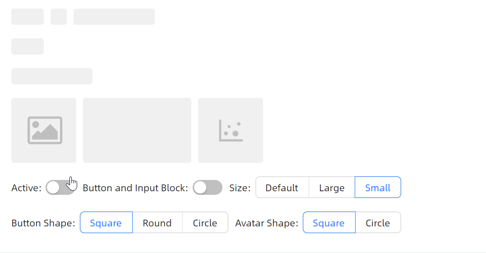
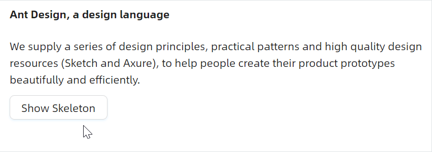

# 高级用法

### 支持多种组件

这个示例一定是开发者想要的，开发者的产品UI往往都是随业务而定的，内置布局并不能满足所有场景，所以 `Skeleton` 组件提供了几乎所有元素的占位符。



axaml文件：
```axaml
<StackPanel Orientation="Vertical" Spacing="20">
    <StackPanel Orientation="Horizontal" Spacing="10">
        <atom:SkeletonButton IsActive="{Binding IsSkeletonActive}" IsBlock="{Binding IsSkeletonBlock}"
                             SizeType="{Binding SkeletonButtonAndInputSizeType}"
                             Shape="{Binding SkeletonButtonShape}"/>
        <atom:SkeletonAvatar IsActive="{Binding IsSkeletonActive}"
                             SizeType="{Binding SkeletonButtonAndInputSizeType}"
                             Shape="{Binding SkeletonAvatarShape}"/>
        <atom:SkeletonInput IsActive="{Binding IsSkeletonActive}"
                            SizeType="{Binding SkeletonButtonAndInputSizeType}"/>
    </StackPanel>
    <atom:SkeletonButton IsActive="{Binding IsSkeletonActive}" IsBlock="{Binding IsSkeletonBlock}"
                         SizeType="{Binding SkeletonButtonAndInputSizeType}"
                         Shape="{Binding SkeletonButtonShape}"/>
    <atom:SkeletonInput IsActive="{Binding IsSkeletonActive}" IsBlock="{Binding IsSkeletonBlock}"
                        SizeType="{Binding SkeletonButtonAndInputSizeType}"/>

    <StackPanel Orientation="Horizontal" Spacing="10">
        <atom:SkeletonImage IsActive="{Binding IsSkeletonActive}"/>
        <atom:SkeletonNode IsActive="{Binding IsSkeletonActive}" Width="160"/>
        <atom:SkeletonNode IsActive="{Binding IsSkeletonActive}">
            <atom:Icon IconInfo="{atom:IconInfoProvider Kind=DotChartOutlined}"
                       NormalFilledBrush="#bfbfbf"
                       Width="40"
                       Height="40"/>
        </atom:SkeletonNode>
    </StackPanel>

    <WrapPanel Orientation="Horizontal" ItemSpacing="10" LineSpacing="20">
        <StackPanel Orientation="Horizontal" Spacing="5">
            <atom:TextBlock VerticalAlignment="Center">Active:</atom:TextBlock>
            <atom:ToggleSwitch VerticalAlignment="Center" IsChecked="{Binding IsSkeletonActive, Mode=TwoWay}"/>
        </StackPanel>

        <StackPanel Orientation="Horizontal" Spacing="5">
            <atom:TextBlock VerticalAlignment="Center">Button and Input Block:</atom:TextBlock>
            <atom:ToggleSwitch IsChecked="{Binding IsSkeletonBlock, Mode=TwoWay}" VerticalAlignment="Center"/>
        </StackPanel>

        <StackPanel Orientation="Horizontal" Spacing="5">
            <atom:TextBlock VerticalAlignment="Center">Size:</atom:TextBlock>
            <atom:OptionButtonGroup ButtonStyle="Outline" OptionCheckedChanged="HandleSizeTypeChanged">
                <atom:OptionButton IsChecked="True">Default</atom:OptionButton>
                <atom:OptionButton>Large</atom:OptionButton>
                <atom:OptionButton>Small</atom:OptionButton>
            </atom:OptionButtonGroup>
        </StackPanel>

        <StackPanel Orientation="Horizontal" Spacing="5">
            <atom:TextBlock VerticalAlignment="Center">Button Shape:</atom:TextBlock>
            <atom:OptionButtonGroup ButtonStyle="Outline" OptionCheckedChanged="HandleButtonShapeChanged">
                <atom:OptionButton IsChecked="True">Square</atom:OptionButton>
                <atom:OptionButton>Round</atom:OptionButton>
                <atom:OptionButton>Circle</atom:OptionButton>
            </atom:OptionButtonGroup>
        </StackPanel>

        <StackPanel Orientation="Horizontal" Spacing="5">
            <atom:TextBlock VerticalAlignment="Center">Avatar Shape:</atom:TextBlock>
            <atom:OptionButtonGroup ButtonStyle="Outline" OptionCheckedChanged="HandleButtonAvatarChanged">
                <atom:OptionButton>Square</atom:OptionButton>
                <atom:OptionButton IsChecked="True">Circle</atom:OptionButton>
            </atom:OptionButtonGroup>
        </StackPanel>
    </WrapPanel>
</StackPanel>
```

### 更多布局

这个示例是开发者真正需要使用时的样子，需要将使用 `Skeleton` 组件将需要异步延迟加载的组件包裹起来。

这种包裹特性本质上由于 `Skeleton` 组件继承了 `Avalonia` 中的 `TemplatedControl` 类，所以它是支持内部具备各种子元素 `Content` 的。



axaml文件：
```axaml
<StackPanel Orientation="Vertical" Spacing="10">
    <atom:Skeleton IsLoading="{Binding SkeletonLoading}">
        <StackPanel Orientation="Vertical" Spacing="20">
            <atom:TextBlock FontWeight="Bold">Ant Design, a design language</atom:TextBlock>
            <atom:TextBlock TextWrapping="Wrap">We supply a series of design principles, practical patterns and high quality design resources (Sketch and Axure), to help people create their product prototypes beautifully and efficiently.</atom:TextBlock>
        </StackPanel>
    </atom:Skeleton>
    <atom:Button IsEnabled="{Binding SkeletonLoading, Converter={x:Static BoolConverters.Not}}"
                 Click="HandleLoadingButtonClicked">Show Skeleton</atom:Button>
</StackPanel>
```
