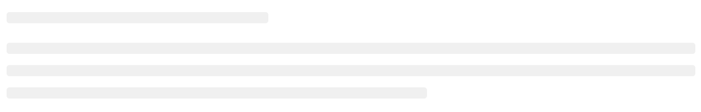
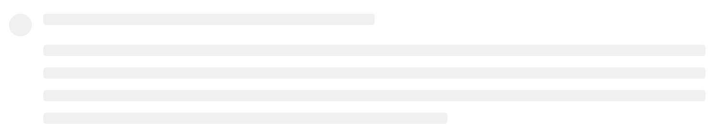
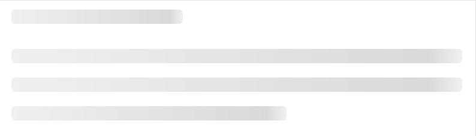

# 快速入门

### 基础配置条件

* Nuget安装Avalonia
* Nuget安装AtomUI

### 基础用法

这个基础示例中创建了一个Skeleton组件，并设置 `IsLoading` 属性为True，此时界面上就会展示 `Skeleton` 组件本身。

`IsLoading` 这个属性可能会让一部分开发者误认为是一种动画效果，实则不然，它仅仅是表示是否显示占位符。



axaml文件：
```axaml
<atom:Skeleton IsLoading="True"/>
```

### 更多布局

下面的示例使用内置布局演示一个较为常用的业务场景，用 `IsShowAvatar` 属性在左侧显示一个头像占位符，用 `ParagraphRows` 在右侧展示几行文本占位符。



axaml文件：
```axaml
<atom:Skeleton IsShowAvatar="True" ParagraphRows="4" IsLoading="True"/>
```

### loading状态

这个示例才是万众期待的动画效果，`IsActive` 属性设定为True，整个占位符区域将会展示一种过渡动画。



axaml文件：
```axaml
<atom:Skeleton IsActive="True" IsLoading="True"/>
```