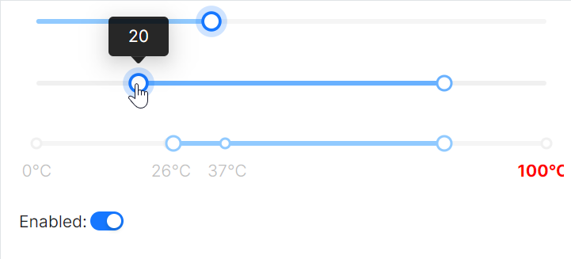

# AtomUI Slider快速入门

### 基础配置条件

* Nuget安装Avalonia
* Nuget安装AtomUI

### 基础用法

本基础用法案例中，关键属性的功能说明：

* `Maximum` 与 `Minimum`：设置了滑块的取值范围。
* `TickFrequency`：值设定为5表示刻度间隔为5。
* `IsEnabled`：绑定到NormalEnabled属性控制启用状态，NormalEnabled具体参考view-model代码。
* `Value`：设定为50表示UI初始值时显示为50。
* `IsRangeMode`：设定为True启用范围模式，显示两个滑块。
* `RangeValue`：设定为"20, 80"表示范围初始值，两个滑块分别位于20和80位置。
* `Marks`：SliderMarks绑定标记点数据，用于显示刻度标记，SliderMarks具体参考view-model代码。

使用 `ToggleSwitch` 控件绑定到NormalEnabled属性，用来控制整个控件的启用状态，点击事件的处理过程参考view-model文件。



axaml文件：
```axaml
<StackPanel Orientation="Vertical" Spacing="20">
    <atom:Slider
        Maximum="100"
        Minimum="0"
        TickFrequency="5"
        IsEnabled="{Binding NormalEnabled}"
        Value="50" />
    
    <atom:Slider
        Maximum="100"
        Minimum="0"
        IsRangeMode="True"
        TickFrequency="5"
        IsEnabled="{Binding NormalEnabled}"
        RangeValue="20, 80" />
    <atom:Slider
        Maximum="100"
        Minimum="0"
        IsEnabled="{Binding NormalEnabled}"
        IsRangeMode="True"
        TickFrequency="5"
        Marks="{Binding SliderMarks}"
        RangeValue="20, 80" />

    <StackPanel Orientation="Horizontal" Spacing="2">
        <atom:TextBlock VerticalAlignment="Center">Enabled:</atom:TextBlock>
        <atom:ToggleSwitch VerticalAlignment="Center" SizeType="Small" IsChecked="{Binding NormalEnabled, Mode=TwoWay}" />
    </StackPanel>
</StackPanel>
```

code-behind文件：
```csharp
using AtomUI.Controls;
using Avalonia.Collections;
using Avalonia.Media;
using ReactiveUI;
public class SliderViewModel : ReactiveObject, IRoutableViewModel
{
    public const string ID = "Slider";
    
    public IScreen HostScreen { get; }
    
    public string UrlPathSegment { get; } = ID;

    private AvaloniaList<SliderMark>? _sliderMarks;

    public AvaloniaList<SliderMark>? SliderMarks
    {
        get => _sliderMarks;
        set => this.RaiseAndSetIfChanged(ref _sliderMarks, value);
    }

    private bool _normalEnabled = true;

    public bool NormalEnabled
    {
        get => _normalEnabled;
        set => this.RaiseAndSetIfChanged(ref _normalEnabled, value);
    }
        
    public SliderViewModel(IScreen screen)
    {
        HostScreen  = screen;
        SliderMarks = new AvaloniaList<SliderMark>();
        SliderMarks.Add(new SliderMark("0°C", 0));
        SliderMarks.Add(new SliderMark("26°C", 26));
        SliderMarks.Add(new SliderMark("37°C", 37));
        SliderMarks.Add(new SliderMark("100°C", 100)
        {
            LabelFontWeight = FontWeight.Bold,
            LabelBrush      = new SolidColorBrush(Colors.Red)
        });
    }
}
```

view-model文件：
```csharp
using AtomUI.Controls;
using Avalonia.Collections;
using Avalonia.Media;
using ReactiveUI;
public class SliderViewModel : ReactiveObject, IRoutableViewModel
{
    public const string ID = "Slider";
    
    public IScreen HostScreen { get; }
    
    public string UrlPathSegment { get; } = ID;

    private AvaloniaList<SliderMark>? _sliderMarks;

    public AvaloniaList<SliderMark>? SliderMarks
    {
        get => _sliderMarks;
        set => this.RaiseAndSetIfChanged(ref _sliderMarks, value);
    }

    private bool _normalEnabled = true;

    public bool NormalEnabled
    {
        get => _normalEnabled;
        set => this.RaiseAndSetIfChanged(ref _normalEnabled, value);
    }
        
    public SliderViewModel(IScreen screen)
    {
        HostScreen  = screen;
        SliderMarks = new AvaloniaList<SliderMark>();
        SliderMarks.Add(new SliderMark("0°C", 0));
        SliderMarks.Add(new SliderMark("26°C", 26));
        SliderMarks.Add(new SliderMark("37°C", 37));
        SliderMarks.Add(new SliderMark("100°C", 100)
        {
            LabelFontWeight = FontWeight.Bold,
            LabelBrush      = new SolidColorBrush(Colors.Red)
        });
    }
}
```