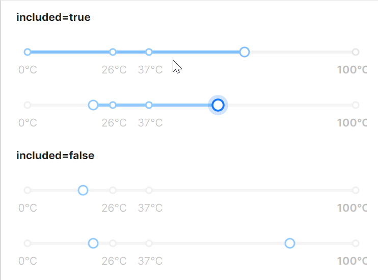

# 标签滑块

这个案例展示了滑块组件的标签滑块功能，默认情况下，滑块组件会根据Included属性的值来确定标记点是否高亮显示。

当Included设置为True时，标记点高亮显示，处于选中范围内的标记点会使用激活状态的样式，标记点边框颜色会使用MarkBorderColorActive而不是默认的MarkBorderColor。在范围模式（IsRangeMode="True"）下，两个滑块之间的轨道区域会被高亮显示；在单滑块模式下，从最小值到滑块位置的轨道区域会被高亮显示。

当Included设置为false时，标记点统一显示。所有标记点使用相同的样式，不区分是否在选中范围内。不对滑块之间的区域进行特殊高亮处理，滑块间的区域显示与普通轨道一致。



```axaml
<StackPanel Orientation="Vertical" Spacing="20">
    <atom:TextBlock FontWeight="Bold">included=true</atom:TextBlock>
    <atom:Slider
        Maximum="100"
        Minimum="0"
        TickFrequency="1"
        Marks="{Binding SliderMarks}"
        Value="20" />

    <atom:Slider
        Maximum="100"
        Minimum="0"
        IsRangeMode="True"
        TickFrequency="5"
        Marks="{Binding SliderMarks}"
        RangeValue="20, 80" />

    <atom:TextBlock FontWeight="Bold">included=false</atom:TextBlock>
    <atom:Slider
        Maximum="100"
        Minimum="0"
        TickFrequency="1"
        Marks="{Binding SliderMarks}"
        Included="False"
        Value="20" />

    <atom:Slider
        Maximum="100"
        Minimum="0"
        IsRangeMode="True"
        TickFrequency="5"
        Included="False"
        Marks="{Binding SliderMarks}"
        RangeValue="20, 80" />

</StackPanel>
```