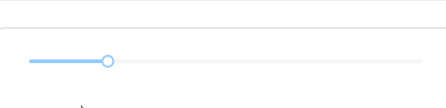

# Tooltips

本案例展示了如何在滑块上显示提示信息，重点关注如下属性：

* `IsSnapToTickEnabled`：设定为True启用刻度对齐，使滑块只能停在刻度点上。
* `ValueFormatTemplate`：按照指定的格式显示数字单位。"\{0\}%"设置值显示格式，将数值以百分比形式显示（如20显示为20%）。



```axaml
<StackPanel Orientation="Vertical" Spacing="20">
    <atom:Slider
        Maximum="100"
        Minimum="0"
        TickFrequency="1"
        IsSnapToTickEnabled="True"
        ValueFormatTemplate="\{0\}%"
        Value="20" />
</StackPanel>
```