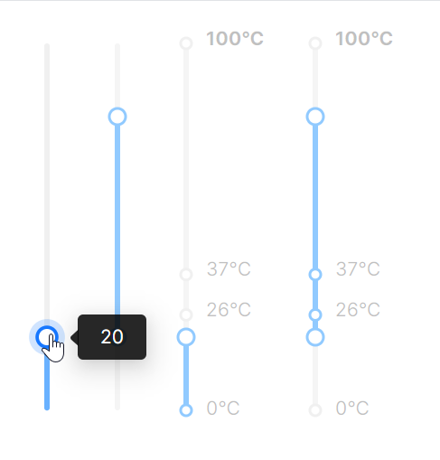

# 垂直Slider

这个案例展示了垂直方向的Slider组件，重点关注如下属性：

* `Orientation`：设定为Vertical设置滑块为垂直方向。
* `Marks`："{Binding SliderMarks}" 绑定标记点数据，在滑块旁显示刻度标记。



```axaml
<StackPanel Orientation="Horizontal" Spacing="20" Height="300">
    <atom:Slider
        Maximum="100"
        Minimum="0"
        Orientation="Vertical"
        TickFrequency="1"
        Value="20" />
    <atom:Slider
        Maximum="100"
        Minimum="0"
        Orientation="Vertical"
        TickFrequency="5"
        IsRangeMode="True"
        RangeValue="20, 80"
        IsSnapToTickEnabled="True"
        Value="20" />

    <atom:Slider
        Maximum="100"
        Minimum="0"
        Orientation="Vertical"
        TickFrequency="1"
        Marks="{Binding SliderMarks}"
        Value="20" />

    <atom:Slider
        Maximum="100"
        Minimum="0"
        IsRangeMode="True"
        Orientation="Vertical"
        TickFrequency="5"
        Marks="{Binding SliderMarks}"
        RangeValue="20, 80" />

</StackPanel>
```