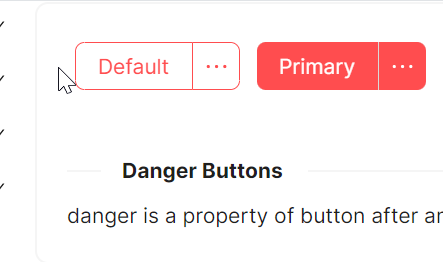
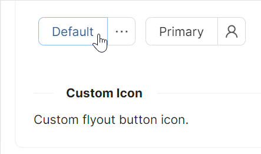

# SplitButton 快速入门

### 基础配置条件

* Nuget 安装 Avalonia
* Nuget 安装 AtomUI

### 基础用法

通过 `Flyout` 属性设置一个 `MenuFlyout`，即可实现基本的分裂按钮。左侧为主按钮，右侧为下拉触发按钮。


```xaml
<StackPanel>
    <atom:SplitButton>
        Default
        <atom:SplitButton.Flyout>
            <atom:MenuFlyout>
                <atom:MenuItem Header="Cut" InputGesture="Ctrl+X"
                               Icon="{atom:IconProvider Kind=ScissorOutlined}" />
                <atom:MenuItem Header="Copy" InputGesture="Ctrl+C"
                               Icon="{atom:IconProvider Kind=CopyOutlined}" />
                <atom:MenuItem Header="Delete" InputGesture="Ctrl+D"
                               Icon="{atom:IconProvider Kind=DeleteOutlined}" />
            </atom:MenuFlyout>
        </atom:SplitButton.Flyout>
    </atom:SplitButton>
</StackPanel>
```

### 危险状态

设置 `IsDanger="true"` 可将按钮切换为危险状态（红色系），适用于删除、重置等破坏性操作的场景。配合 `IsPrimaryButtonType` 可设置主按钮样式。



```xaml
<StackPanel>
    <atom:SplitButton IsDanger="true">
        Default
        <atom:SplitButton.Flyout>
            <atom:MenuFlyout>
                <atom:MenuItem Header="Cut" InputGesture="Ctrl+X"
                               Icon="{atom:IconProvider Kind=ScissorOutlined}" />
                <atom:MenuItem Header="Copy" InputGesture="Ctrl+C"
                               Icon="{atom:IconProvider Kind=CopyOutlined}" />
                <atom:MenuItem Header="Delete" InputGesture="Ctrl+D"
                               Icon="{atom:IconProvider Kind=DeleteOutlined}" />
            </atom:MenuFlyout>
        </atom:SplitButton.Flyout>
    </atom:SplitButton>

    <atom:SplitButton IsDanger="true" IsPrimaryButtonType="True">
        Primary
        <atom:SplitButton.Flyout>
            <atom:MenuFlyout>
                <atom:MenuItem Header="Cut" InputGesture="Ctrl+X"
                               Icon="{atom:IconProvider Kind=ScissorOutlined}" />
                <atom:MenuItem Header="Copy" InputGesture="Ctrl+C"
                               Icon="{atom:IconProvider Kind=CopyOutlined}" />
                <atom:MenuItem Header="Delete" InputGesture="Ctrl+D"
                               Icon="{atom:IconProvider Kind=DeleteOutlined}" />
            </atom:MenuFlyout>
        </atom:SplitButton.Flyout>
    </atom:SplitButton>
</StackPanel>
```

### 自定义图标

通过 `Icon` 属性可为主按钮设置图标，也可通过 `FlyoutButtonIcon` 为下拉按钮区域设置独立图标。`Icon` 类型为 `PathIcon`，详情参考 `Icon` 章节。



```xaml
<StackPanel>
    <atom:SplitButton>
        Default
        <atom:SplitButton.Flyout>
            <atom:MenuFlyout>
                <atom:MenuItem Header="Cut" InputGesture="Ctrl+X"
                               Icon="{atom:IconProvider Kind=ScissorOutlined}" />
                <atom:MenuItem Header="Copy" InputGesture="Ctrl+C"
                               Icon="{atom:IconProvider Kind=CopyOutlined}" />
                <atom:MenuItem Header="Delete" InputGesture="Ctrl+D"
                               Icon="{atom:IconProvider Kind=DeleteOutlined}" />
            </atom:MenuFlyout>
        </atom:SplitButton.Flyout>
    </atom:SplitButton>

    <atom:SplitButton FlyoutButtonIcon="{atom:IconProvider Kind=UserOutlined}">
        Primary
        <atom:SplitButton.Flyout>
            <atom:MenuFlyout>
                <atom:MenuItem Header="Cut" InputGesture="Ctrl+X"
                               Icon="{atom:IconProvider Kind=ScissorOutlined}" />
                <atom:MenuItem Header="Copy" InputGesture="Ctrl+C"
                               Icon="{atom:IconProvider Kind=CopyOutlined}" />
                <atom:MenuItem Header="Delete" InputGesture="Ctrl+D"
                               Icon="{atom:IconProvider Kind=DeleteOutlined}" />
            </atom:MenuFlyout>
        </atom:SplitButton.Flyout>
    </atom:SplitButton>
</StackPanel>
```

### 按钮尺寸

通过 `SizeType` 属性控制按钮尺寸，支持 `Large`、`Middle`、`Small` 三个值，默认为 `Middle`。


```xaml
<StackPanel>
    <atom:SplitButton SizeType="Large">
        Large
        <atom:SplitButton.Flyout>
            <atom:MenuFlyout>
                <atom:MenuItem Header="Cut" InputGesture="Ctrl+X"
                               Icon="{atom:IconProvider Kind=ScissorOutlined}" />
                <atom:MenuItem Header="Copy" InputGesture="Ctrl+C"
                               Icon="{atom:IconProvider Kind=CopyOutlined}" />
                <atom:MenuItem Header="Delete" InputGesture="Ctrl+D"
                               Icon="{atom:IconProvider Kind=DeleteOutlined}" />
            </atom:MenuFlyout>
        </atom:SplitButton.Flyout>
    </atom:SplitButton>
    <atom:SplitButton SizeType="Middle">
        Middle
        <atom:SplitButton.Flyout>
            <atom:MenuFlyout>
                <atom:MenuItem Header="Cut" InputGesture="Ctrl+X"
                               Icon="{atom:IconProvider Kind=ScissorOutlined}" />
                <atom:MenuItem Header="Copy" InputGesture="Ctrl+C"
                               Icon="{atom:IconProvider Kind=CopyOutlined}" />
                <atom:MenuItem Header="Delete" InputGesture="Ctrl+D"
                               Icon="{atom:IconProvider Kind=DeleteOutlined}" />
            </atom:MenuFlyout>
        </atom:SplitButton.Flyout>
    </atom:SplitButton>
    <atom:SplitButton SizeType="Small">
        Small
        <atom:SplitButton.Flyout>
            <atom:MenuFlyout>
                <atom:MenuItem Header="Cut" InputGesture="Ctrl+X"
                               Icon="{atom:IconProvider Kind=ScissorOutlined}" />
                <atom:MenuItem Header="Copy" InputGesture="Ctrl+C"
                               Icon="{atom:IconProvider Kind=CopyOutlined}" />
                <atom:MenuItem Header="Delete" InputGesture="Ctrl+D"
                               Icon="{atom:IconProvider Kind=DeleteOutlined}" />
            </atom:MenuFlyout>
        </atom:SplitButton.Flyout>
    </atom:SplitButton>
</StackPanel>
```

### 触发方式

通过 `TriggerType` 属性控制下拉菜单的触发方式，支持 `Click`（点击触发）和 `Hover`（悬停触发）两个值，默认为 `Click`。


```xaml
<StackPanel>
    <atom:SplitButton TriggerType="Hover">
        Hover Me
        <atom:SplitButton.Flyout>
            <atom:MenuFlyout>
                <atom:MenuItem Header="Cut" InputGesture="Ctrl+X"
                               Icon="{atom:IconProvider Kind=ScissorOutlined}" />
                <atom:MenuItem Header="Copy" InputGesture="Ctrl+C"
                               Icon="{atom:IconProvider Kind=CopyOutlined}" />
                <atom:MenuItem Header="Delete" InputGesture="Ctrl+D"
                               Icon="{atom:IconProvider Kind=DeleteOutlined}" />
            </atom:MenuFlyout>
        </atom:SplitButton.Flyout>
    </atom:SplitButton>

    <atom:SplitButton TriggerType="Click">
        Click Me
        <atom:SplitButton.Flyout>
            <atom:MenuFlyout>
                <atom:MenuItem Header="Cut" InputGesture="Ctrl+X"
                               Icon="{atom:IconProvider Kind=ScissorOutlined}" />
                <atom:MenuItem Header="Copy" InputGesture="Ctrl+C"
                               Icon="{atom:IconProvider Kind=CopyOutlined}" />
                <atom:MenuItem Header="Delete" InputGesture="Ctrl+D"
                               Icon="{atom:IconProvider Kind=DeleteOutlined}" />
            </atom:MenuFlyout>
        </atom:SplitButton.Flyout>
    </atom:SplitButton>
</StackPanel>
```
