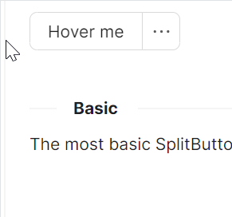

# SplitButton 快速入门

### 基础配置条件

* Nuget安装Avalonia
* Nuget安装AtomUI

### 基础用法



```axaml
<StackPanel>
    <atom:SplitButton TriggerType="Hover">
        Hover me
        <atom:SplitButton.Flyout>
            <atom:MenuFlyout>
                <atom:MenuItem Header="Cut" InputGesture="Ctrl+X"
                               Icon="{atom:IconProvider Kind=ScissorOutlined}" />
                <atom:MenuItem Header="Copy" InputGesture="Ctrl+C" Icon="{atom:IconProvider Kind=CopyOutlined}" />
                <atom:MenuItem Header="Delete" InputGesture="Ctrl+D"
                               Icon="{atom:IconProvider Kind=DeleteOutlined}" />
            </atom:MenuFlyout>
        </atom:SplitButton.Flyout>
    </atom:SplitButton>
</StackPanel>
```
