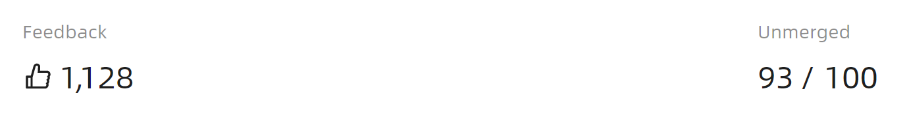

# Statistic 快速入门

### 基础配置条件

* Nuget安装Avalonia
* Nuget安装AtomUI

### 基础用法

通过 `Header` 设定标题，`Value` 设定展示数值。可使用 `Precision` 控制小数位数，将 `IsLoading` 设为 `True` 则显示加载中骨架屏。


```xaml
<UniformGrid Columns="2" Rows="2">
    <atom:Statistic Header="Active Users" Value="112893" />
    <StackPanel Orientation="Vertical" Spacing="16">
        <atom:Statistic Header="Account Balance (CNY)" Value="112893" Precision="2" />
        <atom:Button ButtonType="Primary">Recharge</atom:Button>
    </StackPanel>
    <atom:Statistic Header="Active Users" Value="112893" IsLoading="True" />
</UniformGrid>
```

### 前缀与后缀

通过 `ValuePrefixAddOn` 和 `ValueSuffixAddOn` 可以在数值前后添加图标或文字单位，满足"点赞数"、"百分比"等常见展示需求。



```xaml
<UniformGrid Columns="2" Rows="1">
    <atom:Statistic Header="Feedback" Value="1128" ValuePrefixAddOn="{antdicons:AntDesignIconProvider LikeOutlined}"/>
    <atom:Statistic Header="Unmerged" Value="93" ValueSuffixAddOn="/ 100"/>
</UniformGrid>
```
