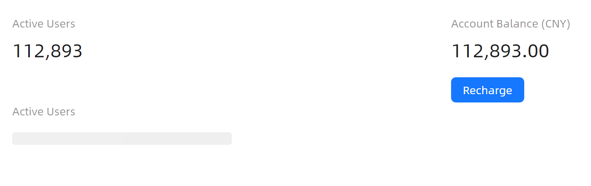

# Statistic 概述

### 简介

Statistic 统计数值组件用于突出展示某个或某组数据，适用于数据看板、概览页面等需要醒目呈现关键指标的场景。

### 何时使用

- 在数据看板或概览页面中，需要突出展示关键指标（如用户数、金额、完成率等）。
- 需要对数值进行格式化展示，例如设定精度、添加前缀/后缀单位。
- 数据加载过程中需要给予用户加载中的视觉反馈。

### 主要功能

- 展示标题（`Header`）与数值（`Value`）
- 支持设定数值精度（`Precision`）
- 支持加载中骨架屏状态（`IsLoading`）
- 支持自定义数值前缀与后缀（`ValuePrefixAddOn` / `ValueSuffixAddOn`），可设定图标或文字单位
- 支持自定义格式化函数（`Formatter`）
