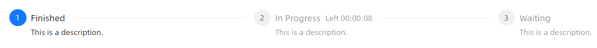
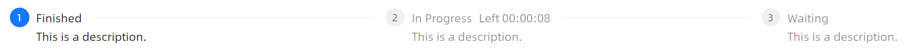
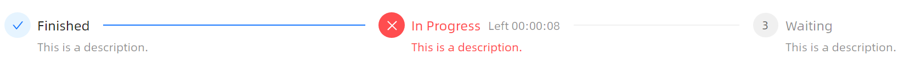
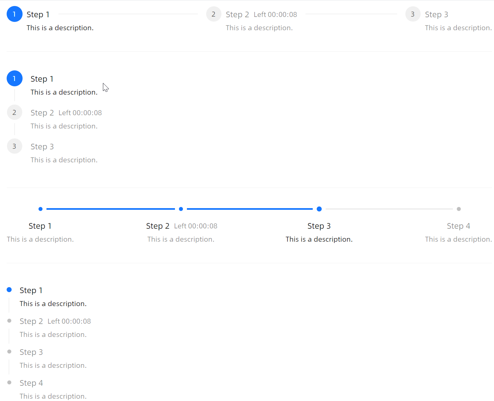
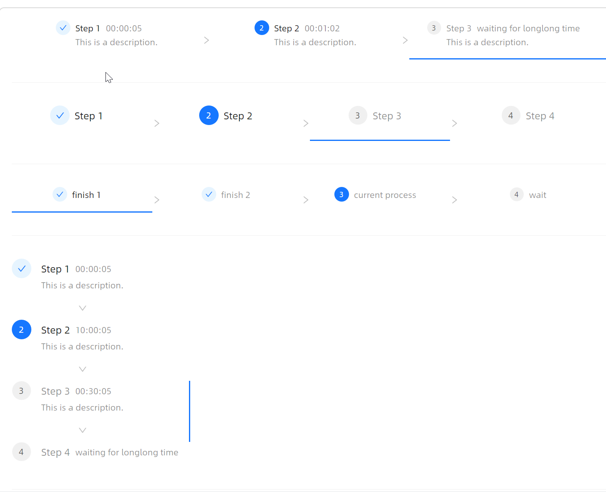
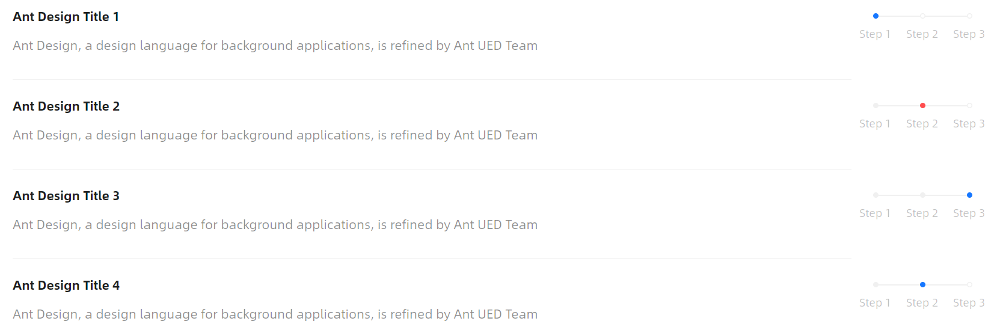
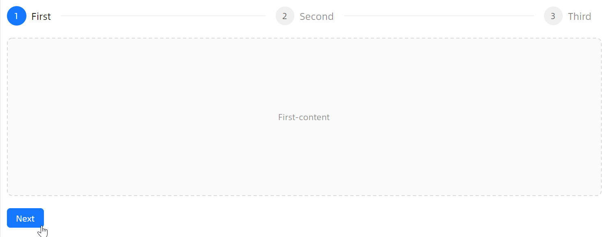

# 快速入门

### 基础配置条件

* Nuget 安装 Avalonia
* Nuget 安装 AtomUI

### 基础用法

最简单的步骤条，通过 `CurrentStep` 属性设置当前步骤的索引（从 0 开始）。每个 `StepsItem` 可以设置 `Header`（标题）和 `Description`（描述）。



```xaml
<atom:Steps CurrentStep="0">
    <atom:StepsItem Header="Finished" Description="This is a description." />
    <atom:StepsItem Header="In Progress" Description="This is a description." SubHeader="Left 00:00:08" />
    <atom:StepsItem Header="Waiting" Description="This is a description." />
</atom:Steps>
```

### Mini 尺寸

设置 `SizeType="Small"` 可以启用迷你尺寸的步骤条，适用于空间有限的场景。



```xaml
<atom:Steps CurrentStep="0" SizeType="Small">
    <atom:StepsItem Header="Finished" Description="This is a description." />
    <atom:StepsItem Header="In Progress" Description="This is a description." SubHeader="Left 00:00:08" />
    <atom:StepsItem Header="Waiting" Description="This is a description." />
</atom:Steps>
```

### 自定义图标

通过 `StepsItem` 的 `Icon` 属性可以为每个步骤设置自定义图标，支持 `IconProvider` 提供的所有图标。


```xaml
<atom:Steps CurrentStep="0">
    <atom:StepsItem Header="Login" Status="Finish" Icon="{atom:IconProvider Kind=UserOutlined}" />
    <atom:StepsItem Header="Verification" Status="Finish" Icon="{atom:IconProvider Kind=SolutionOutlined}" />
    <atom:StepsItem Header="Pay" Status="Process"
                    Icon="{atom:IconProvider Kind=LoadingOutlined, Animation=Spin}" />
    <atom:StepsItem Header="Done" Status="Wait" Icon="{atom:IconProvider Kind=SmileOutlined}" />
</atom:Steps>
```

### 垂直方向

设置 `Orientation="Vertical"` 使步骤条纵向排列。同样支持 Mini 尺寸。


```xaml
<atom:Steps CurrentStep="1" Orientation="Vertical">
    <atom:StepsItem Header="Finished" Description="This is a description." />
    <atom:StepsItem Header="In Progress" Description="This is a description." SubHeader="Left 00:00:08" />
    <atom:StepsItem Header="Waiting" Description="This is a description." />
</atom:Steps>
```


```xaml
<atom:Steps CurrentStep="1" Orientation="Vertical" SizeType="Small">
    <atom:StepsItem Header="Finished" Description="This is a description." />
    <atom:StepsItem Header="In Progress" Description="This is a description." SubHeader="Left 00:00:08" />
    <atom:StepsItem Header="Waiting" Description="This is a description." />
</atom:Steps>
```

### 点状指示器

设置 `ItemIndicatorType="Dot"` 可以将步骤指示器切换为点状样式，让视觉更加简洁。支持水平和垂直方向。


```xaml
<atom:Steps CurrentStep="1" ItemIndicatorType="Dot">
    <atom:StepsItem Header="Finished" Description="This is a description." />
    <atom:StepsItem Header="In Progress" Description="This is a description." SubHeader="Left 00:00:08" />
    <atom:StepsItem Header="Waiting" Description="This is a description." />
</atom:Steps>
```


```xaml
<atom:Steps CurrentStep="1" ItemIndicatorType="Dot" Orientation="Vertical">
    <atom:StepsItem Header="Finished" Description="This is a description." />
    <atom:StepsItem Header="In Progress" Description="This is a description." SubHeader="Left 00:00:08" />
    <atom:StepsItem Header="Waiting" Description="This is a description." />
</atom:Steps>
```

### 错误状态

通过 `CurrentStepStatus="Error"` 可以将当前步骤标记为错误状态，适用于表单校验失败等场景。



```xaml
<atom:Steps CurrentStep="1" CurrentStepStatus="Error">
    <atom:StepsItem Header="Finished" Description="This is a description." />
    <atom:StepsItem Header="In Progress" Description="This is a description." SubHeader="Left 00:00:08" />
    <atom:StepsItem Header="Waiting" Description="This is a description." />
</atom:Steps>
```

### 可点击步骤

设置 `IsItemClickable="True"` 允许用户通过点击步骤来切换当前步骤，适用于非线性流程。



```xaml
<atom:Steps CurrentStep="0" IsItemClickable="True">
    <atom:StepsItem Header="Step 1" Description="This is a description." />
    <atom:StepsItem Header="Step 2" Description="This is a description." SubHeader="Left 00:00:08"/>
    <atom:StepsItem Header="Step 3" Description="This is a description." />
</atom:Steps>
```

### 标签位置

通过 `LabelPlacement="Vertical"` 可以将标签放置在指示器下方，使布局更加紧凑。


```xaml
<atom:Steps CurrentStep="1" LabelPlacement="Vertical">
    <atom:StepsItem Header="Finished" Description="This is a description." />
    <atom:StepsItem Header="In Progress" Description="This is a description." SubHeader="Left 00:00:08" />
    <atom:StepsItem Header="Waiting" Description="This is a description." />
</atom:Steps>
```

### 导航样式

设置 `Style="Navigation"` 可以使用导航风格的步骤条，常用于页面顶部的导航区域。支持水平、垂直方向，以及与点状指示器组合使用。



```xaml
<atom:Steps CurrentStep="0" Style="Navigation" IsItemClickable="True">
    <atom:StepsItem Header="Step 1" Status="Finish"/>
    <atom:StepsItem Header="Step 2" Status="Process"/>
    <atom:StepsItem Header="Step 3" Status="Wait"/>
    <atom:StepsItem Header="Step 4" Status="Wait"/>
</atom:Steps>
```

### 内联样式

设置 `Style="Inline"` 可以将步骤条嵌入到列表项等内容中，以内联方式展示流程进度。



```xaml
<DockPanel LastChildFill="True">
    <atom:Steps CurrentStep="0" DockPanel.Dock="Right" Style="Inline">
        <atom:StepsItem Header="Step 1" Description="This is a description."/>
        <atom:StepsItem Header="Step 2" Description="This is a description."/>
        <atom:StepsItem Header="Step 3" Description="This is a description."/>
    </atom:Steps>
    <StackPanel Orientation="Vertical" Spacing="10">
        <TextBlock FontWeight="Bold">Ant Design Title 1</TextBlock>
        <TextBlock Foreground="{DynamicResource {x:Static atom:SharedTokenKey.ColorTextTertiary}}">
            Ant Design, a design language for background applications, is refined by Ant UED Team
        </TextBlock>
    </StackPanel>
</DockPanel>
```

### 带有进度

设置 `IsShowItemProgress="True"` 并指定 `ProgressValue`（范围 0-100），可以在当前步骤的指示器上展示环形进度条。


```xaml
<atom:Steps CurrentStep="1" ProgressValue="60" IsShowItemProgress="True">
    <atom:StepsItem Header="Finished" Description="This is a description." />
    <atom:StepsItem Header="In Progress" Description="This is a description." SubHeader="Left 00:00:08" />
    <atom:StepsItem Header="Waiting" Description="This is a description." />
</atom:Steps>
```

### 步骤内容切换

通过为 `StepsItem` 设置 `Content` 属性，可以实现步骤与内容区域的联动切换。使用 `CurrentContent` 和 `CurrentContentTemplate` 获取当前步骤的内容。



```xaml
<StackPanel Orientation="Vertical" Spacing="20">
    <atom:Steps Name="CurrentStepContentSteps" CurrentStep="{Binding CurrentStep}">
        <atom:StepsItem Header="First" Content="First-content" />
        <atom:StepsItem Header="Second" Content="Second-content" />
        <atom:StepsItem Header="Third" Content="Last-content" />
    </atom:Steps>
    <atom:DashedBorder BorderThickness="1"
                       BorderBrush="{DynamicResource {x:Static atom:SharedTokenKey.ColorBorder}}"
                       CornerRadius="{DynamicResource {x:Static atom:SharedTokenKey.BorderRadiusLG}}"
                       Background="{DynamicResource {x:Static atom:SharedTokenKey.ColorFillAlter}}"
                       TextElement.Foreground="{DynamicResource {x:Static atom:SharedTokenKey.ColorTextTertiary}}"
                       Height="260">
        <ContentPresenter Content="{Binding #CurrentStepContentSteps.CurrentContent}"
                          ContentTemplate="{Binding #CurrentStepContentSteps.CurrentContentTemplate}"
                          HorizontalAlignment="Center"
                          VerticalAlignment="Center" />
    </atom:DashedBorder>
    <StackPanel Orientation="Horizontal" Spacing="10">
        <atom:Button ButtonType="Primary" Content="Next" Name="NextStepButton" />
        <atom:Button ButtonType="Default" Content="Previous" Name="PreviousButton"
                     IsVisible="{Binding PreviousButtonVisible}" />
    </StackPanel>
</StackPanel>
```
