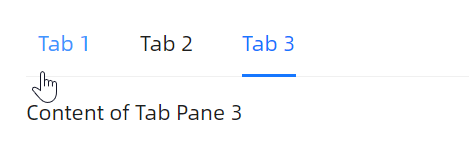
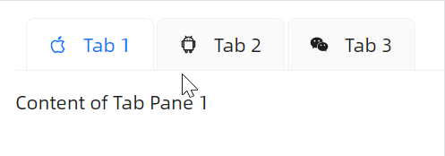
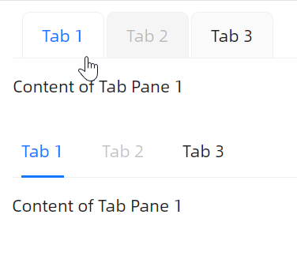
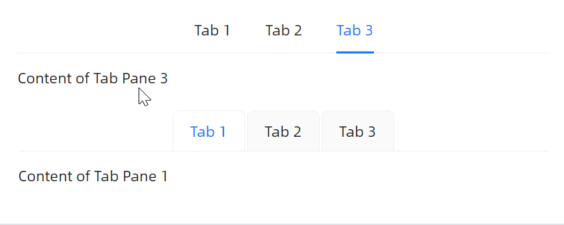
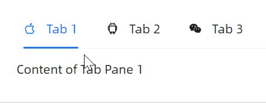
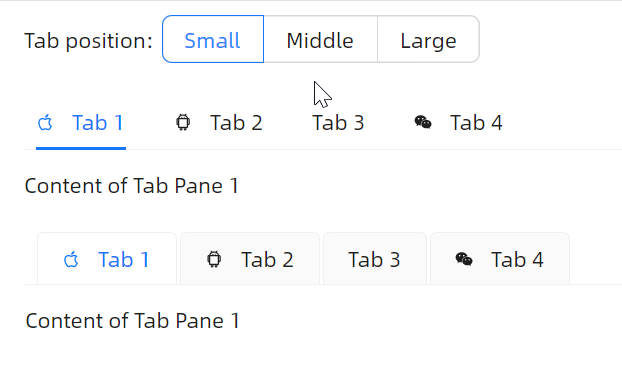
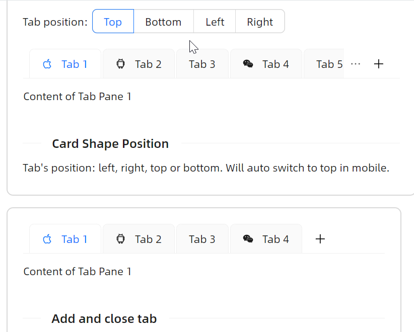
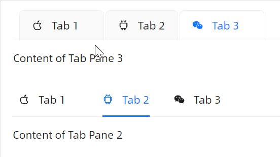

# 快速入门

### 基础配置条件

* Nuget安装Avalonia
* Nuget安装AtomUI

### 基础用法

最基本的用法是通过 `TabItem` 直接声明标签页，每个 `TabItem` 通过 `Header` 属性设置标签标题，内容直接放置在标签内部。



```xaml
<StackPanel Orientation="Vertical" Spacing="20">
    <atom:TabControl Name="TestControl">
        <atom:TabItem Header="Tab 1">Content of Tab Pane 1</atom:TabItem>
        <atom:TabItem Header="Tab 2">Content of Tab Pane 2</atom:TabItem>
        <atom:TabItem Header="Tab 3">Content of Tab Pane 3</atom:TabItem>
    </atom:TabControl>
</StackPanel>
```

### 卡片风格

如果需要卡片样式的选项卡，可以使用 `CardTabControl` 组件，用法与 `TabControl` 完全一致。



```xaml
<StackPanel Orientation="Vertical" Spacing="20">
    <atom:CardTabControl>
        <atom:TabItem Header="Tab 1" Icon="{atom:IconProvider Kind=AppleOutlined}">Content of Tab Pane 1</atom:TabItem>
        <atom:TabItem Header="Tab 2" Icon="{atom:IconProvider Kind=AndroidOutlined}">Content of Tab Pane 2</atom:TabItem>
        <atom:TabItem Header="Tab 3" Icon="{atom:IconProvider Kind=WechatOutlined}">Content of Tab Pane 3</atom:TabItem>
    </atom:CardTabControl>
</StackPanel>
```

### ItemsSource 绑定

在实际开发中，通常使用 `ItemsSource` 属性绑定数据集合来动态生成标签页，并通过 `ItemTemplate` 自定义内容模板。


```xaml
<StackPanel Orientation="Vertical" Spacing="20">
    <atom:TabControl ItemsSource="{Binding TabItemDataSource}">
        <atom:TabControl.ItemTemplate>
            <DataTemplate>
                <Border Padding="10">
                    <TextBlock Text="{Binding Content}" />
                </Border>
            </DataTemplate>
        </atom:TabControl.ItemTemplate>
    </atom:TabControl>
</StackPanel>
```

### 禁用标签

将 `TabItem` 的 `IsEnabled` 属性设为 `False`，可以禁用指定的标签页。禁用后该标签不可点击且呈现为灰色样式。



```xaml
<StackPanel Orientation="Vertical" Spacing="20">
    <atom:CardTabControl>
        <atom:TabItem Header="Tab 1">Content of Tab Pane 1</atom:TabItem>
        <atom:TabItem Header="Tab 2" IsEnabled="False">Content of Tab Pane 2</atom:TabItem>
        <atom:TabItem Header="Tab 3">Content of Tab Pane 3</atom:TabItem>
    </atom:CardTabControl>

    <atom:TabControl>
        <atom:TabItem Header="Tab 1">Content of Tab Pane 1</atom:TabItem>
        <atom:TabItem Header="Tab 2" IsEnabled="False">Content of Tab Pane 2</atom:TabItem>
        <atom:TabItem Header="Tab 3">Content of Tab Pane 3</atom:TabItem>
    </atom:TabControl>
</StackPanel>
```

### 居中对齐

将 `TabAlignmentCenter` 属性设置为 `True`，可以让标签栏整体居中显示。`TabControl` 和 `CardTabControl` 均支持此功能。



```xaml
<StackPanel Orientation="Vertical" Spacing="20">
    <atom:TabControl TabAlignmentCenter="True">
        <atom:TabItem Header="Tab 1">Content of Tab Pane 1</atom:TabItem>
        <atom:TabItem Header="Tab 2">Content of Tab Pane 2</atom:TabItem>
        <atom:TabItem Header="Tab 3">Content of Tab Pane 3</atom:TabItem>
    </atom:TabControl>

    <atom:CardTabControl TabAlignmentCenter="True">
        <atom:TabItem Header="Tab 1">Content of Tab Pane 1</atom:TabItem>
        <atom:TabItem Header="Tab 2">Content of Tab Pane 2</atom:TabItem>
        <atom:TabItem Header="Tab 3">Content of Tab Pane 3</atom:TabItem>
    </atom:CardTabControl>
</StackPanel>
```

### 带图标

通过 `TabItem` 的 `Icon` 属性为标签页添加图标，值为 `atom:IconProvider`。



```xaml
<StackPanel Orientation="Vertical" Spacing="20">
    <atom:TabControl>
        <atom:TabItem Header="Tab 1" Icon="{atom:IconProvider Kind=AppleOutlined}">Content of Tab Pane 1</atom:TabItem>
        <atom:TabItem Header="Tab 2" Icon="{atom:IconProvider Kind=AndroidOutlined}">Content of Tab Pane 2</atom:TabItem>
        <atom:TabItem Header="Tab 3" Icon="{atom:IconProvider Kind=WechatOutlined}">Content of Tab Pane 3</atom:TabItem>
    </atom:TabControl>
</StackPanel>
```

### 大小尺寸

通过 `SizeType` 属性可以设置标签页的尺寸，可选值有 `Large`、`Middle`、`Small`。`TabControl` 和 `CardTabControl` 均支持。



```xaml
<StackPanel Orientation="Vertical" Spacing="20">
    <atom:TabControl SizeType="Large">
        <atom:TabItem Header="Tab 1" Icon="{atom:IconProvider Kind=AppleOutlined}">Content of Tab Pane 1</atom:TabItem>
        <atom:TabItem Header="Tab 2" Icon="{atom:IconProvider Kind=AndroidOutlined}">Content of Tab Pane 2</atom:TabItem>
        <atom:TabItem Header="Tab 3">Content of Tab Pane 3</atom:TabItem>
    </atom:TabControl>

    <atom:CardTabControl SizeType="Small">
        <atom:TabItem Header="Tab 1" Icon="{atom:IconProvider Kind=AppleOutlined}">Content of Tab Pane 1</atom:TabItem>
        <atom:TabItem Header="Tab 2" Icon="{atom:IconProvider Kind=AndroidOutlined}">Content of Tab Pane 2</atom:TabItem>
        <atom:TabItem Header="Tab 3">Content of Tab Pane 3</atom:TabItem>
    </atom:CardTabControl>
</StackPanel>
```

### 标签位置

通过 `TabStripPlacement` 属性设置标签栏的位置，支持 `Top`、`Bottom`、`Left`、`Right` 四个方向。


```xaml
<StackPanel Orientation="Vertical" Spacing="20">
    <DockPanel Height="300">
        <atom:TabControl TabStripPlacement="Left">
            <atom:TabItem Header="Tab 1" Icon="{atom:IconProvider Kind=AppleOutlined}">Content of Tab Pane 1</atom:TabItem>
            <atom:TabItem Header="Tab 2" Icon="{atom:IconProvider Kind=AndroidOutlined}">Content of Tab Pane 2</atom:TabItem>
            <atom:TabItem Header="Tab 3">Content of Tab Pane 3</atom:TabItem>
        </atom:TabControl>
    </DockPanel>
</StackPanel>
```

卡片风格的选项卡同样支持四个方向的标签位置设定。



```xaml
<StackPanel Orientation="Vertical" Spacing="20">
    <DockPanel Height="300">
        <atom:CardTabControl TabStripPlacement="Right">
            <atom:TabItem Header="Tab 1" Icon="{atom:IconProvider Kind=AppleOutlined}">Content of Tab Pane 1</atom:TabItem>
            <atom:TabItem Header="Tab 2" Icon="{atom:IconProvider Kind=AndroidOutlined}">Content of Tab Pane 2</atom:TabItem>
            <atom:TabItem Header="Tab 3">Content of Tab Pane 3</atom:TabItem>
        </atom:CardTabControl>
    </DockPanel>
</StackPanel>
```

### 动态标签管理

#### 关闭标签

将 `IsTabClosable` 设为 `True`，标签页将显示关闭按钮。配合 `IsTabAutoHideCloseButton` 可以在鼠标未悬停时自动隐藏关闭按钮。如需某个标签不可关闭，可以在对应的 `TabItem` 上设置 `IsClosable="False"`。



```xaml
<StackPanel Orientation="Vertical" Spacing="20">
    <atom:CardTabControl IsTabClosable="True"
                         IsTabAutoHideCloseButton="True">
        <atom:TabItem Header="Tab 1" Icon="{atom:IconProvider Kind=AppleOutlined}">
            Content of Tab Pane 1
        </atom:TabItem>
        <atom:TabItem Header="Tab 2"
                      Icon="{atom:IconProvider Kind=AndroidOutlined}"
                      IsClosable="False">
            Content of Tab Pane 2
        </atom:TabItem>
        <atom:TabItem Header="Tab 3" Icon="{atom:IconProvider Kind=WechatOutlined}">
            Content of Tab Pane 3
        </atom:TabItem>
    </atom:CardTabControl>

    <atom:TabControl IsTabClosable="True"
                     IsTabAutoHideCloseButton="True">
        <atom:TabItem Header="Tab 1" Icon="{atom:IconProvider Kind=AppleOutlined}">
            Content of Tab Pane 1
        </atom:TabItem>
        <atom:TabItem Header="Tab 2"
                      Icon="{atom:IconProvider Kind=AndroidOutlined}"
                      IsClosable="False">
            Content of Tab Pane 2
        </atom:TabItem>
        <atom:TabItem Header="Tab 3" Icon="{atom:IconProvider Kind=WechatOutlined}">
            Content of Tab Pane 3
        </atom:TabItem>
    </atom:TabControl>
</StackPanel>
```

#### 添加标签

将 `IsShowAddTabButton` 设为 `True`，标签栏末尾将显示一个"+"按钮，用于动态添加新标签页。


```xaml
<atom:CardTabControl IsShowAddTabButton="True" Name="AddTabDemoTabControl">
    <atom:TabItem Header="Tab 1" Icon="{atom:IconProvider Kind=AppleOutlined}">Content of Tab Pane 1</atom:TabItem>
    <atom:TabItem Header="Tab 2" Icon="{atom:IconProvider Kind=AndroidOutlined}">Content of Tab Pane 2</atom:TabItem>
    <atom:TabItem Header="Tab 3">Content of Tab Pane 3</atom:TabItem>
    <atom:TabItem Header="Tab 4" Icon="{atom:IconProvider Kind=WechatOutlined}">Content of Tab Pane 4</atom:TabItem>
</atom:CardTabControl>
```

### 多标签滑动

当标签数量超出可视区域时，TabControl 会自动启用横向滑动功能，无需任何额外配置。该特性是 `TabControl` 和 `CardTabControl` 的内置能力。


```xaml
<StackPanel Orientation="Vertical" Spacing="20">
    <atom:TabControl>
        <atom:TabItem Header="Tab 1">Content of Tab Pane 1</atom:TabItem>
        <atom:TabItem Header="Tab 2">Content of Tab Pane 2</atom:TabItem>
        <atom:TabItem Header="Tab 3">Content of Tab Pane 3</atom:TabItem>
        <atom:TabItem Header="Tab 4">Content of Tab Pane 4</atom:TabItem>
        <atom:TabItem Header="Tab 5">Content of Tab Pane 5</atom:TabItem>
        <atom:TabItem Header="Tab 6">Content of Tab Pane 6</atom:TabItem>
        <atom:TabItem Header="Tab 7">Content of Tab Pane 7</atom:TabItem>
        <atom:TabItem Header="Tab 8">Content of Tab Pane 8</atom:TabItem>
        <atom:TabItem Header="Tab 9">Content of Tab Pane 9</atom:TabItem>
        <atom:TabItem Header="Tab 10">Content of Tab Pane 10</atom:TabItem>
    </atom:TabControl>

    <atom:CardTabControl>
        <atom:TabItem Header="Tab 1">Content of Tab Pane 1</atom:TabItem>
        <atom:TabItem Header="Tab 2">Content of Tab Pane 2</atom:TabItem>
        <atom:TabItem Header="Tab 3">Content of Tab Pane 3</atom:TabItem>
        <atom:TabItem Header="Tab 4">Content of Tab Pane 4</atom:TabItem>
        <atom:TabItem Header="Tab 5">Content of Tab Pane 5</atom:TabItem>
        <atom:TabItem Header="Tab 6">Content of Tab Pane 6</atom:TabItem>
        <atom:TabItem Header="Tab 7">Content of Tab Pane 7</atom:TabItem>
        <atom:TabItem Header="Tab 8">Content of Tab Pane 8</atom:TabItem>
        <atom:TabItem Header="Tab 9">Content of Tab Pane 9</atom:TabItem>
        <atom:TabItem Header="Tab 10">Content of Tab Pane 10</atom:TabItem>
    </atom:CardTabControl>
</StackPanel>
```
