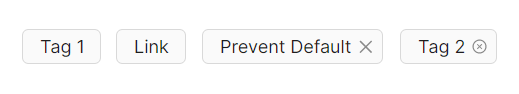
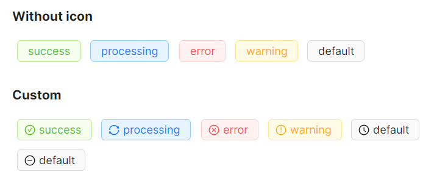
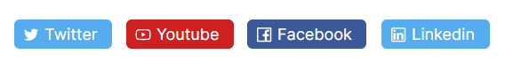
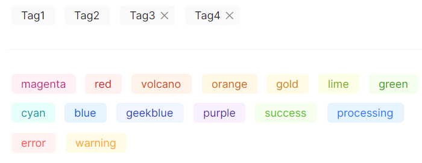

# Tag 快速入门

### 基础配置条件

* Nuget 安装 Avalonia
* Nuget 安装 AtomUI

### 基础用法

通过 `IsClosable` 属性开启关闭按钮，通过 `CloseIcon` 属性自定义关闭图标。



```xaml
<WrapPanel HorizontalAlignment="Left" Orientation="Horizontal">
    <atom:Tag>Tag 1</atom:Tag>
    <atom:Tag>Link</atom:Tag>
    <atom:Tag IsClosable="True">Prevent Default</atom:Tag>
    <atom:Tag IsClosable="True"
              CloseIcon="{atom:IconProvider Kind=CloseCircleOutlined}">
        Tag 2
    </atom:Tag>
</WrapPanel>
```

### 预设颜色

`TagColor` 属性内置了 13 种预设颜色，也可以通过指定十六进制颜色值来自定义颜色。


```xaml
<StackPanel Orientation="Vertical">
    <atom:TextBlock FontWeight="Bold" FontSize="14" Margin="0, 0, 0, 10">Presets</atom:TextBlock>
    <WrapPanel HorizontalAlignment="Left">
        <atom:Tag TagColor="magenta">magenta</atom:Tag>
        <atom:Tag TagColor="red">red</atom:Tag>
        <atom:Tag TagColor="volcano">volcano</atom:Tag>
        <atom:Tag TagColor="orange">orange</atom:Tag>
        <atom:Tag TagColor="gold">gold</atom:Tag>
        <atom:Tag TagColor="lime">lime</atom:Tag>
        <atom:Tag TagColor="green">green</atom:Tag>
        <atom:Tag TagColor="cyan">cyan</atom:Tag>
        <atom:Tag TagColor="blue">blue</atom:Tag>
        <atom:Tag TagColor="geekblue">geekblue</atom:Tag>
        <atom:Tag TagColor="purple">purple</atom:Tag>
    </WrapPanel>

    <atom:TextBlock FontWeight="Bold" FontSize="14" Margin="0, 20, 0, 10">Custom</atom:TextBlock>
    <WrapPanel HorizontalAlignment="Left">
        <atom:Tag TagColor="#f50">#f50</atom:Tag>
        <atom:Tag TagColor="#2db7f5" IsClosable="True">#2db7f5</atom:Tag>
        <atom:Tag TagColor="#87d068">#87d068</atom:Tag>
        <atom:Tag TagColor="#108ee9">#108ee9</atom:Tag>
    </WrapPanel>
</StackPanel>
```

### 状态颜色

`TagColor` 属性内置了 5 种表达状态的颜色：`default`、`success`、`info`、`warning`、`error`。可结合 `Icon` 属性为状态标签添加图标，增强可读性。



```xaml
<StackPanel Orientation="Vertical">
    <atom:TextBlock FontWeight="Bold" FontSize="14" Margin="0, 0, 0, 10">Without icon</atom:TextBlock>
    <WrapPanel HorizontalAlignment="Left">
        <atom:Tag TagColor="success">success</atom:Tag>
        <atom:Tag TagColor="info">processing</atom:Tag>
        <atom:Tag TagColor="error">error</atom:Tag>
        <atom:Tag TagColor="warning">warning</atom:Tag>
        <atom:Tag TagColor="default">default</atom:Tag>
    </WrapPanel>

    <atom:TextBlock FontWeight="Bold" FontSize="14" Margin="0, 20, 0, 10">With icon</atom:TextBlock>
    <WrapPanel HorizontalAlignment="Left">
        <atom:Tag TagColor="success"
                  Icon="{atom:IconProvider Kind=CheckCircleOutlined}">
            success
        </atom:Tag>
        <atom:Tag TagColor="info"
                  Icon="{atom:IconProvider Kind=SyncOutlined}">
            processing
        </atom:Tag>
        <atom:Tag TagColor="error"
                  Icon="{atom:IconProvider Kind=CloseCircleOutlined}">
            error
        </atom:Tag>
        <atom:Tag TagColor="warning"
                  Icon="{atom:IconProvider Kind=ExclamationCircleOutlined}">
            warning
        </atom:Tag>
        <atom:Tag TagColor="default"
                  Icon="{atom:IconProvider Kind=ClockCircleOutlined}">
            default
        </atom:Tag>
        <atom:Tag TagColor="default"
                  Icon="{atom:IconProvider Kind=MinusCircleOutlined}">
            default
        </atom:Tag>
    </WrapPanel>
</StackPanel>
```

### 图标设定

通过 `Icon` 属性可以为标签添加各种图标，适用于展示带有品牌或功能标识的标签。



```xaml
<WrapPanel HorizontalAlignment="Left" Orientation="Horizontal">
    <atom:Tag TagColor="#55acee"
              Icon="{atom:IconProvider Kind=TwitterOutlined}">
        Twitter
    </atom:Tag>
    <atom:Tag TagColor="#cd201f"
              Icon="{atom:IconProvider Kind=YoutubeOutlined}">
        Youtube
    </atom:Tag>
    <atom:Tag TagColor="#3b5999"
              Icon="{atom:IconProvider Kind=FacebookOutlined}">
        Facebook
    </atom:Tag>
    <atom:Tag TagColor="#55acee"
              Icon="{atom:IconProvider Kind=LinkedinOutlined}">
        Linkedin
    </atom:Tag>
</WrapPanel>
```

### 无边框模式

通过将 `Bordered` 属性设置为 `False` 来隐藏标签边框，呈现更简洁的视觉效果。



```xaml
<StackPanel Orientation="Vertical">
    <WrapPanel HorizontalAlignment="Left">
        <atom:Tag Bordered="False">Tag1</atom:Tag>
        <atom:Tag Bordered="False">Tag2</atom:Tag>
        <atom:Tag Bordered="False" IsClosable="True">Tag3</atom:Tag>
        <atom:Tag Bordered="False" IsClosable="True">Tag4</atom:Tag>
    </WrapPanel>

    <atom:Separator FontWeight="Bold" FontSize="14" Margin="0, 20, 0, 20" />
    <WrapPanel HorizontalAlignment="Left">
        <atom:Tag TagColor="magenta" Bordered="False">magenta</atom:Tag>
        <atom:Tag TagColor="red" Bordered="False">red</atom:Tag>
        <atom:Tag TagColor="volcano" Bordered="False">volcano</atom:Tag>
        <atom:Tag TagColor="orange" Bordered="False">orange</atom:Tag>
        <atom:Tag TagColor="gold" Bordered="False">gold</atom:Tag>
        <atom:Tag TagColor="lime" Bordered="False">lime</atom:Tag>
        <atom:Tag TagColor="green" Bordered="False">green</atom:Tag>
        <atom:Tag TagColor="cyan" Bordered="False">cyan</atom:Tag>
        <atom:Tag TagColor="blue" Bordered="False">blue</atom:Tag>
        <atom:Tag TagColor="geekblue" Bordered="False">geekblue</atom:Tag>
        <atom:Tag TagColor="purple" Bordered="False">purple</atom:Tag>

        <atom:Tag TagColor="success" Bordered="False">success</atom:Tag>
        <atom:Tag TagColor="info" Bordered="False">processing</atom:Tag>
        <atom:Tag TagColor="error" Bordered="False">error</atom:Tag>
        <atom:Tag TagColor="warning" Bordered="False">warning</atom:Tag>
    </WrapPanel>
</StackPanel>
```
