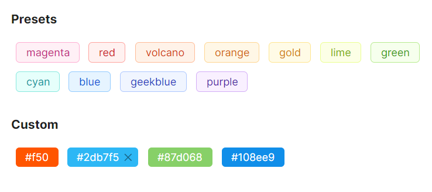

# Tag 概述

### 简介

`Tag` 用于标记和分类的小型标签组件，继承自 `TemplatedControl`。适用于对事物进行标记、分类、属性描述等场景。

### 主要功能

* 内置 13 种预设颜色，同时支持自定义十六进制颜色
* 提供 5 种状态颜色（success、info、error、warning、default），方便表达业务状态
* 支持自定义图标和关闭图标
* 支持可关闭标签，并可监听关闭事件
* 通过 `Bordered` 属性灵活控制边框显示

### 何时使用

* 用于标记事物的属性与维度
* 用于分类或筛选内容
* 用于表达状态信息（成功、警告、错误等）
