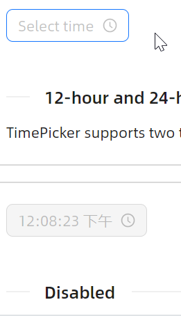

# 12/24格式

将 `ClockIdentifier` 设定为 `HourClock24` 即可得到24小时制选择器；设定为 `HourClock12` 即为12小时格式。



```axaml
<StackPanel Orientation="Horizontal">
    <atom:TimePicker Watermark="Select time" IsNeedConfirm="True" IsShowNow="True"
                     ClockIdentifier="HourClock24" />
</StackPanel>
```