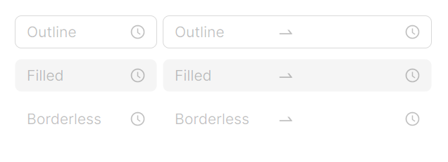

# 快速入门

### 基础配置条件

* Nuget安装Avalonia
* Nuget安装AtomUI

### 基础用法

`Watermark` 属性类似于HTML中的Placeholder，起到一种占位符的作用。`IsNeedConfirm` 属性用于控制是否显示确认按钮，`IsShowNow` 属性用于控制是否显示"此刻"快捷按钮。


```xaml
<atom:TimePicker Watermark="Select time" IsNeedConfirm="False" IsShowNow="True" />
```

### 12/24 小时制

通过 `ClockIdentifier` 属性设置时钟制式。设定为 `HourClock24` 即可得到 24 小时制选择器；设定为 `HourClock12` 即为 12 小时格式。


```xaml
<StackPanel Orientation="Horizontal">
    <atom:TimePicker Watermark="Select time" IsNeedConfirm="True" IsShowNow="True"
                     ClockIdentifier="HourClock24" />
</StackPanel>
```

### 步进间隔

通过 `MinuteIncrement` 和 `SecondIncrement` 属性可分别设置分钟和秒钟的步进间隔。例如将 `MinuteIncrement` 设定为 `15` 即分钟选择器步进为 15 分钟；将 `SecondIncrement` 设定为 `10` 即秒钟选择器步进为 10 秒钟。


```xaml
<StackPanel Orientation="Horizontal" Spacing="10">
    <atom:TimePicker Watermark="Select time"
                     DefaultTime="12:08:23"
                     MinuteIncrement="15"
                     SecondIncrement="10" />
</StackPanel>
```

### 大小尺寸

`SizeType` 属性用于设置组件的大小，可选值有 `Large`、`Middle`、`Small`。


```xaml
<StackPanel Orientation="Horizontal" Spacing="10">
    <atom:TimePicker Watermark="Select time" SizeType="Large" DefaultTime="12:08:23" />
    <atom:TimePicker Watermark="Select time" SizeType="Middle" DefaultTime="12:08:23" />
    <atom:TimePicker Watermark="Select time" SizeType="Small" DefaultTime="12:08:23" />
</StackPanel>
```

### 禁用

`IsEnabled` 属性用于决定组件是否可用，设置为 `False` 后组件将变为只读灰色状态。


```xaml
<StackPanel Orientation="Horizontal" Spacing="10">
    <atom:TimePicker Watermark="Select time" IsEnabled="False" DefaultTime="12:08:23" />
</StackPanel>
```

### 状态色

状态色可以向用户传递明确的信息，比如错误、警告等。通过 `Status` 属性可快速设置组件的状态色，可选值有 `Default`、`Warning`、`Error`。


```xaml
<StackPanel Orientation="Vertical" Spacing="10">
    <StackPanel Orientation="Horizontal" Spacing="5">
        <atom:TimePicker Status="Default"
                         Watermark="Select time" />
        <atom:RangeTimePicker StyleVariant="Outline"
                              Status="Default"
                              Watermark="Start time"
                              SecondaryWatermark="End time"
                              IsNeedConfirm="True"
                              ClockIdentifier="HourClock24" />
    </StackPanel>
    <StackPanel Orientation="Horizontal" Spacing="5">
        <atom:TimePicker Status="Warning"
                         Watermark="Select time" />
        <atom:RangeTimePicker StyleVariant="Outline"
                              Status="Warning"
                              Watermark="Start time"
                              SecondaryWatermark="End time"
                              IsNeedConfirm="True"
                              ClockIdentifier="HourClock24" />
    </StackPanel>
    <StackPanel Orientation="Horizontal" Spacing="5">
        <atom:TimePicker Status="Error"
                         Watermark="Select time" />
        <atom:RangeTimePicker StyleVariant="Outline"
                              Status="Error"
                              Watermark="Start time"
                              SecondaryWatermark="End time"
                              IsNeedConfirm="True"
                              ClockIdentifier="HourClock24" />
    </StackPanel>
</StackPanel>
```

### 样式变体

`StyleVariant` 属性用于设置组件的样式风格，可选值如下：

* **Outline**（轮廓样式）：具有明显的边框，适合需要强调输入控件边界的设计，常用于表单填写等需要明确指示用户输入区域的场景
* **Filled**（填充样式）：背景有填充色，通常用于 Material Design 风格的界面，提供更好的视觉层次感
* **Borderless**（无边框样式）：简洁的外观，适合在工具栏或需要紧凑布局的地方使用



```xaml
<StackPanel Orientation="Vertical" Spacing="10">
    <StackPanel Orientation="Horizontal" Spacing="5">
        <atom:TimePicker Watermark="Outline"
                         StyleVariant="Outline" />
        <atom:RangeTimePicker StyleVariant="Outline"
                              Watermark="Outline" />
    </StackPanel>
    <StackPanel Orientation="Horizontal" Spacing="5">
        <atom:TimePicker Watermark="Filled"
                         StyleVariant="Filled" />
        <atom:RangeTimePicker StyleVariant="Filled"
                              Watermark="Filled" />
    </StackPanel>
    <StackPanel Orientation="Horizontal" Spacing="5">
        <atom:TimePicker Watermark="Borderless"
                         StyleVariant="Borderless" />
        <atom:RangeTimePicker StyleVariant="Borderless"
                              Watermark="Borderless" />
    </StackPanel>
</StackPanel>
```

### 时间范围选择器

使用 `RangeTimePicker` 组件即可实现时间范围选择。通过 `RangeStartDefaultTime` 和 `RangeEndDefaultTime` 设置默认的起止时间。


```xaml
<StackPanel Orientation="Horizontal" Spacing="10">
    <atom:RangeTimePicker Status="Default"
                          Watermark="Start time"
                          SecondaryWatermark="End time"
                          RangeStartDefaultTime="10:09:20"
                          RangeEndDefaultTime="12:12:20" />
</StackPanel>
```
