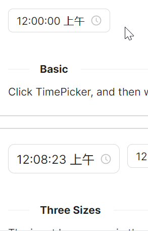
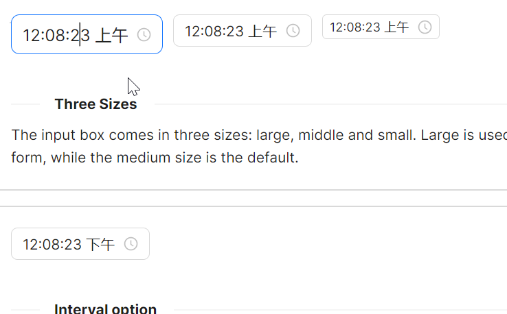
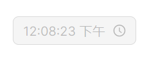
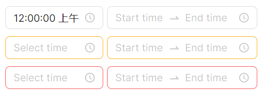

# TimePicker 快速入门

### 基础配置条件

* Nuget安装Avalonia
* Nuget安装AtomUI

### 基础用法

`Watermark` 属性用于显示默认水印文案，`IsNeedConfirm`属性用于是否显示确认按钮，`IsShowNow`属性用于是否显示现在按钮。



```axaml
<atom:TimePicker Watermark="Select time" IsNeedConfirm="False" IsShowNow="True" />
```

### 大小尺寸

支持三种不同大小尺寸，通过 `SizeType` 来设置尺寸，可选择 `Large`、 `Middle`、 `Small`。



```axaml
<StackPanel Orientation="Horizontal" Spacing="10">
    <atom:TimePicker Watermark="Select time" SizeType="Large" DefaultTime="12:08:23" />
    <atom:TimePicker Watermark="Select time" SizeType="Middle" DefaultTime="12:08:23" />
    <atom:TimePicker Watermark="Select time" SizeType="Small" DefaultTime="12:08:23" />
</StackPanel>
```

### 禁用状态

将 `IsEnabled` 设定为 `False` 来禁用组件。



```axaml
<StackPanel Orientation="Horizontal" Spacing="10">
    <atom:TimePicker Watermark="Select time" IsEnabled="False" DefaultTime="12:08:23" />
</StackPanel>
```

### 多状态

将 `Status` 设定为 `Default`、 `Warning`、 `Error` 来设置组件的状态。



```axaml
<StackPanel Orientation="Vertical" Spacing="10">
    <StackPanel Orientation="Horizontal" Spacing="5">
        <atom:TimePicker Status="Default"
                         Watermark="Select time" />
        <atom:RangeTimePicker StyleVariant="Outline"
                              Status="Default"
                              Watermark="Start time"
                              SecondaryWatermark="End time"
                              IsNeedConfirm="True"
                              ClockIdentifier="HourClock24" />
    </StackPanel>
    <StackPanel Orientation="Horizontal" Spacing="5">
        <atom:TimePicker Status="Warning"
                         Watermark="Select time" />
        <atom:RangeTimePicker StyleVariant="Outline"
                              Status="Warning"
                              Watermark="Start time"
                              SecondaryWatermark="End time"
                              IsNeedConfirm="True"
                              ClockIdentifier="HourClock24" />
    </StackPanel>
    <StackPanel Orientation="Horizontal" Spacing="5">
        <atom:TimePicker Status="Error"
                         Watermark="Select time" />
        <atom:RangeTimePicker StyleVariant="Outline"
                              Status="Error"
                              Watermark="Start time"
                              SecondaryWatermark="End time"
                              IsNeedConfirm="True"
                              ClockIdentifier="HourClock24" />
    </StackPanel>
</StackPanel>
```