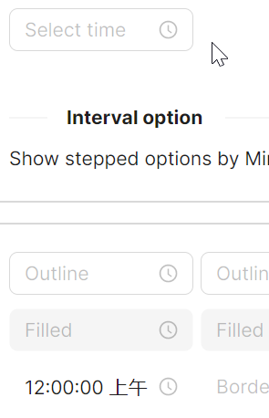

# 间隔设定

将 `MinuteIncrement` 设定为 `15` 即可设定分钟选择器步进为15分钟；将 `SecondIncrement` 设定为 `10` 即可设定秒钟选择器步进为10秒钟。



```axaml
<StackPanel Orientation="Horizontal" Spacing="10">
    <atom:TimePicker Watermark="Select time"
                     DefaultTime="12:08:23"
                     MinuteIncrement="15"
                     SecondIncrement="10" />
</StackPanel>
```