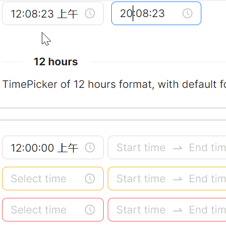

# TimePicker 概述

### 简介

TimePicker 是一个功能丰富的时间选择组件，支持单时间选择与范围时间选择两种模式。可通过配置切换 12/24 小时制，还提供确认按钮、"此刻"快捷按钮、分钟与秒钟步进等实用功能，满足各类业务场景下的时间选取需求。

### 主要功能

* 单时间选择（TimePicker）与范围时间选择（RangeTimePicker）
* 支持 12 小时制与 24 小时制切换（ClockIdentifier）
* 内置确认按钮模式，适用于需要用户二次确认的场景（IsNeedConfirm）
* 支持分钟与秒钟步进间隔配置（MinuteIncrement / SecondIncrement）
* 提供多种尺寸（Large / Middle / Small）、状态色（Default / Warning / Error）和样式变体（Outline / Filled / Borderless）
* 支持禁用状态与水印占位文字
