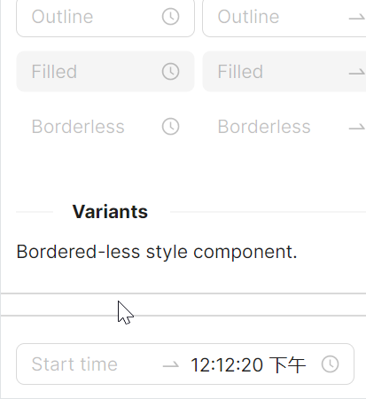

# 时间范围选择器

使用 `RangeTimePicker` 组件即可实现时间范围选择。



```axaml
<StackPanel Orientation="Horizontal" Spacing="10">
    <atom:RangeTimePicker Status="Default"
                          Watermark="Start time"
                          SecondaryWatermark="End time"
                          RangeStartDefaultTime="10:09:20"
                          RangeEndDefaultTime="12:12:20" />
</StackPanel>
```