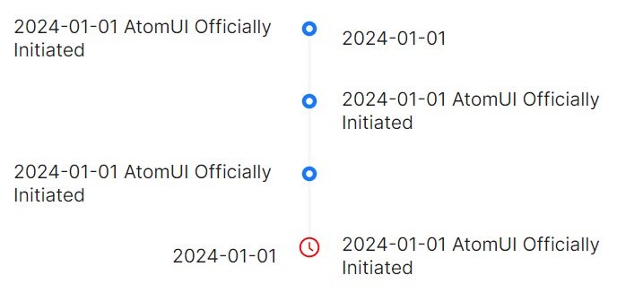
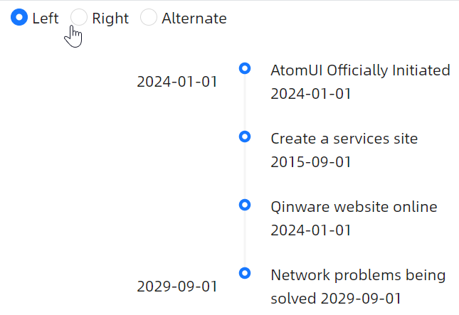
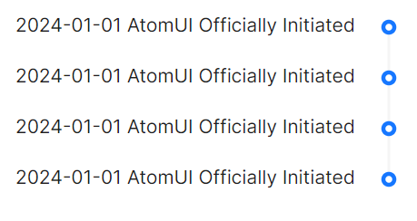

# 时间线样式

### 交替时间线

当 `Mode` 为 `Alternate` 时，会开启交替时间线模式。



axaml文件：
```axaml
<atom:Timeline Mode="Alternate">
    <atom:TimelineItem Label="2024-01-01">
        2024-01-01 AtomUI Officially Initiated
    </atom:TimelineItem>
    <atom:TimelineItem>
        2024-01-01 AtomUI Officially Initiated
    </atom:TimelineItem>
    <atom:TimelineItem>
        2024-01-01 AtomUI Officially Initiated
    </atom:TimelineItem>
    <atom:TimelineItem IndicatorIcon="{atom:IconProvider Kind=ClockCircleOutlined}"
                       IndicatorColor ="Red"
                       Label="2024-01-01">
        2024-01-01 AtomUI Officially Initiated
    </atom:TimelineItem>
</atom:Timeline>
```

### 左右侧模式

当 `Mode` 为 `Left` 或 `Right` 时，会开启左侧/右侧时间线模式。下面示例种，使用code-behind代码修改Mode属性的值，即可实现左右侧时间线切换。



axaml文件：
```axaml
<StackPanel>
    <WrapPanel Margin="0,0,0,20" Orientation="Horizontal">
        <WrapPanel.Styles>
            <Style Selector="atom|RadioButton">
                <Setter Property="Margin" Value="5" />
            </Style>
        </WrapPanel.Styles>
        <atom:RadioButton IsChecked="True" x:Name="ModeLeft">Left</atom:RadioButton>
        <atom:RadioButton x:Name="ModeRight">Right</atom:RadioButton>
        <atom:RadioButton x:Name="ModeAlternate">Alternate</atom:RadioButton>
    </WrapPanel>
    <atom:Timeline Mode="Left" x:Name="LabelTimeline">
        <atom:TimelineItem
            Label="2024-01-01">
            AtomUI Officially Initiated 2024-01-01 
        </atom:TimelineItem>
        <atom:TimelineItem>
            Create a services site 2015-09-01
        </atom:TimelineItem>
        <atom:TimelineItem>
            Qinware website online 2024-01-01 
        </atom:TimelineItem>
        <atom:TimelineItem 
            Label="2029-09-01">
            Network problems being solved 2029-09-01
        </atom:TimelineItem>
    </atom:Timeline>
</StackPanel>
```

code-behind文件：
```csharp
using AtomUIGallery.ShowCases.ViewModels;
using Avalonia.ReactiveUI;
using ReactiveUI;
using AtomUI.Controls;
using Avalonia.Interactivity;
using RadioButton = Avalonia.Controls.RadioButton;
public partial class TimelineShowCase : ReactiveUserControl<TimelineViewModel>
{
    public TimelineShowCase()
    {
        this.WhenActivated(disposables => { });
        InitializeComponent();
        
        ModeLeft.IsCheckedChanged += ModeChecked;

        ModeRight.IsCheckedChanged += ModeChecked;

        ModeAlternate.IsCheckedChanged += ModeChecked;
        
        ReverseButton.Click += ReverseButtonClick;
    }
    
    private void ReverseButtonClick(object? sender, RoutedEventArgs e)
    {
        ReverseTimeline.IsReverse = !ReverseTimeline.IsReverse;
    }
    
    private void ModeChecked(object? sender, RoutedEventArgs e)
    {
        if (sender is RadioButton radioButton)
        {
            if (radioButton == ModeLeft && ModeLeft.IsChecked.HasValue && ModeLeft.IsChecked.Value)
            {
                LabelTimeline.Mode = TimeLineMode.Left;
            }
            else if (radioButton == ModeRight && ModeRight.IsChecked.HasValue && ModeRight.IsChecked.Value)
            {
                LabelTimeline.Mode = TimeLineMode.Right;
            }
            else if (radioButton == ModeAlternate && ModeAlternate.IsChecked.HasValue && ModeAlternate.IsChecked.Value)
            {
                LabelTimeline.Mode = TimeLineMode.Alternate;
            }
        }
    }

}
```

### 右



```axaml
<atom:Timeline Mode="Right">
    <atom:TimelineItem>
        2024-01-01 AtomUI Officially Initiated
    </atom:TimelineItem>
    <atom:TimelineItem>
        2024-01-01 AtomUI Officially Initiated
    </atom:TimelineItem>
    <atom:TimelineItem>
        2024-01-01 AtomUI Officially Initiated
    </atom:TimelineItem>
    <atom:TimelineItem>
        2024-01-01 AtomUI Officially Initiated
    </atom:TimelineItem>
</atom:Timeline>
```