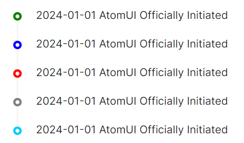

# Timeline 快速入门

### 基础配置条件

* Nuget安装Avalonia
* Nuget安装AtomUI

### 基础用法

通过 `Timeline` 与 `TimelineItem` 组件嵌套组合来构建时间线。每个 `TimelineItem` 代表时间线上的一个节点，通过 `IndicatorColor` 可以设定该节点的指示器颜色。


```xaml
<atom:Timeline>
    <atom:TimelineItem>
        2024-01-01 AtomUI Officially Initiated
    </atom:TimelineItem>
    <atom:TimelineItem IndicatorColor="green">
        2024-08-12 After more than 7 months of development, AtomUI is officially open-source.
        Welcome everyone to follow us.
    </atom:TimelineItem>
    <atom:TimelineItem IndicatorColor="red">
        2024-10-01 Release of the 0.0.1 Preview Version
    </atom:TimelineItem>
</atom:Timeline>
```

### 预设颜色

`IndicatorColor` 属性内置 green、blue、red、gray 四种预设颜色，也可以通过十六进制颜色值（如 `#00CCFF`）指定自定义颜色。



```xaml
<atom:Timeline>
    <atom:TimelineItem IndicatorColor="green">
        2024-01-01 AtomUI Officially Initiated
    </atom:TimelineItem>
    <atom:TimelineItem IndicatorColor="blue">
        2024-01-01 AtomUI Officially Initiated
    </atom:TimelineItem>
    <atom:TimelineItem IndicatorColor="Red">
        2024-01-01 AtomUI Officially Initiated
    </atom:TimelineItem>
    <atom:TimelineItem IndicatorColor="gray">
        2024-01-01 AtomUI Officially Initiated
    </atom:TimelineItem>
    <atom:TimelineItem IndicatorColor="#00CCFF">
        2024-01-01 AtomUI Officially Initiated
    </atom:TimelineItem>
</atom:Timeline>
```

### 时间线模式

通过 `Mode` 属性可以切换时间线的排版模式。支持 `Left`（左侧，默认值）、`Right`（右侧）和 `Alternate`（交替）三种模式。

#### 交替模式

当 `Mode` 为 `Alternate` 时，时间线节点会左右交替排列。可配合 `Label` 属性在对侧显示标签文本。


```xaml
<atom:Timeline Mode="Alternate">
    <atom:TimelineItem Label="2024-01-01">
        2024-01-01 AtomUI Officially Initiated
    </atom:TimelineItem>
    <atom:TimelineItem>
        2024-01-01 AtomUI Officially Initiated
    </atom:TimelineItem>
    <atom:TimelineItem>
        2024-01-01 AtomUI Officially Initiated
    </atom:TimelineItem>
    <atom:TimelineItem IndicatorIcon="{atom:IconProvider Kind=ClockCircleOutlined}"
                       IndicatorColor ="Red"
                       Label="2024-01-01">
        2024-01-01 AtomUI Officially Initiated
    </atom:TimelineItem>
</atom:Timeline>
```

#### 右侧模式


```xaml
<atom:Timeline Mode="Right">
    <atom:TimelineItem>
        2024-01-01 AtomUI Officially Initiated
    </atom:TimelineItem>
    <atom:TimelineItem>
        2024-01-01 AtomUI Officially Initiated
    </atom:TimelineItem>
    <atom:TimelineItem>
        2024-01-01 AtomUI Officially Initiated
    </atom:TimelineItem>
    <atom:TimelineItem>
        2024-01-01 AtomUI Officially Initiated
    </atom:TimelineItem>
</atom:Timeline>
```

#### 通过 code-behind 动态切换模式

下面的示例展示了如何在 C# code-behind 中通过 RadioButton 切换 `Mode` 属性来动态改变时间线排版模式。


axaml文件：
```xaml
<StackPanel>
    <WrapPanel Margin="0,0,0,20" Orientation="Horizontal">
        <WrapPanel.Styles>
            <Style Selector="atom|RadioButton">
                <Setter Property="Margin" Value="5" />
            </Style>
        </WrapPanel.Styles>
        <atom:RadioButton IsChecked="True" x:Name="ModeLeft">Left</atom:RadioButton>
        <atom:RadioButton x:Name="ModeRight">Right</atom:RadioButton>
        <atom:RadioButton x:Name="ModeAlternate">Alternate</atom:RadioButton>
    </WrapPanel>
    <atom:Timeline Mode="Left" x:Name="LabelTimeline">
        <atom:TimelineItem Label="2024-01-01">
            AtomUI Officially Initiated 2024-01-01
        </atom:TimelineItem>
        <atom:TimelineItem>
            Create a services site 2015-09-01
        </atom:TimelineItem>
        <atom:TimelineItem>
            Qinware website online 2024-01-01
        </atom:TimelineItem>
        <atom:TimelineItem Label="2029-09-01">
            Network problems being solved 2029-09-01
        </atom:TimelineItem>
    </atom:Timeline>
</StackPanel>
```

code-behind文件：
```csharp
private void ModeChecked(object? sender, RoutedEventArgs e)
{
    if (sender is RadioButton radioButton)
    {
        if (radioButton == ModeLeft && ModeLeft.IsChecked.HasValue && ModeLeft.IsChecked.Value)
        {
            LabelTimeline.Mode = TimeLineMode.Left;
        }
        else if (radioButton == ModeRight && ModeRight.IsChecked.HasValue && ModeRight.IsChecked.Value)
        {
            LabelTimeline.Mode = TimeLineMode.Right;
        }
        else if (radioButton == ModeAlternate && ModeAlternate.IsChecked.HasValue && ModeAlternate.IsChecked.Value)
        {
            LabelTimeline.Mode = TimeLineMode.Alternate;
        }
    }
}
```

### 快速反转

当 `IsReverse` 为 `True` 时，时间线按相反顺序显示，最新的条目出现在顶部。默认值为 `False`，即按正常顺序从上到下排列。


axaml文件：
```xaml
<StackPanel>
    <atom:Timeline
        Pending="Recording..."
        IsReverse="False"
        x:Name="ReverseTimeline">
        <atom:TimelineItem Label="2024-01-01">
            2024-01-01 AtomUI Officially Initiated. 1
        </atom:TimelineItem>
        <atom:TimelineItem Label="2024-08-12">
            2024-01-01 AtomUI Officially Initiated. 2
        </atom:TimelineItem>
        <atom:TimelineItem Label="2024-10-01">
            2024-01-01 AtomUI Officially Initiated. 3
        </atom:TimelineItem>
    </atom:Timeline>
    <DockPanel>
        <atom:Button ButtonType="Primary" x:Name="ReverseButton">Toggle Reverse</atom:Button>
    </DockPanel>
</StackPanel>
```

code-behind文件：
```csharp
private void ReverseButtonClick(object? sender, RoutedEventArgs e)
{
    ReverseTimeline.IsReverse = !ReverseTimeline.IsReverse;
}
```
