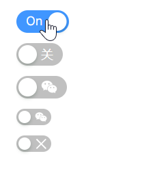
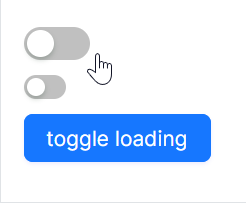

# 高级用法

### 自定义文案和图标

这个示例向大家展示如何控制组件的文案和图标，开发者需要关注如下属性：
* `OnContent`：用于设定开启状态的文案，可以通过绑定 `atom:IconProvider` 来绑定图标。
* `OffContent`：用于设定关闭状态的文案，可以通过绑定 `atom:IconProvider` 来绑定图标。
* `IsChecked`：用于设定组件的初始状态。



```axaml
<StackPanel HorizontalAlignment="Left" Spacing="10" Orientation="Vertical">
    <atom:ToggleSwitch
        OnContent="On"
        OffContent="Off"
        IsChecked="True" />
    <atom:ToggleSwitch
        OnContent="开"
        OffContent="关" />
    <atom:ToggleSwitch
        OnContent="{atom:IconProvider Kind=TwitterOutlined}"
        OffContent="{atom:IconProvider Kind=WechatOutlined}"/>
    <atom:ToggleSwitch
        SizeType="Small"
        OnContent="{atom:IconProvider Kind=CheckOutlined}"
        OffContent="{atom:IconProvider Kind=WechatOutlined}"/>
    <atom:ToggleSwitch SizeType="Small">
        <atom:ToggleSwitch.OnContent>
            <atom:Icon IconInfo="{atom:IconInfoProvider Kind=CheckOutlined}" />
        </atom:ToggleSwitch.OnContent>
        <atom:ToggleSwitch.OffContent>
            <atom:Icon IconInfo="{atom:IconInfoProvider Kind=CloseOutlined}" />
        </atom:ToggleSwitch.OffContent>
    </atom:ToggleSwitch>
</StackPanel>
```

### loading状态

在一些业务场景中，打开或关闭时同时需要一个“耗时”的同步过程，此时需要一个loading状态提供一个更好的操作体验。

下面这个示例展示如何设定loading状态，通过 `atom:Button` 组件来设定 `atom:ToggleSwitch` 组件的loading状态，本质上是通过操作 `atom:ToggleSwitch` 组件的 `IsLoading` 属性。



axaml文件：
```axaml
<StackPanel HorizontalAlignment="Left" Spacing="10" Orientation="Vertical">
    <atom:ToggleSwitch IsLoading="True" IsChecked="true" x:Name="ToggleSwitchDefault" />
    <atom:ToggleSwitch SizeType="Small" IsLoading="True" x:Name="ToggleSwitchSmall" />
    <atom:Button ButtonType="Primary"
                 x:Name="ToggleLoadingStatusBtn"
                 Command="{Binding $parent[showCase:ToggleSwitchShowCase].ToggleLoadingStatus}"
                 CommandParameter="{Binding ElementName=ToggleLoadingStatusBtn}">
        toggle loading
    </atom:Button>
</StackPanel>
```

code-behind文件：
```csharp
using System.Reactive;
using AtomUIGallery.ShowCases.ViewModels;
using Avalonia.Controls;
using Avalonia.ReactiveUI;
using ReactiveUI;
using Button = AtomUI.Controls.Button;
using ToggleSwitch = AtomUI.Controls.ToggleSwitch;

public partial class ToggleSwitchShowCase : ReactiveUserControl<ToggleSwitchViewModel>
{
    public ReactiveCommand<object, Unit> ToggleSwitchCommand { get; private set; }
    
    public ToggleSwitchShowCase()
    {
        this.WhenActivated(disposables => { });
        ToggleSwitchCommand = ReactiveCommand.Create<object, Unit>(o =>
        {
            ToggleDisabledStatus(o);
            return Unit.Default;
        });
        InitializeComponent();
    }
    
    public static void ToggleDisabledStatus(object arg)
    {
        var switchBtn = (arg as ToggleSwitch)!;
        switchBtn.IsEnabled = !switchBtn.IsEnabled;
    }
    
    public static void ToggleLoadingStatus(object arg)
    {
        var btn                 = (arg as Button)!;
        var stackPanel          = btn.Parent as StackPanel;
        var toggleSwitchDefault = stackPanel?.Children[0] as ToggleSwitch;
        var toggleSwitchSmall   = stackPanel?.Children[1] as ToggleSwitch;
        if (toggleSwitchDefault is not null)
        {
            toggleSwitchDefault.IsLoading = !toggleSwitchDefault.IsLoading;
        }

        if (toggleSwitchSmall is not null)
        {
            toggleSwitchSmall.IsLoading = !toggleSwitchSmall.IsLoading;
        }
    }
}
```
