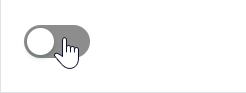
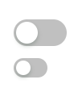

# 快速入门

### 基础配置条件

* Nuget 安装 Avalonia
* Nuget 安装 AtomUI

### 基础用法

最简单的用法，直接使用 `atom:ToggleSwitch` 即可创建一个默认的开关组件。



```xaml
<atom:ToggleSwitch />
```

### 大小尺寸

通过 `SizeType` 属性设定组件大小，提供三种尺寸：`Large`、`Middle`（默认）、`Small`。



```xaml
<StackPanel HorizontalAlignment="Left" Spacing="10" Orientation="Vertical">
    <atom:ToggleSwitch />
    <atom:ToggleSwitch SizeType="Small" />
</StackPanel>
```

### 禁用

通过 `IsEnabled` 属性控制组件的禁用/启用状态。下面示例中，通过 `atom:Button` 组件切换 `atom:ToggleSwitch` 的禁用状态。


axaml 文件：
```xaml
<StackPanel HorizontalAlignment="Left" Spacing="10" Orientation="Vertical">
    <atom:ToggleSwitch x:Name="ToggleDisabledSwitch" />
    <atom:Button ButtonType="Primary"
                 Command="{Binding $parent[showCase:ToggleSwitchShowCase].ToggleSwitchCommand}"
                 CommandParameter="{Binding ElementName=ToggleDisabledSwitch}"
                 >
        toggle disabled
    </atom:Button>
</StackPanel>
```

code-behind 文件：
```csharp
using System.Reactive;
using AtomUIGallery.ShowCases.ViewModels;
using Avalonia.Controls;
using Avalonia.ReactiveUI;
using ReactiveUI;
using Button = AtomUI.Controls.Button;
using ToggleSwitch = AtomUI.Controls.ToggleSwitch;

public partial class ToggleSwitchShowCase : ReactiveUserControl<ToggleSwitchViewModel>
{
    public ReactiveCommand<object, Unit> ToggleSwitchCommand { get; private set; }

    public ToggleSwitchShowCase()
    {
        this.WhenActivated(disposables => { });
        ToggleSwitchCommand = ReactiveCommand.Create<object, Unit>(o =>
        {
            ToggleDisabledStatus(o);
            return Unit.Default;
        });
        InitializeComponent();
    }

    public static void ToggleDisabledStatus(object arg)
    {
        var switchBtn = (arg as ToggleSwitch)!;
        switchBtn.IsEnabled = !switchBtn.IsEnabled;
    }
}
```

### 自定义文案和图标

通过 `OnContent` 和 `OffContent` 属性分别设定开启和关闭状态的文案内容。也可以通过绑定 `atom:IconProvider` 来设定图标。


```xaml
<StackPanel HorizontalAlignment="Left" Spacing="10" Orientation="Vertical">
    <atom:ToggleSwitch
        OnContent="On"
        OffContent="Off"
        IsChecked="True" />
    <atom:ToggleSwitch
        OnContent="开"
        OffContent="关" />
    <atom:ToggleSwitch
        OnContent="{atom:IconProvider Kind=TwitterOutlined}"
        OffContent="{atom:IconProvider Kind=WechatOutlined}"/>
    <atom:ToggleSwitch
        SizeType="Small"
        OnContent="{atom:IconProvider Kind=CheckOutlined}"
        OffContent="{atom:IconProvider Kind=WechatOutlined}"/>
    <atom:ToggleSwitch SizeType="Small">
        <atom:ToggleSwitch.OnContent>
            <atom:Icon IconInfo="{atom:IconInfoProvider Kind=CheckOutlined}" />
        </atom:ToggleSwitch.OnContent>
        <atom:ToggleSwitch.OffContent>
            <atom:Icon IconInfo="{atom:IconInfoProvider Kind=CloseOutlined}" />
        </atom:ToggleSwitch.OffContent>
    </atom:ToggleSwitch>
</StackPanel>
```

### Loading 加载状态

当开关操作涉及异步处理时，可以通过 `IsLoading` 属性设置加载状态，为用户提供更好的操作反馈。


axaml 文件：
```xaml
<StackPanel HorizontalAlignment="Left" Spacing="10" Orientation="Vertical">
    <atom:ToggleSwitch IsLoading="True" IsChecked="true" x:Name="ToggleSwitchDefault" />
    <atom:ToggleSwitch SizeType="Small" IsLoading="True" x:Name="ToggleSwitchSmall" />
    <atom:Button ButtonType="Primary"
                 x:Name="ToggleLoadingStatusBtn"
                 Command="{Binding $parent[showCase:ToggleSwitchShowCase].ToggleLoadingStatus}"
                 CommandParameter="{Binding ElementName=ToggleLoadingStatusBtn}">
        toggle loading
    </atom:Button>
</StackPanel>
```

code-behind 文件：
```csharp
using System.Reactive;
using AtomUIGallery.ShowCases.ViewModels;
using Avalonia.Controls;
using Avalonia.ReactiveUI;
using ReactiveUI;
using Button = AtomUI.Controls.Button;
using ToggleSwitch = AtomUI.Controls.ToggleSwitch;

public partial class ToggleSwitchShowCase : ReactiveUserControl<ToggleSwitchViewModel>
{
    public ReactiveCommand<object, Unit> ToggleSwitchCommand { get; private set; }

    public ToggleSwitchShowCase()
    {
        this.WhenActivated(disposables => { });
        ToggleSwitchCommand = ReactiveCommand.Create<object, Unit>(o =>
        {
            ToggleDisabledStatus(o);
            return Unit.Default;
        });
        InitializeComponent();
    }

    public static void ToggleDisabledStatus(object arg)
    {
        var switchBtn = (arg as ToggleSwitch)!;
        switchBtn.IsEnabled = !switchBtn.IsEnabled;
    }

    public static void ToggleLoadingStatus(object arg)
    {
        var btn                 = (arg as Button)!;
        var stackPanel          = btn.Parent as StackPanel;
        var toggleSwitchDefault = stackPanel?.Children[0] as ToggleSwitch;
        var toggleSwitchSmall   = stackPanel?.Children[1] as ToggleSwitch;
        if (toggleSwitchDefault is not null)
        {
            toggleSwitchDefault.IsLoading = !toggleSwitchDefault.IsLoading;
        }

        if (toggleSwitchSmall is not null)
        {
            toggleSwitchSmall.IsLoading = !toggleSwitchSmall.IsLoading;
        }
    }
}
```
