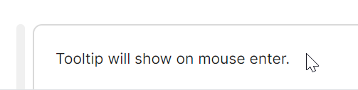
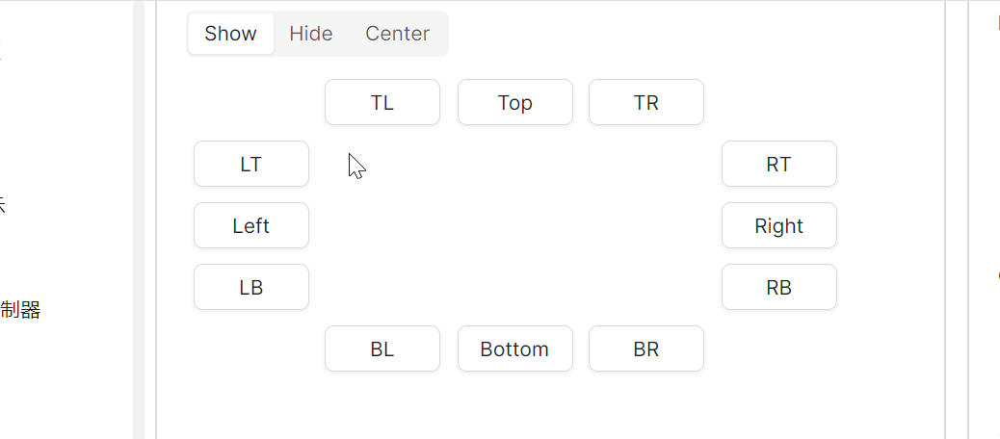
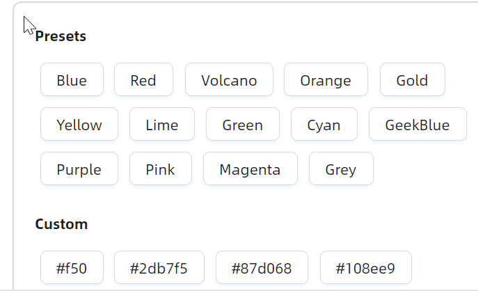

# ToolTip 快速入门

### 基础配置条件

* Nuget 安装 Avalonia
* Nuget 安装 AtomUI

### 基础用法

`ToolTip` 的核心用法是通过附加属性将提示信息绑定到目标控件上。最简单的方式是设置 `ToolTip.Tip` 属性，当鼠标悬停时即可展示提示文本。



axaml 文件：
```xaml
<atom:TextBlock
    HorizontalAlignment="Left"
    atom:ToolTip.Tip="prompt text">
    Tooltip will show on mouse enter.
</atom:TextBlock>
```

### 位置

通过 `Placement` 属性可以控制提示信息的弹出方向。组件支持 12 个方位，包括上、下、左、右四个主方向及其边缘对齐变体。

下面的示例虽然在写法上看起来像是子元素，但本质上仍然是附加属性的用法。`Tip` 属性用来设定提示信息，`Placement` 属性用于设定提示信息出现的位置。


axaml 文件：
```xaml
<Grid>
    <Grid.Styles>
        <Style Selector="atom|Button">
            <Setter Property="Margin" Value="5" />
            <Setter Property="Width" Value="80" />
        </Style>
    </Grid.Styles>
    <Grid.RowDefinitions>
        <RowDefinition Height="Auto" />
        <RowDefinition Height="Auto" />
        <RowDefinition Height="Auto" />
        <RowDefinition Height="Auto" />
        <RowDefinition Height="Auto" />
    </Grid.RowDefinitions>
    <Grid.ColumnDefinitions>
        <ColumnDefinition Width="Auto" />
        <ColumnDefinition Width="Auto" />
        <ColumnDefinition Width="Auto" />
        <ColumnDefinition Width="Auto" />
        <ColumnDefinition Width="Auto" />
    </Grid.ColumnDefinitions>

    <atom:Button Grid.Row="1" Grid.Column="0" Content="LT">
        <atom:ToolTip.Tip>prompt text</atom:ToolTip.Tip>
        <atom:ToolTip.Placement>LeftEdgeAlignedTop</atom:ToolTip.Placement>
    </atom:Button>
    <atom:Button Grid.Row="2" Grid.Column="0" Content="Left">
        <atom:ToolTip.Tip>prompt text</atom:ToolTip.Tip>
        <atom:ToolTip.Placement>Left</atom:ToolTip.Placement>
    </atom:Button>
    <atom:Button Grid.Row="3" Grid.Column="0" Content="LB">
        <atom:ToolTip.Tip>prompt text</atom:ToolTip.Tip>
        <atom:ToolTip.Placement>LeftEdgeAlignedBottom</atom:ToolTip.Placement>
    </atom:Button>

    <atom:Button Grid.Row="0" Grid.Column="1" Content="TL">
        <atom:ToolTip.Tip>prompt text</atom:ToolTip.Tip>
        <atom:ToolTip.Placement>TopEdgeAlignedLeft</atom:ToolTip.Placement>
    </atom:Button>
    <atom:Button Grid.Row="0" Grid.Column="2" Content="Top">
        <atom:ToolTip.Tip>prompt text</atom:ToolTip.Tip>
        <atom:ToolTip.Placement>Top</atom:ToolTip.Placement>
    </atom:Button>
    <atom:Button Grid.Row="0" Grid.Column="3" Content="TR">
        <atom:ToolTip.Tip>prompt text</atom:ToolTip.Tip>
        <atom:ToolTip.Placement>TopEdgeAlignedRight</atom:ToolTip.Placement>
    </atom:Button>

    <atom:Button Grid.Row="1" Grid.Column="4" Content="RT">
        <atom:ToolTip.Tip>prompt text</atom:ToolTip.Tip>
        <atom:ToolTip.Placement>RightEdgeAlignedTop</atom:ToolTip.Placement>
    </atom:Button>
    <atom:Button Grid.Row="2" Grid.Column="4" Content="Right">
        <atom:ToolTip.Tip>prompt text</atom:ToolTip.Tip>
        <atom:ToolTip.Placement>Right</atom:ToolTip.Placement>
    </atom:Button>
    <atom:Button Grid.Row="3" Grid.Column="4" Content="RB">
        <atom:ToolTip.Tip>prompt text</atom:ToolTip.Tip>
        <atom:ToolTip.Placement>RightEdgeAlignedBottom</atom:ToolTip.Placement>
    </atom:Button>

    <atom:Button Grid.Row="4" Grid.Column="1" Content="BL">
        <atom:ToolTip.Tip>prompt text</atom:ToolTip.Tip>
        <atom:ToolTip.Placement>BottomEdgeAlignedLeft</atom:ToolTip.Placement>
    </atom:Button>
    <atom:Button Grid.Row="4" Grid.Column="2" Content="Bottom">
        <atom:ToolTip.Tip>prompt text</atom:ToolTip.Tip>
        <atom:ToolTip.Placement>Bottom</atom:ToolTip.Placement>
    </atom:Button>
    <atom:Button Grid.Row="4" Grid.Column="3" Content="BR">
        <atom:ToolTip.Tip>prompt text</atom:ToolTip.Tip>
        <atom:ToolTip.Placement>BottomEdgeAlignedRight</atom:ToolTip.Placement>
    </atom:Button>

</Grid>
```

### 箭头

通过 `IsShowArrow` 和 `IsPointAtCenter` 两个属性可以控制箭头的显示行为。

* `IsShowArrow`：控制箭头是否显示，默认为 `true`。
* `IsPointAtCenter`：控制箭头是否指向目标控件的中心，默认为 `false`。



axaml 文件：
```xaml
<StackPanel Orientation="Vertical" Spacing="10">
    <atom:Segmented x:Name="ArrowSegmented">
        <atom:SegmentedItem>Show</atom:SegmentedItem>
        <atom:SegmentedItem>Hide</atom:SegmentedItem>
        <atom:SegmentedItem>Center</atom:SegmentedItem>
    </atom:Segmented>
    <Grid>
        <Grid.Styles>
            <Style Selector="atom|Button">
                <Setter Property="Margin" Value="5" />
                <Setter Property="Width" Value="80" />
            </Style>
        </Grid.Styles>
        <Grid.RowDefinitions>
            <RowDefinition Height="Auto" />
            <RowDefinition Height="Auto" />
            <RowDefinition Height="Auto" />
            <RowDefinition Height="Auto" />
            <RowDefinition Height="Auto" />
        </Grid.RowDefinitions>
        <Grid.ColumnDefinitions>
            <ColumnDefinition Width="Auto" />
            <ColumnDefinition Width="Auto" />
            <ColumnDefinition Width="Auto" />
            <ColumnDefinition Width="Auto" />
            <ColumnDefinition Width="Auto" />
        </Grid.ColumnDefinitions>

        <atom:Button Grid.Row="1" Grid.Column="0" Content="LT"
                     atom:ToolTip.IsShowArrow="{Binding ShowArrow}"
                     atom:ToolTip.IsPointAtCenter="{Binding IsPointAtCenter}">
            <atom:ToolTip.Tip>prompt text</atom:ToolTip.Tip>
            <atom:ToolTip.Placement>LeftEdgeAlignedTop</atom:ToolTip.Placement>
        </atom:Button>
        <atom:Button Grid.Row="2" Grid.Column="0" Content="Left"
                     atom:ToolTip.IsShowArrow="{Binding ShowArrow}"
                     atom:ToolTip.IsPointAtCenter="{Binding IsPointAtCenter}">
            <atom:ToolTip.Tip>prompt text</atom:ToolTip.Tip>
            <atom:ToolTip.Placement>Left</atom:ToolTip.Placement>
        </atom:Button>
        <atom:Button Grid.Row="3" Grid.Column="0" Content="LB"
                     atom:ToolTip.IsShowArrow="{Binding ShowArrow}"
                     atom:ToolTip.IsPointAtCenter="{Binding IsPointAtCenter}">
            <atom:ToolTip.Tip>prompt text</atom:ToolTip.Tip>
            <atom:ToolTip.Placement>LeftEdgeAlignedBottom</atom:ToolTip.Placement>
        </atom:Button>

        <atom:Button Grid.Row="0" Grid.Column="1" Content="TL"
                     atom:ToolTip.IsShowArrow="{Binding ShowArrow}"
                     atom:ToolTip.IsPointAtCenter="{Binding IsPointAtCenter}">
            <atom:ToolTip.Tip>prompt text</atom:ToolTip.Tip>
            <atom:ToolTip.Placement>TopEdgeAlignedLeft</atom:ToolTip.Placement>
        </atom:Button>
        <atom:Button Grid.Row="0" Grid.Column="2" Content="Top"
                     atom:ToolTip.IsShowArrow="{Binding ShowArrow}"
                     atom:ToolTip.IsPointAtCenter="{Binding IsPointAtCenter}">
            <atom:ToolTip.Tip>prompt text</atom:ToolTip.Tip>
            <atom:ToolTip.Placement>Top</atom:ToolTip.Placement>
        </atom:Button>
        <atom:Button Grid.Row="0" Grid.Column="3" Content="TR"
                     atom:ToolTip.IsShowArrow="{Binding ShowArrow}"
                     atom:ToolTip.IsPointAtCenter="{Binding IsPointAtCenter}">
            <atom:ToolTip.Tip>prompt text</atom:ToolTip.Tip>
            <atom:ToolTip.Placement>TopEdgeAlignedRight</atom:ToolTip.Placement>
        </atom:Button>

        <atom:Button Grid.Row="1" Grid.Column="4" Content="RT"
                     atom:ToolTip.IsShowArrow="{Binding ShowArrow}"
                     atom:ToolTip.IsPointAtCenter="{Binding IsPointAtCenter}">
            <atom:ToolTip.Tip>prompt text</atom:ToolTip.Tip>
            <atom:ToolTip.Placement>RightEdgeAlignedTop</atom:ToolTip.Placement>
        </atom:Button>
        <atom:Button Grid.Row="2" Grid.Column="4" Content="Right"
                     atom:ToolTip.IsShowArrow="{Binding ShowArrow}"
                     atom:ToolTip.IsPointAtCenter="{Binding IsPointAtCenter}">
            <atom:ToolTip.Tip>prompt text</atom:ToolTip.Tip>
            <atom:ToolTip.Placement>Right</atom:ToolTip.Placement>
        </atom:Button>
        <atom:Button Grid.Row="3" Grid.Column="4" Content="RB"
                     atom:ToolTip.IsShowArrow="{Binding ShowArrow}"
                     atom:ToolTip.IsPointAtCenter="{Binding IsPointAtCenter}">
            <atom:ToolTip.Tip>prompt text</atom:ToolTip.Tip>
            <atom:ToolTip.Placement>RightEdgeAlignedBottom</atom:ToolTip.Placement>
        </atom:Button>

        <atom:Button Grid.Row="4" Grid.Column="1" Content="BL"
                     atom:ToolTip.IsShowArrow="{Binding ShowArrow}"
                     atom:ToolTip.IsPointAtCenter="{Binding IsPointAtCenter}">
            <atom:ToolTip.Tip>prompt text</atom:ToolTip.Tip>
            <atom:ToolTip.Placement>BottomEdgeAlignedLeft</atom:ToolTip.Placement>
        </atom:Button>
        <atom:Button Grid.Row="4" Grid.Column="2" Content="Bottom"
                     atom:ToolTip.IsShowArrow="{Binding ShowArrow}"
                     atom:ToolTip.IsPointAtCenter="{Binding IsPointAtCenter}">
            <atom:ToolTip.Tip>prompt text</atom:ToolTip.Tip>
            <atom:ToolTip.Placement>Bottom</atom:ToolTip.Placement>
        </atom:Button>
        <atom:Button Grid.Row="4" Grid.Column="3" Content="BR"
                     atom:ToolTip.IsShowArrow="{Binding ShowArrow}"
                     atom:ToolTip.IsPointAtCenter="{Binding IsPointAtCenter}">
            <atom:ToolTip.Tip>prompt text</atom:ToolTip.Tip>
            <atom:ToolTip.Placement>BottomEdgeAlignedRight</atom:ToolTip.Placement>
        </atom:Button>

    </Grid>
</StackPanel>
```

code-behind 文件：
```csharp
using AtomUIGallery.ShowCases.ViewModels;
using Avalonia.ReactiveUI;
using ReactiveUI;

namespace AtomUIGallery.ShowCases.Views;

public partial class TooltipShowCase : ReactiveUserControl<TooltipViewModel>
{
    public TooltipShowCase()
    {
        this.WhenActivated(disposables =>
        {
            if (DataContext is TooltipViewModel viewModel)
            {
                ArrowSegmented.SelectionChanged += viewModel.HandleSelectionChanged;
            }
        });
        InitializeComponent();
    }
}
```

ViewModel 文件：
```csharp
using AtomUI.Controls;
using Avalonia.Controls;
using ReactiveUI;

namespace AtomUIGallery.ShowCases.ViewModels;

public class TooltipViewModel : ReactiveObject, IRoutableViewModel
{
    public const string ID = "Tooltip";

    public IScreen HostScreen { get; }

    public string UrlPathSegment { get; } = ID;

    public TooltipViewModel(IScreen screen)
    {
        HostScreen = screen;
    }

    private bool _showArrow = true;

    public bool ShowArrow
    {
        get => _showArrow;
        set => this.RaiseAndSetIfChanged(ref _showArrow, value);
    }

    private bool _isPointAtCenter;

    public bool IsPointAtCenter
    {
        get => _isPointAtCenter;
        set => this.RaiseAndSetIfChanged(ref _isPointAtCenter, value);
    }

    public void HandleSelectionChanged(object? sender, SelectionChangedEventArgs args)
    {
        if (sender is Segmented segmented)
        {
            if (segmented.SelectedIndex == 0)
            {
                ShowArrow       = true;
                IsPointAtCenter = false;
            }
            else if (segmented.SelectedIndex == 1)
            {
                ShowArrow       = false;
                IsPointAtCenter = false;
            }
            else if (segmented.SelectedIndex == 2)
            {
                IsPointAtCenter = true;
                ShowArrow       = true;
            }
        }
    }
}
```

### 颜色

组件提供了 `PresetColor` 和 `Color` 两个属性来设定提示框的颜色。`PresetColor` 用于选择 13 种内置预设颜色，`Color` 用于指定自定义的十六进制色值。



axaml 文件：
```xaml
<StackPanel Orientation="Vertical">
    <TextBlock FontWeight="Bold" FontSize="14" Margin="0, 0, 0, 10">Presets</TextBlock>
    <WrapPanel HorizontalAlignment="Left">
        <atom:Button Content="Blue" atom:ToolTip.PresetColor="Blue">
            <atom:ToolTip.Tip>prompt text</atom:ToolTip.Tip>
            <atom:ToolTip.Placement>Top</atom:ToolTip.Placement>
        </atom:Button>
        <atom:Button Content="Red" atom:ToolTip.PresetColor="Red">
            <atom:ToolTip.Tip>prompt text</atom:ToolTip.Tip>
            <atom:ToolTip.Placement>Top</atom:ToolTip.Placement>
        </atom:Button>
        <atom:Button Content="Volcano" atom:ToolTip.PresetColor="Volcano">
            <atom:ToolTip.Tip>prompt text</atom:ToolTip.Tip>
            <atom:ToolTip.Placement>Top</atom:ToolTip.Placement>
        </atom:Button>
        <atom:Button Content="Orange" atom:ToolTip.PresetColor="Orange">
            <atom:ToolTip.Tip>prompt text</atom:ToolTip.Tip>
            <atom:ToolTip.Placement>Top</atom:ToolTip.Placement>
        </atom:Button>
        <atom:Button Content="Gold" atom:ToolTip.PresetColor="Gold">
            <atom:ToolTip.Tip>prompt text</atom:ToolTip.Tip>
            <atom:ToolTip.Placement>Top</atom:ToolTip.Placement>
        </atom:Button>
        <atom:Button Content="Yellow" atom:ToolTip.PresetColor="Yellow">
            <atom:ToolTip.Tip>prompt text</atom:ToolTip.Tip>
            <atom:ToolTip.Placement>Top</atom:ToolTip.Placement>
        </atom:Button>
        <atom:Button Content="Lime" atom:ToolTip.PresetColor="Lime">
            <atom:ToolTip.Tip>prompt text</atom:ToolTip.Tip>
            <atom:ToolTip.Placement>Top</atom:ToolTip.Placement>
        </atom:Button>
        <atom:Button Content="Green" atom:ToolTip.PresetColor="Green">
            <atom:ToolTip.Tip>prompt text</atom:ToolTip.Tip>
            <atom:ToolTip.Placement>Top</atom:ToolTip.Placement>
        </atom:Button>
        <atom:Button Content="Cyan" atom:ToolTip.PresetColor="Cyan">
            <atom:ToolTip.Tip>prompt text</atom:ToolTip.Tip>
            <atom:ToolTip.Placement>Top</atom:ToolTip.Placement>
        </atom:Button>
        <atom:Button Content="GeekBlue" atom:ToolTip.PresetColor="GeekBlue">
            <atom:ToolTip.Tip>prompt text</atom:ToolTip.Tip>
            <atom:ToolTip.Placement>Top</atom:ToolTip.Placement>
        </atom:Button>
        <atom:Button Content="Purple" atom:ToolTip.PresetColor="Purple">
            <atom:ToolTip.Tip>prompt text</atom:ToolTip.Tip>
            <atom:ToolTip.Placement>Top</atom:ToolTip.Placement>
        </atom:Button>
        <atom:Button Content="Pink" atom:ToolTip.PresetColor="Pink">
            <atom:ToolTip.Tip>prompt text</atom:ToolTip.Tip>
            <atom:ToolTip.Placement>Top</atom:ToolTip.Placement>
        </atom:Button>
        <atom:Button Content="Magenta" atom:ToolTip.PresetColor="Magenta">
            <atom:ToolTip.Tip>prompt text</atom:ToolTip.Tip>
            <atom:ToolTip.Placement>Top</atom:ToolTip.Placement>
        </atom:Button>
        <atom:Button Content="Grey" atom:ToolTip.PresetColor="Grey">
            <atom:ToolTip.Tip>prompt text</atom:ToolTip.Tip>
            <atom:ToolTip.Placement>Top</atom:ToolTip.Placement>
        </atom:Button>
    </WrapPanel>

    <TextBlock FontWeight="Bold" FontSize="14" Margin="0, 20, 0, 10">Custom</TextBlock>
    <WrapPanel HorizontalAlignment="Left">
        <atom:Button Content="#f50" atom:ToolTip.Color="#f50">
            <atom:ToolTip.Tip>prompt text</atom:ToolTip.Tip>
            <atom:ToolTip.Placement>Top</atom:ToolTip.Placement>
        </atom:Button>
        <atom:Button Content="#2db7f5" atom:ToolTip.Color="#2db7f5">
            <atom:ToolTip.Tip>prompt text</atom:ToolTip.Tip>
            <atom:ToolTip.Placement>Top</atom:ToolTip.Placement>
        </atom:Button>
        <atom:Button Content="#87d068" atom:ToolTip.Color="#87d068">
            <atom:ToolTip.Tip>prompt text</atom:ToolTip.Tip>
            <atom:ToolTip.Placement>Top</atom:ToolTip.Placement>
        </atom:Button>
        <atom:Button Content="#108ee9" atom:ToolTip.Color="#108ee9">
            <atom:ToolTip.Tip>prompt text</atom:ToolTip.Tip>
            <atom:ToolTip.Placement>Top</atom:ToolTip.Placement>
        </atom:Button>
    </WrapPanel>
</StackPanel>
```
