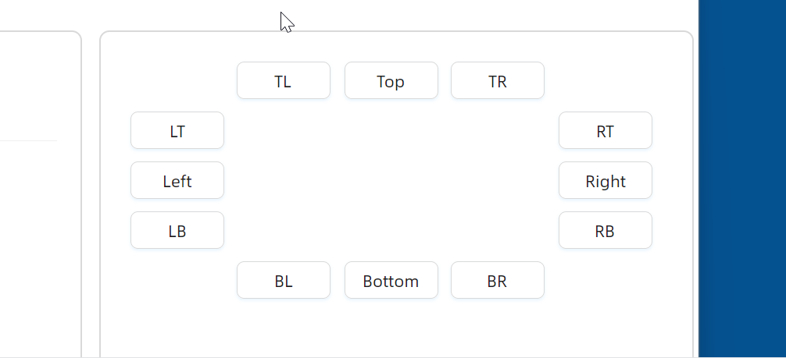

# ToolTip 概述

### 简介

`ToolTip` 是一种轻量级的提示组件，当用户将鼠标悬停在目标元素上时，会自动弹出一个浮层来展示提示信息。它不占用页面布局空间，非常适合为按钮、图标、文本等元素补充说明性信息。

`ToolTip` 继承自 `ContentControl`，通过附加属性的方式挂载到任意控件上，使用简洁灵活。

### 主要功能

* 支持 12 个弹出位置，涵盖上、下、左、右及各边缘对齐方向
* 支持显示或隐藏箭头，并可设置箭头指向目标中心
* 支持 13 种预设颜色以及自定义十六进制颜色
* 支持配置显示延迟、偏移量、与锚点间距等行为参数
* 支持在禁用控件上显示提示
* 支持自定义弹出位置回调
