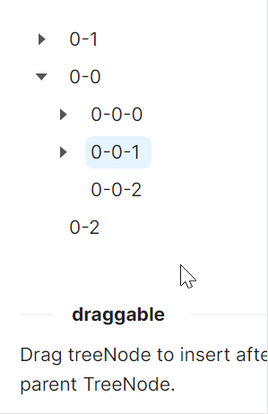

# 拖拽特性

`IsDraggable` 为True表示启用了树节点的拖拽功能，允许用户通过拖拽来重新组织树结构；`NodeHoverMode` Block设置节点悬停模式为块状高亮，提供更好的视觉反馈。



axaml文件：
```axaml
<atom:TreeView IsDraggable="True" NodeHoverMode="Block">
    <atom:TreeViewItem Header="0-0">
        <atom:TreeViewItem Header="0-0-0">
            <atom:TreeViewItem Header="0-0-0-0" />
            <atom:TreeViewItem Header="0-0-0-1" />
            <atom:TreeViewItem Header="0-0-0-2" />
        </atom:TreeViewItem>
        <atom:TreeViewItem Header="0-0-1">
            <atom:TreeViewItem Header="0-0-1-0" />
            <atom:TreeViewItem Header="0-0-1-1" />
            <atom:TreeViewItem Header="0-0-1-2" />
        </atom:TreeViewItem>
        <atom:TreeViewItem Header="0-0-2" />
    </atom:TreeViewItem>
    <atom:TreeViewItem Header="0-1">
        <atom:TreeViewItem Header="0-1-0">
            <atom:TreeViewItem Header="0-1-0-0" />
            <atom:TreeViewItem Header="0-1-0-1" />
            <atom:TreeViewItem Header="0-1-0-2" />
        </atom:TreeViewItem>
        <atom:TreeViewItem Header="0-1-1">
            <atom:TreeViewItem Header="0-1-1-0" />
            <atom:TreeViewItem Header="0-1-1-1" />
            <atom:TreeViewItem Header="0-1-1-2" />
        </atom:TreeViewItem>
        <atom:TreeViewItem Header="0-1-2" />
    </atom:TreeViewItem>
    <atom:TreeViewItem Header="0-2" />
</atom:TreeView>
```


code-behind文件：
```csharp
using AtomUIGallery.ShowCases.ViewModels;
using Avalonia.ReactiveUI;
using ReactiveUI;
public partial class TreeViewShowCase : ReactiveUserControl<TreeViewViewModel>
{
    public TreeViewShowCase()
    {
        this.WhenActivated(disposables => { });
        InitializeComponent();
    }
}
```

view-model文件：
```csharp
using ReactiveUI;
public class TreeViewViewModel : ReactiveObject, IRoutableViewModel
{
    public const string ID = "TreeView";
    
    public IScreen HostScreen { get; }
    
    public string UrlPathSegment { get; } = ID;
    
    private bool _showLineSwitchChecked = true;

    public bool ShowLineSwitchChecked
    {
        get => _showLineSwitchChecked;
        set => this.RaiseAndSetIfChanged(ref _showLineSwitchChecked, value);
    }
    
    private bool _showIconSwitchChecked;

    public bool ShowIconSwitchChecked
    {
        get => _showIconSwitchChecked;
        set => this.RaiseAndSetIfChanged(ref _showIconSwitchChecked, value);
    }

    private bool _showLeafIconSwitchChecked;

    public bool ShowLeafIconSwitchChecked
    {
        get => _showLeafIconSwitchChecked;
        set => this.RaiseAndSetIfChanged(ref _showLeafIconSwitchChecked, value);
    }

    public TreeViewViewModel(IScreen screen)
    {
        HostScreen = screen;
    }
}
```