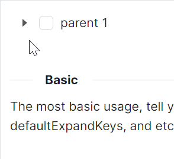

# TreeView 快速入门

### 基础配置条件

* Nuget安装Avalonia
* Nuget安装AtomUI

### 基础用法

使用了 `atom:TreeView` 控件作为树形结构的根容器，通过嵌套的 `atom:TreeViewItem` 构建层级关系。

设置 `ToggleType` 为 `CheckBox` 表示使用复选框作为切换控件类型，`IsDefaultExpandAll` 为True使所有节点默认展开



```axaml
<atom:TreeView ToggleType="CheckBox" IsDefaultExpandAll="True">
    <atom:TreeViewItem Header="parent 1">
        <atom:TreeViewItem Header="parent 1-0">
            <atom:TreeViewItem Header="leaf" IsChecked="True" />
            <atom:TreeViewItem Header="leaf" />
        </atom:TreeViewItem>
        <atom:TreeViewItem Header="parent 1-1" IsChecked="True">
            <atom:TreeViewItem Header="sss" />
        </atom:TreeViewItem>
    </atom:TreeViewItem>
</atom:TreeView>
```
