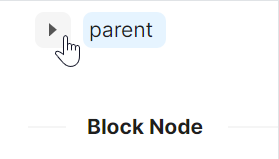

# TreeView 快速入门

### 基础配置条件

* Nuget安装Avalonia
* Nuget安装AtomUI

### 基础用法

使用 `atom:TreeView` 控件作为树形结构的根容器，通过嵌套的 `atom:TreeViewItem` 构建层级关系。

设置 `ToggleType` 为 `CheckBox` 表示使用复选框作为切换控件类型，`IsDefaultExpandAll` 为 True 使所有节点默认展开。


```xaml
<atom:TreeView ToggleType="CheckBox" IsDefaultExpandAll="True">
    <atom:TreeViewItem Header="parent 1">
        <atom:TreeViewItem Header="parent 1-0">
            <atom:TreeViewItem Header="leaf" IsChecked="True" />
            <atom:TreeViewItem Header="leaf" />
        </atom:TreeViewItem>
        <atom:TreeViewItem Header="parent 1-1" IsChecked="True">
            <atom:TreeViewItem Header="sss" />
        </atom:TreeViewItem>
    </atom:TreeViewItem>
</atom:TreeView>
```

### 单选模式

设置 `ToggleType` 为 `Radio` 表示节点切换类型为单选模式。配合 `NodeHoverMode="Block"` 可设置节点悬停效果为块状高亮，`IsEnabled="False"` 可禁用某个节点。



```xaml
<atom:TreeView ToggleType="Radio" IsDefaultExpandAll="True" NodeHoverMode="Block">
    <atom:TreeViewItem Header="parent">
        <atom:TreeViewItem Header="child 1" IsEnabled="False" />
        <atom:TreeViewItem Header="child 2" />
    </atom:TreeViewItem>
</atom:TreeView>
```

### 拖拽排序

设置 `IsDraggable` 为 True 启用树节点的拖拽功能，允许用户通过拖拽来重新组织树结构。配合 `NodeHoverMode="Block"` 设置节点悬停模式为块状高亮，提供更好的视觉反馈。


axaml文件：
```xaml
<atom:TreeView IsDraggable="True" NodeHoverMode="Block">
    <atom:TreeViewItem Header="0-0">
        <atom:TreeViewItem Header="0-0-0">
            <atom:TreeViewItem Header="0-0-0-0" />
            <atom:TreeViewItem Header="0-0-0-1" />
            <atom:TreeViewItem Header="0-0-0-2" />
        </atom:TreeViewItem>
        <atom:TreeViewItem Header="0-0-1">
            <atom:TreeViewItem Header="0-0-1-0" />
            <atom:TreeViewItem Header="0-0-1-1" />
            <atom:TreeViewItem Header="0-0-1-2" />
        </atom:TreeViewItem>
        <atom:TreeViewItem Header="0-0-2" />
    </atom:TreeViewItem>
    <atom:TreeViewItem Header="0-1">
        <atom:TreeViewItem Header="0-1-0">
            <atom:TreeViewItem Header="0-1-0-0" />
            <atom:TreeViewItem Header="0-1-0-1" />
            <atom:TreeViewItem Header="0-1-0-2" />
        </atom:TreeViewItem>
        <atom:TreeViewItem Header="0-1-1">
            <atom:TreeViewItem Header="0-1-1-0" />
            <atom:TreeViewItem Header="0-1-1-1" />
            <atom:TreeViewItem Header="0-1-1-2" />
        </atom:TreeViewItem>
        <atom:TreeViewItem Header="0-1-2" />
    </atom:TreeViewItem>
    <atom:TreeViewItem Header="0-2" />
</atom:TreeView>
```

code-behind文件：
```csharp
using AtomUIGallery.ShowCases.ViewModels;
using Avalonia.ReactiveUI;
using ReactiveUI;
public partial class TreeViewShowCase : ReactiveUserControl<TreeViewViewModel>
{
    public TreeViewShowCase()
    {
        this.WhenActivated(disposables => { });
        InitializeComponent();
    }
}
```

view-model文件：
```csharp
using ReactiveUI;
public class TreeViewViewModel : ReactiveObject, IRoutableViewModel
{
    public const string ID = "TreeView";

    public IScreen HostScreen { get; }

    public string UrlPathSegment { get; } = ID;

    private bool _showLineSwitchChecked = true;

    public bool ShowLineSwitchChecked
    {
        get => _showLineSwitchChecked;
        set => this.RaiseAndSetIfChanged(ref _showLineSwitchChecked, value);
    }

    private bool _showIconSwitchChecked;

    public bool ShowIconSwitchChecked
    {
        get => _showIconSwitchChecked;
        set => this.RaiseAndSetIfChanged(ref _showIconSwitchChecked, value);
    }

    private bool _showLeafIconSwitchChecked;

    public bool ShowLeafIconSwitchChecked
    {
        get => _showLeafIconSwitchChecked;
        set => this.RaiseAndSetIfChanged(ref _showLeafIconSwitchChecked, value);
    }

    public TreeViewViewModel(IScreen screen)
    {
        HostScreen = screen;
    }
}
```

### 连接线与图标

使用 `ToggleSwitch` 控件分别绑定到 `TreeView` 的三个可视化属性：
* `IsShowLine`: 控制是否显示节点间的连接线
* `IsShowIcon`: 控制是否显示节点图标
* `IsShowLeafIcon`: 控制是否显示叶节点图标

`IsExpanded` 为 True 预设某些节点为展开状态，`IsSwitcherRotation` 为 False 禁用切换器旋转动画效果。


axaml文件：
```xaml
<StackPanel Orientation="Vertical" Spacing="10">
    <StackPanel Orientation="Horizontal" Spacing="10">
        <TextBlock VerticalAlignment="Center">showLine:</TextBlock>
        <atom:ToggleSwitch VerticalAlignment="Center" IsChecked="{Binding ShowLineSwitchChecked,Mode=TwoWay}" />
    </StackPanel>

    <StackPanel Orientation="Horizontal" Spacing="10">
        <TextBlock VerticalAlignment="Center" >showIcon:</TextBlock>
        <atom:ToggleSwitch VerticalAlignment="Center" IsChecked="{Binding ShowIconSwitchChecked,Mode=TwoWay}" />
    </StackPanel>

    <StackPanel Orientation="Horizontal" Spacing="10">
        <TextBlock VerticalAlignment="Center">ShowLeafIcon:</TextBlock>
        <atom:ToggleSwitch VerticalAlignment="Center" IsChecked="{Binding ShowLeafIconSwitchChecked,Mode=TwoWay}" />
    </StackPanel>

    <atom:TreeView IsShowLine="{Binding ShowLineSwitchChecked}"
                   IsShowIcon="{Binding ShowIconSwitchChecked}"
                   IsShowLeafIcon="{Binding ShowLeafIconSwitchChecked}"
                   IsSwitcherRotation="False">
        <atom:TreeViewItem Header="parent 1" Icon="{atom:IconProvider Kind=CarryOutOutlined}"
                           IsExpanded="True">
            <atom:TreeViewItem Header="parent 1-0" Icon="{atom:IconProvider Kind=CarryOutOutlined}"
                               IsExpanded="True">
                <atom:TreeViewItem Header="leaf 1" Icon="{atom:IconProvider Kind=CarryOutOutlined}" />
                <atom:TreeViewItem Header="leaf 2" Icon="{atom:IconProvider Kind=CarryOutOutlined}" />
            </atom:TreeViewItem>
            <atom:TreeViewItem Header="parent 1-1">
                <atom:TreeViewItem Header="leaf" Icon="{atom:IconProvider Kind=CarryOutOutlined}" />
            </atom:TreeViewItem>
            <atom:TreeViewItem Header="parent 1-2">
                <atom:TreeViewItem Header="leaf 1" Icon="{atom:IconProvider Kind=CarryOutOutlined}" />
                <atom:TreeViewItem Header="leaf 2" Icon="{atom:IconProvider Kind=CarryOutOutlined}" />
            </atom:TreeViewItem>
        </atom:TreeViewItem>
        <atom:TreeViewItem Header="parent 2">
            <atom:TreeViewItem Header="parent 2-0" Icon="{atom:IconProvider Kind=CarryOutOutlined}">
                <atom:TreeViewItem Header="leaf 1" Icon="{atom:IconProvider Kind=CarryOutOutlined}" />
                <atom:TreeViewItem Header="leaf 2" Icon="{atom:IconProvider Kind=CarryOutOutlined}" />
            </atom:TreeViewItem>
        </atom:TreeViewItem>
    </atom:TreeView>
</StackPanel>
```

code-behind与view-model文件同拖拽排序示例一致，请参考上方代码。
