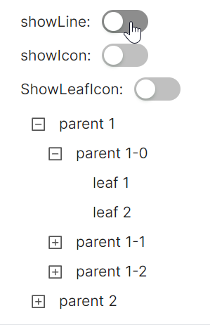

# 带线Tree

使用三个 `ToggleSwitch` 控件分别绑定到 `TreeView` 的三个可视化属性： 
* `IsShowLine`: 控制是否显示节点间的连接线
* `IsShowIcon`: 控制是否显示节点图标
* `IsShowLeafIcon`: 控制是否显示叶节点图标

ToggleSwitch相关逻辑还需要参考code-behind与view model。

`IsExpanded` 为True预设某些节点为展开状态，`IsSwitcherRotation` 为False禁用切换器旋转动画效果。



axaml文件：
```axaml
<StackPanel Orientation="Vertical" Spacing="10">
    <StackPanel Orientation="Horizontal" Spacing="10">
        <TextBlock VerticalAlignment="Center">showLine:</TextBlock>
        <atom:ToggleSwitch VerticalAlignment="Center" IsChecked="{Binding ShowLineSwitchChecked,Mode=TwoWay}" />
    </StackPanel>

    <StackPanel Orientation="Horizontal" Spacing="10">
        <TextBlock VerticalAlignment="Center" >showIcon:</TextBlock>
        <atom:ToggleSwitch VerticalAlignment="Center" IsChecked="{Binding ShowIconSwitchChecked,Mode=TwoWay}" />
    </StackPanel>

    <StackPanel Orientation="Horizontal" Spacing="10">
        <TextBlock VerticalAlignment="Center">ShowLeafIcon:</TextBlock>
        <atom:ToggleSwitch VerticalAlignment="Center" IsChecked="{Binding ShowLeafIconSwitchChecked,Mode=TwoWay}" />
    </StackPanel>

    <atom:TreeView IsShowLine="{Binding ShowLineSwitchChecked}"
                   IsShowIcon="{Binding ShowIconSwitchChecked}"
                   IsShowLeafIcon="{Binding ShowLeafIconSwitchChecked}"
                   IsSwitcherRotation="False">
        <atom:TreeViewItem Header="parent 1" Icon="{atom:IconProvider Kind=CarryOutOutlined}"
                           IsExpanded="True">
            <atom:TreeViewItem Header="parent 1-0" Icon="{atom:IconProvider Kind=CarryOutOutlined}"
                               IsExpanded="True">
                <atom:TreeViewItem Header="leaf 1" Icon="{atom:IconProvider Kind=CarryOutOutlined}" />
                <atom:TreeViewItem Header="leaf 2" Icon="{atom:IconProvider Kind=CarryOutOutlined}" />
            </atom:TreeViewItem>
            <atom:TreeViewItem Header="parent 1-1">
                <atom:TreeViewItem Header="leaf" Icon="{atom:IconProvider Kind=CarryOutOutlined}" />
            </atom:TreeViewItem>
            <atom:TreeViewItem Header="parent 1-2">
                <atom:TreeViewItem Header="leaf 1" Icon="{atom:IconProvider Kind=CarryOutOutlined}" />
                <atom:TreeViewItem Header="leaf 2" Icon="{atom:IconProvider Kind=CarryOutOutlined}" />
            </atom:TreeViewItem>
        </atom:TreeViewItem>
        <atom:TreeViewItem Header="parent 2">
            <atom:TreeViewItem Header="parent 2-0" Icon="{atom:IconProvider Kind=CarryOutOutlined}">
                <atom:TreeViewItem Header="leaf 1" Icon="{atom:IconProvider Kind=CarryOutOutlined}" />
                <atom:TreeViewItem Header="leaf 2" Icon="{atom:IconProvider Kind=CarryOutOutlined}" />
            </atom:TreeViewItem>
        </atom:TreeViewItem>
    </atom:TreeView>
</StackPanel>
```

axaml.cs文件，即code-behind：
```csharp
using AtomUIGallery.ShowCases.ViewModels;
using Avalonia.ReactiveUI;
using ReactiveUI;
public partial class TreeViewShowCase : ReactiveUserControl<TreeViewViewModel>
{
    public TreeViewShowCase()
    {
        this.WhenActivated(disposables => { });
        InitializeComponent();
    }
}
```

view model文件：
```csharp
using ReactiveUI;
public class TreeViewViewModel : ReactiveObject, IRoutableViewModel
{
    public const string ID = "TreeView";
    
    public IScreen HostScreen { get; }
    
    public string UrlPathSegment { get; } = ID;
    
    private bool _showLineSwitchChecked = true;

    public bool ShowLineSwitchChecked
    {
        get => _showLineSwitchChecked;
        set => this.RaiseAndSetIfChanged(ref _showLineSwitchChecked, value);
    }
    
    private bool _showIconSwitchChecked;

    public bool ShowIconSwitchChecked
    {
        get => _showIconSwitchChecked;
        set => this.RaiseAndSetIfChanged(ref _showIconSwitchChecked, value);
    }

    private bool _showLeafIconSwitchChecked;

    public bool ShowLeafIconSwitchChecked
    {
        get => _showLeafIconSwitchChecked;
        set => this.RaiseAndSetIfChanged(ref _showLeafIconSwitchChecked, value);
    }

    public TreeViewViewModel(IScreen screen)
    {
        HostScreen = screen;
    }
}
```