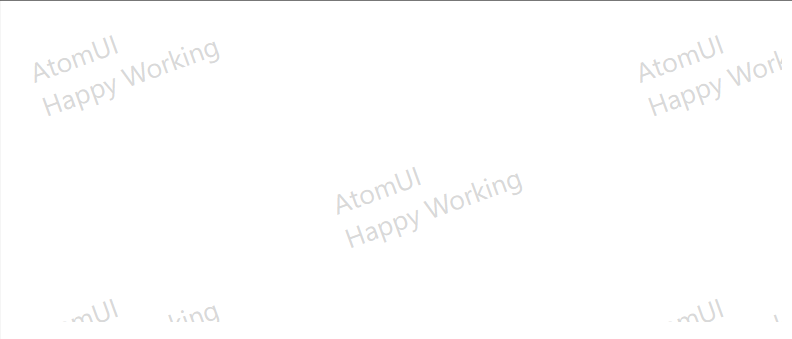

# Watermark 快速入门

### 基础配置条件

* Nuget安装Avalonia
* Nuget安装AtomUI

### 基础用法

`atom:Watermark.Glyph` 是一个附加属性(Attached Property)，用于在控件上设置水印内容。它可以应用在各种控件上，如 `Border` 和 `StackPanel` 支持不同的水印类型。

通过 `atom:TextGlyph` 表示文字水印；通过 `<atom:ImageGlyph>` 定义图片水印。

给一个 `Border` 所构成的区域添加文本水印，水印内容为"AtomUI"。


```axaml
<Border Height="300" 
        HorizontalAlignment="Stretch" 
        atom:Watermark.Glyph="{atom:TextGlyph 'AtomUI'}" />
```

### 多行文本水印

给一个 `Border` 所构成的区域添加多行文本水印，水印内容为"AtomUI"和"Happy Working"。



```axaml
<Border Height="200"
        HorizontalAlignment="Stretch"
        atom:Watermark.Glyph="{atom:TextGlyph 'AtomUI&#x000A;Happy Working', FontSize=18, Foreground=Gray}" />
```