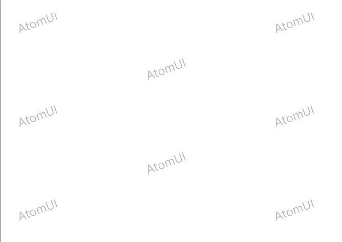

# Watermark 水印

## 简介

给页面局部区域添加水印，支持文本水印和图片水印。Watermark 通过附加属性的方式将水印图案渲染到目标控件的背景上，适用于内容版权保护、页面防篡改等场景。

## 何时使用

- 需要对页面内容进行版权声明或防伪标识时
- 需要在特定区域叠加品牌标识或提示信息时
- 防止截图或拍照后内容被冒用时

## 主要特性

- **文本水印** — 通过 `TextGlyph` 快速创建文本水印，支持自定义字号、颜色等样式
- **多行文本水印** — 使用换行符 `&#x000A;` 实现多行文本水印内容
- **图片水印** — 通过 `ImageGlyph` 使用自定义图片作为水印图案
- **附加属性** — 以 `atom:Watermark.Glyph` 附加属性的方式挂载，可应用于 `Border`、`StackPanel` 等任意控件
- **自定义预览** — 水印会覆盖在目标控件的内容之上，可自由组合文本、图片等子内容
