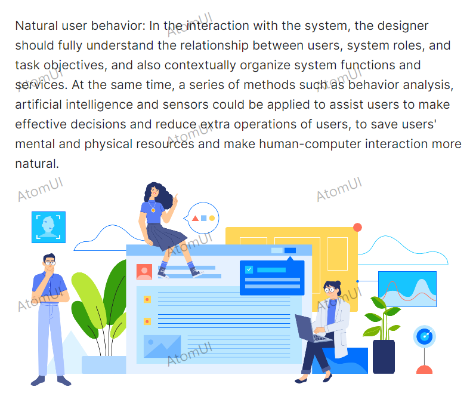

# 图片水印

通过给StackPanel添加自定义配置 atom:Watermark.Glyph="{atom:TextGlyph 'AtomUI'} 来预览StackPanel的水印背景。



```axaml
<StackPanel atom:Watermark.Glyph="{atom:TextGlyph 'AtomUI'}">
    <atom:TextBlock TextWrapping="Wrap">
        The light-speed iteration of the digital world makes products more complex. However, human consciousness and attention resources are limited. Facing this design contradiction, the pursuit of natural interaction will be the consistent direction of Ant Design.
        <LineBreak /><LineBreak />
        Natural user cognition: According to cognitive psychology, about 80% of external information is obtained through visual channels. The most important visual elements in the interface design, including layout, colors, illustrations, icons, etc., should fully absorb the laws of nature, thereby reducing the user's cognitive cost and bringing authentic and smooth feelings. In some scenarios, opportunely adding other sensory channels such as hearing, touch can create a richer and more natural product experience.
        <LineBreak /><LineBreak />
        Natural user behavior: In the interaction with the system, the designer should fully understand the relationship between users, system roles, and task objectives, and also contextually organize system functions and services. At the same time, a series of methods such as behavior analysis, artificial intelligence and sensors could be applied to assist users to make effective decisions and reduce extra operations of users, to save users' mental and physical resources and make human-computer interaction more natural.
    </atom:TextBlock>
    <Image Source="/Assets/watermark-sample.png" />
</StackPanel>
```